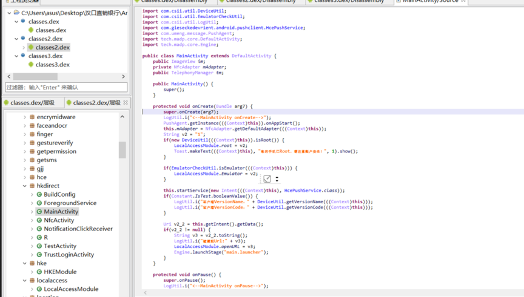
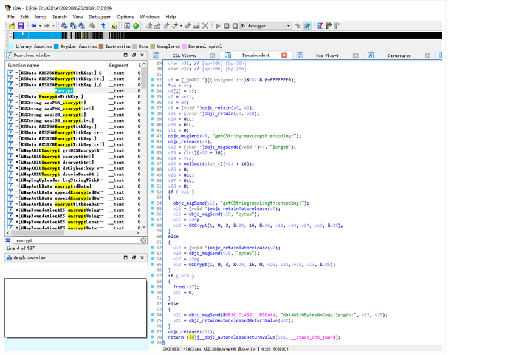
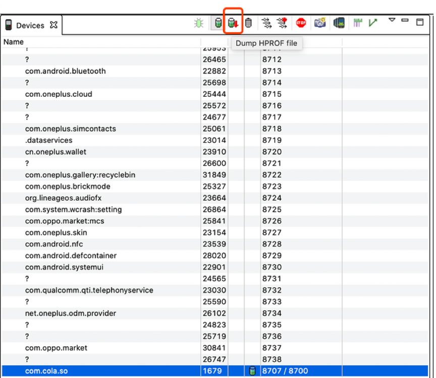
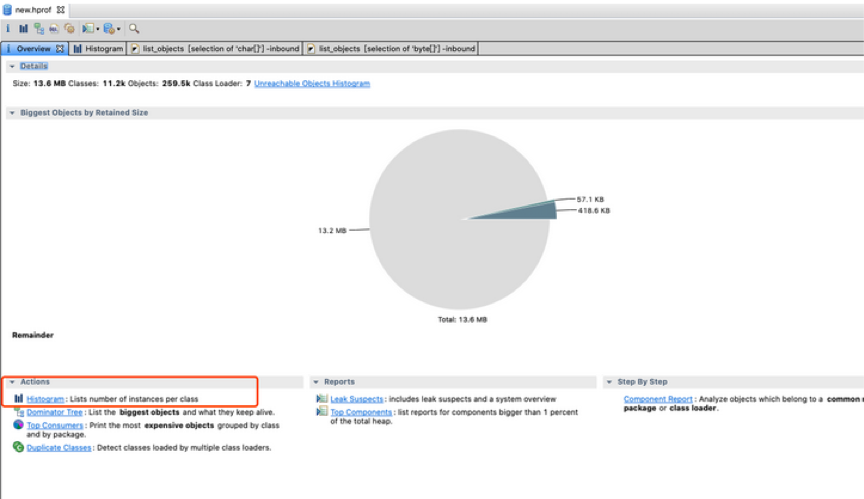
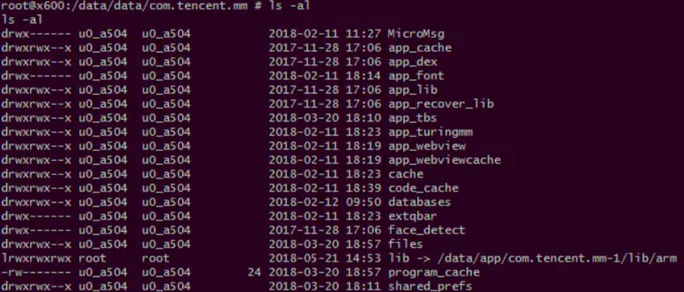
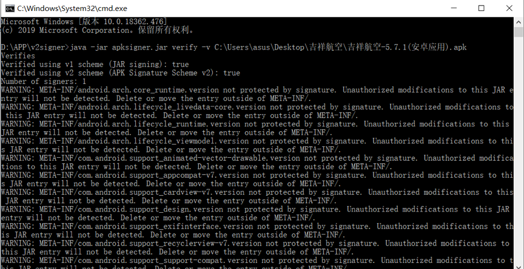
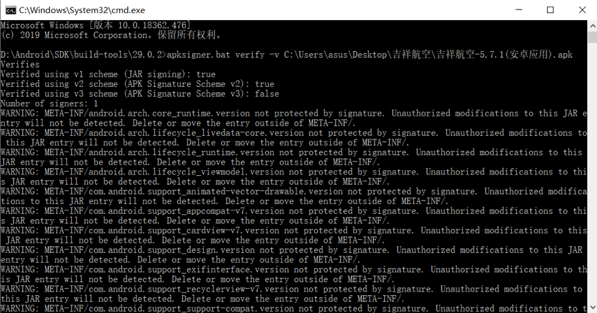

# 1. Android客户端

## 1.1 检测点总览

​	Android客户端(APK安装包)检测项分为二进制代码保护、用户数据安全、数据传输保护、加密算法及密钥安全、跨进程交互安全、Android应用安全规范6大类共计44个小项：


| **分类**                | **安全风险**                                       |
| ----------------------- | -------------------------------------------------- |
| **二进制代码保护**      | DEX文件加固强度不足                                |
|                         | 缺少DEX代码(classes.dex)加密保护                   |
|                         | 缺少Native反调试检测                               |
|                         | 缺少Native代码注入检测                             |
|                         | 缺少Native库(.so文件)加密保护                      |
|                         | 缺少脚本代码(JavaScript、Lua等文件)加密保护        |
|                         | 缺少敏感资源文件加密保护                           |
|                         | 缺少自身签名完整性校验                             |
|                         | 缺少自身文件完整性校验                             |
| **用户数据安全**        | 内存明文存储敏感信息                               |
|                         | Shared Preferences文件中明文存储敏感信息           |
|                         | SQLite数据库中明文存储敏感信息                     |
|                         | 明文传输核心业务数据                               |
|                         | 允许备份标记没有设置为关闭                         |
|                         | 敏感信息界面截屏未进行提示                         |
|                         | 调试日志输出敏感信息                               |
|                         | 模拟器检测                                         |
|                         | Root检测                                           |
|                         | 代理检测                                           |
|                         | Xposed检测                                         |
|                         | 输入监听风险                                       |
| **数据传输保护**        | 使用HTTP进行核心业务数据交互                       |
|                         | 使用ALLOW_ALL_HOSTNAME_VERIFIER忽略SSL证书域名验证 |
|                         | 自定义HostnameVerifier忽略SSL证书域名验证          |
|                         | 自定义X509TrustManager未正确校验SSL证书链          |
|                         | 自定义WebViewClient忽略SSL证书校验异常             |
|                         | 端口开放风险                                       |
| **加密算法及密钥安全**  | 不合理配置加密算法                                 |
|                         | 密钥明文硬编码                                     |
| **跨进程交互安全**      | 导出组件Activity拒绝服务漏洞                       |
|                         | 导出组件Service拒绝服务漏洞                        |
|                         | 导出组件Broadcast Receiver拒绝服务漏洞             |
|                         | 导出组件Content Provider数据泄露                   |
|                         | 导出组件Content Provider SQL注入漏洞               |
|                         | 导出组件Content Provider目录遍历漏洞               |
| **Android应用安全规范** | 允许调试标记没有设置为关闭                         |
|                         | WebView存在潜在跨站脚本攻击风险                    |
|                         | 允许WebView访问本地任意脚本                        |
|                         | App沙箱文件权限设置错误                            |
|                         | Janus漏洞                                          |
|                         | 访问第三方页面时未进行提示                         |
|                         | 未校验二维码域名                                   |
|                         | 地址随机化                                         |
|                         | 堆栈保护                                           |


## 1.2 检测点概述及测试用例

### 1.2.1 二进制代码保护

#### 1.2.1.1 DEX文件加固强度不足


**概述**

App对classes.dex文件加固强度不足.classes.dex是Android App的可执行文件，包含了编译后的Java代码的字节码。由于没有对该文件进行加密，使用工具可以将字节码还原成Java的代码。攻击者可以轻松的获取应用程序客户端所有的业务逻辑代码，并发起其他攻击，如二次打包，植入恶意代码，的WebAPI逆向等。

**风险等级**

**中危**

**测试用例**

1. 使用自主研发的脱壳机进行脱壳。

   工具：Fdex（见附件）

   Xposed环境下安装Fdex，选择hook目标APP;

   运行app点击功能后，可在“/data/user/0/包名”路径下找到脱出来的.dex文件，将脱壳文件拖入JEB查看是否有业务逻辑代码


#### 1.2.1.2  缺少DEX代码(classes.dex)加密保护


**概述**

App在发布的时候并没有对classes.dex文件进行保护。classes.dex是Android App的可执行文件，包含了编译后的Java代码的字节码。由于没有对该文件进行加密，使用工具可以将字节码还原成Java代码。攻击者可以轻松的获取App客户端所有的业务逻辑代码，并发起其他攻击，如二次打包、植入恶意代码、WebApi逆向等。

**风险等级**

**高危**

**测试用例**

以JEB使用为例：

1. 在PC上安装JEB；
2. 解压目标App文件，获取其包中的classes.dex文件；
3. 使用JEB对classes.dex文件进行反编译；
4. 若App没有进行保护，JEB可将目标classes.dex文件反编译成Java代码，看到核心业务逻辑。

（漏洞截图必须是核心代码的截图）




#### 1.2.1.3  缺少Native反调试检测


**概述**

App没有使用反调试技术对运行时的程序进行保护。攻击者可以通过动态调试的方法，对App进行逆向、跟踪等。同时，攻击者还可以利用调试技术，在运行时的App内存中注入恶意代码，达到截获运行时数据的目的，此举可能导致用户的隐私信息被窃取。

**风险等级**

**高危**

**测试用例**

以IDA Pro为例：

1. 反编译apk文件，查看AndroidManifest.xml文件是否有android:debuggable属性（没有的话默认是false），需要添加android:debuggable属性为true，并进行二次打包（如果有二次打包、重签名校验，可以尝试进一步去改smali或者hook）；
2. 准备一台Root手机，连接至PC；
3. 使用adb向目标手机推送IDA Pro的Android调试器；
4. 在手机上运行android_server，转发23946端口
5. adb shell am start -D -n 包名/入口函数
6. 打开IDA Pro尝试Attach调试进程，在进程列表中选择目标进程的包名；
7. 尝试Attach该进程，并进行调试。


####  1.2.1.4 缺少Native代码注入检测


**概述**

App没有使用反调试技术对运行时的程序进行保护。攻击者可以通过动态调试的方法，对App进行逆向、跟踪等。同时，攻击者还可以利用调试技术，在运行时的App内存中注入恶意代码，达到截获运行时数据的目的，此举可能导致用户的隐私信息被窃取。

**风险等级**

**高危**

**测试用例**

以Frida为例：

1. 准备一台Root手机，连接至PC；

2. 在PC上安装Python 2.x或Python 3.x，并安装frida python库;

3. 从 https://github.com/frida/frida/releases 下载对应的frida-server，解压后使用adb向目标手机推送frida-server;

4. 在手机上运行Frida Server，同时启动目标App;

5. 启动命令行，输入以下命令进行注入尝试：

   ```shell
   frida-trace -U -i "recv*" -i "read*" 目标App包名
   ```

6. 观察Frida是否能成功注入，并且获取recv api相关的数据。


#### 1.2.1.5 缺少Native库(.so文件)加密保护


**概述**

App在发布的时候没有对核心的SO库进行加密、加壳处理。SO中包含了编译后的机器码，由于没有对该文件进行加密，使用工具可以将字节码还原成类C代码。

**风险等级**

**高危**

**测试用例**

以IDA Pro为例：

1. 在PC安装IDA Pro，同时安装Hex-Rays Decompiler插件；
2. 解压App包，提取包中的.so文件；
3. 尝试使用IDA Pro对.so文件进行反汇编；
4. 尝试使用Hex-Rays Decompiler对.so文件进行反编译;
5. 查看是否能够正常反编译，看到核心业务逻辑代码（截图需为核心业务逻辑代码）。




#### 1.2.1.6 缺少脚本代码(Javascript、Lua等文件)加密保护

**概述**

App使用了第三方的代码执行引擎编写客户端的业务逻辑代码，这些代码以脚本的形式保存在App的资源文件中。由于没有对这些文件进行加密保护，攻击者可以直接从资源中获取本地业务逻辑代码，并发起其他攻击，如篡改、植入恶意代码、网络协议分析等。

**风险等级**

**高危**

**测试用例**

1. 解压App包，提取包中的.js、.lua文件；
2. 检测这些文件是否以明文的形式存储，是否包含可读的核心业务逻辑代码（截图需为核心业务逻辑、加解密代码）。


#### 1.2.1.7 缺少敏感资源文件加密保护

**概述**

App业务相关的敏感资源文件以明文的形式存储，由于没有加密保护，这些文件在应用发布后可能被其他人获取，并结合其他漏洞和手段产生真实攻击。

**风险等级**

**高危**/**中危**/**低危**

**测试用例**

1. 解压App包，提取包中业务相关的敏感文件，逐一进行分析；
2. 检测这些文件是否以明文的形式存储数据，根据具体存储的信息类型，判定风险等级，如明文存储密码、密钥文件为高危，明文存储姓名、手机号、银行卡号为中危，明文存储位置信息等为低危。若发现有端口号泄露，可定级为中危。（如不确定，请找2人以上进行交叉验证。注：公钥证书不算敏感资源文件）


#### 1.2.1.8 缺少自身签名完整性校验

**概述**

Android系统使用JAR包的签名机制对APK进行完整性保护，确保APK在不安全的网络传输时的完整性得到保护。但Android系统没有对数字签名的颁发者进行管理，任何人都可以生成数字签名，并使用该签名对APK包进行重新签名。如果App本身不对自身的签名来源进行有效的完整性检查，攻击者可以篡改应用（插入恶意代码、木马、后门、广告等），重新签名并且二次发布，导致应用程序完整性被破坏。

**风险等级**

**高危**

**测试用例**

1. 在PC上安装JDK；
2. 利用keytool （java自带）工具查看原包签名信息；
3. 使用 keytool 进行签名，覆盖原始的数字签名（还有很多可以直接签名的工具，如AndroidKiller、ApkIDE）；

- $ apksigner.jar sign --ks debug.jks apk文件

1. 查看重签后的签名信息：

   ```shell
   keytool -printcert -file C:\Users\Administrator\Desktop\t\META-INF\CERT.RSA
   ```

   

2. 安装重新签名后的应用，检测其是否能够重新运行。


#### 1.2.1.9 缺少自身文件完整性校验

**概述**

Android应用在编译后会将其代码、资源文件、配置文件打包成APK文件，APK文件的格式为zip包，任何人均可通过解压的方式获取其内部文件。如果不对内部文件进行完整性校验，攻击者可能会对APK包中的资源文件、代码文件进行篡改（插入恶意代码、木马、后门、广告等），重新签名并且发布，并使用钓鱼的方式对终端用户进行攻击。

**风险等级**

**高危**

**测试用例**

1. 在PC上安装Apktool；

2. 使用Apktool对APK文件进行反编译：

   ```
   apktool d target.apk -o unpacked
   ```

   

3. 尝试篡改反编译后的APP图标文件，一般在资源文件res的drawable相关目录下；

4. 使用Apktool编译修改后的APK文件，进行重打包；

   ```
    apktool b unpacked -o target.apk
   ```

5. 对修改后的文件进行重新签名；

6. 安装篡改后的应用，检测其是否能够重新运行,若应用可以正常运行相应功能，判定为存在该漏洞。


### 1.2.2 用户数据安全


#### 1.2.2.1 内存明文存储敏感信息

**概述**

因为Android将应用程序存储在内存中（即使在使用后），直到内存被回收，加密密钥可能会保留在内存中。发现或窃取设备的攻击者可以附加调试器并从应用程序转储内存，或者加载内核模块以转储内存中的全部内容。

**风险等级**

**高危**/**中危**/**低危**

**测试用例**

1. 利用DDMS导出的hprof文件

 

2. 转换hprof文件为标准格式

   ```shell
   hprof-conv old.hprof new.hprof
   ```

   

3. 使用MAT(Memory Analyzer)工具打开hprof文件，分析是否明文存储了用户敏感信息, 查找字符串, 打开Histogram



4. 根据具体存储的信息类型，判定风险等级，如明文存储密码、密钥为高危，明文存储姓名、手机号、银行卡号为中危，明文存储位置信息等为低危。

工具下载地址：http://www.eclipse.org/mat/downloads.php（根据自己的电脑，下载对应的版本）

参考测试方法：https://note.youdao.com/ynoteshare1/index.html?id=070f0110671d45527d06e1cf9493b602&type=note


#### 1.2.2.2 SharedPreferences文件中明文存储敏感信息

**概述**

在所有应用程序中，都必然涉及数据的交互。有些时候，应用程序有少量的数据需要保存，并且这些数据的格式很简单。比如：软件设置、用户账户设置，用户习惯设置等，这个时候就可以用到SharedPreferences。其实，SharedPreferences使用xml格式为Android应用提供一种永久的数据存贮方式。将未经加密的敏感信息以明文的形式保存在SharedPreferences中。当用户手机失窃，或者连接到电脑时，这些明文的敏感数据可能被第三方程序获取，导致用户信息泄露、身份认证信息被窃取。

**风险等级**

**高危**/**中危**/**低危**

**测试用例**

1. 正常使用APP的部分功能后(如登录操作等)，使用三方工具读取APP的SharedPreferences文件，查看是否有明文保存的信息，根据具体存储的信息类型，判定风险等级，如明文存储密码为高危，明文存储姓名、手机号、银行卡号为中危，明文存储位置信息等为低危。（如不确定，请找2人以上进行交叉验证）。

访问路径：/data/data/包名/ shared_prefs/


#### 1.2.2.3 SQLite数据库中明文存储敏感信息 

**概述**

App在处理运行时产生的敏感数据（如账号、密码、Cookie、Token等业务相关敏感信息）时，将未经加密的敏感信息以明文的形式保存在SQLite数据库中。当用户手机失窃，或者连接到电脑时，这些明文的敏感数据可能被第三方程序获取，导致用户信息泄露、身份认证信息被窃取。

**风险等级**

**高危**/**中危**

**测试用例**

1. 正常使用APP的部分功能后(如登录操作等)，adb pull导出/data/data/包名下的.db文件
2. 使用第三方工具（如：sqlitestudio）读取APP的.db文件，查看是否有明文保存的信息，根据具体存储的信息类型，判定风险等级，如明文存储密码为高危，明文存储姓名、手机号、银行卡号为中危，明文存储位置信息等为低危。（如不确定，请找2人以上进行交叉验证）。


#### 1.2.2.4 明文传输核心业务数据

**概述**

应用数据交互采用明文传输数据、没有加密、完整校验等机制，在不可信的网络环境下，网络请求依然可以被进行中间人攻击，导致传输过程中的敏感信息能够被第三方程序监听，截获，篡改，重放等。

**风险等级**

**警告**

**测试用例**

1. 通过burp抓取核心业务数据（密码、姓名、手机号、银行卡号、位置信息等）包，看是否明文进行传输。


#### 1.2.2.5 允许备份标记没有设置为关闭

#### **概述**

App发布时，AndroidManifest.xml文件中的android:allowBackup属性没有显示的设置为False，导致App运行时存储在沙箱中的文件（Cookies、SharedPreferences、数据库）可以通过adb备份到其他媒介，存在隐私信息泄露的风险。

**风险等级**

**中危**

**测试用例**

1. 在PC上安装Apktool；
2. 使用Apktool对APK文件进行反编译；
3. 打开unpacked/AndroidManifest.xml文件，检查application节点的android:allowBackup属性，如值为true，则存在该风险。


#### 1.2.2.6 敏感信息界面截屏未进行提示 

**概述**

App的敏感界面没有做防止截屏处理，导致用户的个人敏感信息被三方截屏、录屏软件截取。

**风险等级**

**警告**

**测试用例**

在敏感信息界面截屏，查看能否截屏成功，若截屏成功且无提示页面则存在该风险；若可以截屏成功且有提示，则判定为不存在该风险。（需截图到有敏感数据的页面，如登录、支付等截面）


#### 1.2.2.7 调试日志输出敏感信息

**概述**

App没有移除调试日志输出相关的代码，在运行的时候，会将日志信息输出到Logcat中，且日志信息中包含业务相关的敏感信息。而调试日志中的敏感信息可能被第三方程序获取，导致用户敏感信息泄露。

**风险等级**

**中危**

**测试用例**

1. 不开启Xposed等插件（比如：inspeckage、justtrustme等）的情况下，打开手机的USB调试选项并连到电脑，同时在电脑上打开DDMS监视Logcat输出；
2. 正常执行几个业务后，检查DDMS中的日志；
3. 人工确认日志中是否包含敏感信息。


#### 1.2.2.8 模拟器检测

**概述**

模拟器经济成本低、可定制、易开发、容易部署，攻击者可以通过自己修改定制特定的模拟器达到监控应用关键函数、获取应用敏感数据，破解应用的目的。

**风险等级**

**警告**

**测试用例**

1. 将App运行在模拟器上；
2. 查看App是否能够正常运行，或者有没有任何提示信息。


#### 1.2.2.9 Root检测

**概述**

App在不安全的root环境下运行时存在较高的风险，系统原有的安全机制几乎失效，防护软件也会变得更加容易遭受攻击，获取了高权限的恶意程序可任意读取App的敏感数据、内存数据，或者注入代码等，导致用户敏感信息被泄露。

**风险等级**

**警告**

**测试用例**

将App运行在拥有Root权限的设备中，未启用其它插件，以下情况为存在问题：

1. App能够正常运行，没有提示处于root环境的信息。
2. 在root环境下卡在初始页面或闪退。


#### 1.2.2.10 代理检测

**概述**

应用使用代理服务器联网，可能导致客户端与服务器端通信的数据被监听和篡改，导致用户敏感数据泄露或者服务器被恶意攻击。

**风险等级**

**警告**

**测试用例**

1. 在测试机上开启代理进行抓包，看APP是否有提示或者无法抓取到数据包，如无法抓包，需进一步判断是否由其他原因引起，如https单向、双向校验等，可通过逆向代码或调试查看无法抓包原因，从而准确判断是否是由代理检测导致无法抓包。


#### 1.2.2.11 Xposed检测

**概述**

Xposed是常见的hook框架，大多数hook手段常用的框架，黑客经常使用hook手段对apk进行脱壳、内存截取或修改、逻辑分析等操作，对常见框架进行检测，并做对应防护，可以有效阻止黑客的非法操作。

**风险等级**

**警告**

**测试用例**

在安装并启用了Xposed的手机上运行应用，发现应用是否闪退或弹窗提示。此处需排查确认不是由于root检测引起的闪退。


#### 1.2.2.12 输入监听风险

**概述**

应用程序中的敏感信息通常主要来源于使用者的直接输入，如果用户的输入数据被监听或者按键位置被记录，很可能导致户的输入数据被获取，其中的账号、密码等隐私信息泄露。而Android系统的默认输入键盘中通常都面临数据监听的风险。

**风险等级**

**中危**/**低危**

**测试用例**

页面+代码分析进行确认，风险等级视情况而定，银行类判定为中危，其余类为低危

1. 在登录界面、注册界面、支付界面等，调用键盘，查看是否调用安全键盘（非系统自带键盘）；
2. 未加固的情况下，分析res下的.xml资源文件里是否设置密码显示形式android:password="true" ,JEB反编译分析源码中是否有键盘调用标识；

加固的情况下，尝试进行脱壳，分析源代码中是否有键盘调用标识。

（如：com.ai.ynqd.controls.NullMenuEditText 这个是亚信自定义的密码输入框。）


### 1.2.3 数据传输保护


#### 1.2.3.1 使用HTTP进行核心业务数据交互

**概述**

App使用HTTP协议进行网络数据交互，由于HTTP是明文传输数据，没有加密、完整校验等机制，在不可信的网络环境下，导致传输过程中的敏感信息能够被第三方程序监听、截获、篡改、重放等。

**风险等级**

**警告**

**测试用例**

1. 通过burp抓取核心业务数据包（如登陆、支付等接口数据）看是否使用http进行传输。


#### 1.2.3.2 使用ALLOW_ALL_HOSTNAME_VERIFIER**忽略**SSL证书域名验证

**概述**

App在使用HTTPS相关函数时，如果调用setHostnameVerifier设置了ALLOW_ALL_HOSTNAME_VERIFIER或者AllowAllHostnameVerifier，SSLSocketFactory会忽略证书中的域名和真实域名是否匹配，导致在不可信的网络环境下，网络请求依然可以被进行中间人攻击（Man-in-the-MiddleAttack），导致传输过程中的敏感信息能够被第三方程序监听、截获、篡改、重放等。

**风险等级**

**严重**

**测试用例**

使用Apktool可进行漏洞检测：

1. 使用Apktool将目标应用反编译成smali代码；

2. 在smali代码中搜索*ALLOW_ALL_HOSTNAME_VERIFIER*或者*AllowAllHostnameVerifier*：

   ```shell
   grep -r "ALLOW_ALL_HOSTNAME_VERIFIER\|AllowAllHostnameVerifier" unpacked
   ```

3. 根据上述定位到的文件进行深度反编译，确定漏洞是否存在。


#### 1.2.3.3 自定义HostnameVerifier忽略SSL证书域名验证

**概述**

App在使用HTTPS相关函数时，在setHostnameVerifier方法中使用自定义的HostnameVerifier，同时没有在该类的实现代码中进行域名校验，导致在不可信的网络环境下，网络请求依然可以被进行中间人攻击（Man-in-the-MiddleAttack），导致传输过程中的敏感信息能够被第三方程序监听、截获、篡改、重放等。

**风险等级**

**严重**

**测试用例**

使用Apktool可进行漏洞检测：

1. 使用Apktool将目标应用反编译成smali代码：

2. 在smali代码中搜索*setHostnameVerifier*，并找到对应的HostnameVerifier类：

   ```shell
   grep -r "setHostnameVerifier" unpacked
   ```

3. 根据上述定位到的文件进行深度分析，确定漏洞是否存在。

4. 存在风险的写法如下所示：

   ```java
   HostnameVerifier hnv = **new** HostnameVerifier() {
     @Override
     **public** boolean verify(String hostname, SSLSession session) {
      *// Always return true*，接受任意域名服务器
      **return** **true**;
     }
    };
   ```

   


#### 1.2.3.4 自定义X509TrustManager未正确校验SSL证书链

**概述**

App在使用HTTPS相关函数时，没有正确编写X509TrustManager类的相关函数，导致TrustManager无法校验证书的可靠来源。后果是在不可信的网络环境下，网络请求依然可以被进行中间人攻击（Man-in-the-MiddleAttack），导致传输过程中的敏感信息能够被第三方程序监听、截获、篡改、重放等。

**风险等级**

**严重**

**测试用例**

使用Apktool可进行漏洞检测：

1. 使用Apktool将目标应用反编译成smali代码：

   ```shell
   apktool d -o unpacked target.apk
   ```

2. 在smali代码中搜索*X509TrustManager*类的实现：

   ```shell
   grep -r "X509TrustManager" unpacked
   ```

3. 根据上述定位到的文件进行深度反编译，确定漏洞是否存在。

4. 如下所示就是没有正确校验证书的例子：

   ```java
   class MyTrustManager implements X509TrustManager{
    // 不作任何校验
     public void checkClientTrusted(X509Certificate[] paramArrayOfX509Certificate, String paramString) {}
      // 不作任何校验
    public void checkServerTrusted(X509Certificate[] paramArrayOfX509Certificate, String paramString) {}
    // 返回null
    public X509Certificate[] getAcceptedIssuers(){
      return null;
    }
    }
   ```

   


#### 1.2.3.5 自定义WebViewClient忽略SSL证书校验异常

**概述**

App使用了WebViewClient进行网络数据交互，但没有正确处理onReceivedSslError函数，在该函数中忽略了证书错误。后果是在不可信的网络环境下，网络请求依然可以被进行中间人攻击（Man-in-the-MiddleAttack），导致传输过程中的敏感信息能够被第三方程序监听、截获、篡改、重放等。

Android系统内置了一些可信机构办法的证书，可用于作HTTPs证书校验。实际上，使用Webview组件进行HTTPs通信，其证书验证环节也是系统默认会去做的。若发现证书不合法，Webview将显示一个空白页面，其错误在onReceivedSslError()这个方法里进行处理。使用Webview进行HTTPs通信应当遵循安全规范：onReceivedSslError()方法里不能简单地用proceed()方法进行处理，建议给用户一定的提示（如“SSL证书错误，是否继续连接”等）。

**风险等级**

**严重**

**测试用例**

使用Apktool可进行漏洞检测：

1. 使用Apktool将目标应用反编译成smali代码；

2. 在smali代码中搜索*WebViewClient*类，并查看*onReceivedSslError*函数的实现：

   ```
   grep -r "onReceivedSslError" unpacked
   ```

3. 根据上述定位到的文件进行深度反编译，确定漏洞是否存在。

4. 如下所示，给出的错误实例：

   ```java
   public void onReceivedSslError(WebView view, SslErrorHandler handler, SslError error){
    // 只简单地调用*proceed()*方法，忽略证书错误问题
    paramSslErrorHandler.proceed();
    }
   ```

   


#### 1.2.3.6 端口开放风险

**概述**

app为了某些特定的功能(消息推送，信息收集等)，会在本地开启某些端口进行监听，当接收到远程指令，就调用对应的接口函数来进行操作，如果这些端口被发现并恶意利用，将对用户造成巨大危害。

**风险等级**

**警告**

**测试用例**

1. 使用adb连接到手机shell；
2. 使用netstat命令查看手机当前开启端口；
3. 反编译应用查看开放端口对应的服务是否能够被恶意利用。


### 1.2.4  加密算法及密码安全

#### 1.2.4.1 不合理配置加密算法

**概述**

App对数据进行加密时，是否使用了业界推荐的安全的加密算法。使用这些加密算法时是否正确的使用。

**风险等级**

**低危**

**测试用例**

使用反编译工具将Apk反编译，检查代码中的加密算法是否正确使用，如：

1. 加密核心、敏感数据时使用了不安全的DES加密算法；
2. AES加密时是否使用不安全的ECB模式；
3. RSA加密时每次加密的结果是否是一样的；

（分析业务逻辑中是否用到此算法，如果没有使用此算法就不算风险，最好可以找到解密方法进行解密数据）


#### 1.2.4.2 密钥明文硬编码

**概述**

App开发者在使用了密码学相关代码对敏感信息或者网络请求进行加密，但密钥以字符串形式存储在代码中。攻击者可以通过反编译的方式获取加密算法和加密密钥，然后通过中间人攻击窃取通信密文数据，结合密钥和加解密算法即可解密还原数据，导致用户敏感信息存在泄露的风险。

**风险等级**

**高危**

**测试用例**

使用Apktool检测DEX文件：

1. 使用Apktool将目标应用反编译成smali代码；
2. 在代码中搜索密码学相关字符串；
3. 对定位到的代码进行回溯分析、深度人工分析，确定密钥是否硬编码存储在代码中。

使用IDA Pro检测SO文件：

1. 使用IDA Pro对APK中的so文件进行反编译；
2. 人工走读反汇编代码，识别代码中的密码学算法；
3. 对定位到的代码进行回溯分析、深度人工分析，确定密钥是否硬编码存储在代码中。

（分析业务逻辑中是否用到此算法，如果没有使用此算法就不算风险，最好可以找到解密方法进行解密数据）


### 1.2.5  跨进程交互安全

#### 1.2.5.1 导出组件Activity拒绝服务漏洞

**概述**

App在AndroidManifest.xml文件中设置了Activity为导出，导致该组件可以被第三方程序调用，并可以通过Intent接受参数传入。如果这些组件在从Intent获取参数的时候没有对其合法性进行校验，且代码没有使用异常处理，则会导致App抛出异常无法被捕获，进而导致App崩溃。第三方恶意程序可以通过在后台不断发送能够使App崩溃的Intent，使得程序无法正常运行。

**风险等级**

**中危**

**测试用例**

使用Drozer可进行漏洞检测：

1. 参考Drozer官方文档对PC、测试手机进行配置；

2. 在测试手机上安装目标应用：

3. 转发端口，并启动Drozer控制台：

   ```shell
   adb forward tcp:31415 tcp:31415
   drozer console connect
   ```

4. 执行以下命令，获取当前应用导出的Activity：

   ```shell
   dz> run app.activity.info --package 包名
   ```

5. 对搜索到的Activity逐个执行以下命令，尝试启动Activity：

   ```shell
   dz> run app.activity.start --component 包名 组件名
   ```

6. 若目标应用崩溃，则该组件存在拒绝服务漏洞。

7. 同时检测以下情况造成的拒绝服务：

   1) 空指针异常；

   2) 类型转换异常；

   3) 数组越界访问异常；

   4) 类未定义异常；

   5) 其他异常


#### 1.2.5.2 导出组件Service拒绝服务漏洞


**概述**

App在AndroidManifest.xml文件中设置了Service为导出，导致该组件可以被第三方程序调用，并可以通过Intent接受参数传入。如果这些组件在从Intent获取参数的时候没有对其合法性进行校验，且代码没有使用异常处理，则会导致App抛出异常无法被捕获，进而导致App崩溃。第三方恶意程序可以通过在后台不断发送能够使App崩溃的Intent，使得程序无法正常运行。

**风险等级**

**中危**

**测试用例**

使用Drozer可进行漏洞检测：

1. 参考Drozer官方文档对PC、测试手机进行配置；

2. 在测试手机上安装目标应用：

3. 转发端口，并启动Drozer控制台：

   ```shell
   adb forward tcp:31415 tcp:31415
   drozer console connect
   ```

4. 执行以下命令，获取当前应用导出的Service：

   ```shell
   dz> run app.service.info --package 包名
   ```

5. 对搜索到的Service逐个执行以下命令，尝试启动Service：

   ```shell
   dz> run app.service.start --component 包名 组件名
   ```

6. 若目标应用崩溃，则该组件存在拒绝服务漏洞。

7. 同时检测以下情况造成的拒绝服务：

   1) 空指针异常；

   2) 类型转换异常；

   3) 数组越界访问异常；

   4) 类未定义异常；

   5) 其他异常

   

#### 1.2.5.3 导出组件Broadcast Receiver拒绝服务漏洞

**概述**

App在AndroidManifest.xml文件中设置了Broadcast Receiver为导出，导致该组件可以被第三方程序调用，并可以通过Intent接受参数传入。如果这些组件在从Intent获取参数的时候没有对其合法性进行校验，且代码没有使用异常处理，则会导致App抛出异常无法被捕获，进而导致App崩溃。第三方恶意程序可以通过在后台不断发送能够使App崩溃的Intent，使得程序无法正常运行。

**风险等级**

**中危**

**测试用例**

使用Drozer可进行漏洞检测：

1. 参考Drozer官方文档对PC、测试手机进行配置；

2. 在测试手机上安装目标应用：

3. 转发端口，并启动Drozer控制台：

   ```shell
   adb forward tcp:31415 tcp:31415
   drozer console connect
   ```

4. 执行以下命令，获取当前应用导出的Broadcast Receiver：

   ```shell
   dz> run app.broadcast.info --package 包名
   ```

5. 对搜索到的Broadcast Receiver逐个执行以下命令，尝试启动Broadcast Receiver：

   ```shell
   dz> run app.broadcast.send --component 包名 组件名
   ```

6. 若目标应用崩溃，则该组件存在拒绝服务漏洞。

7. 同时检测以下情况造成的拒绝服务：

   1) 空指针异常；

   2) 类型转换异常；

   3) 数组越界访问异常；

   4) 类未定义异常；

   5) 其他异常


#### 1.2.5.4 导出组件Content Provider数据泄露

**概述**

App在AndroidManifest.xml文件中设置了Content Provider为导出，导致该组件可以被第三方程序调用，并可以使用SQL语句进行数据查询。如果Content Provider中存储了敏感数据，如配置文件、用户敏感信息等，可能会导致Content Provider本地数据泄漏。

**风险等级**

**中危**

**测试用例**

使用Drozer可进行漏洞检测：

1. 参考Drozer官方文档对PC、测试手机进行配置；

2. 在测试手机上安装目标应用：

3. 转发端口，并启动Drozer控制台：

   ```shell
   adb forward tcp:31415 tcp:31415
   drozer console connect
   ```

4. 执行以下命令，获取当前应用导出的Content Provider URI：

   ```shell
   dz> run scanner.provider.finduris --package 包名
   ```

5. 对搜索到的URI逐个执行以下命令，尝试读取Content Provider中的数据：

   ```
   dz> run app.provider.query URI --vertical
   ```

6. 检查输出的数据是否包含敏感信息。


#### 1.2.5.5 导出组件Content Provider SQL注入漏洞

**概述**

App在AndroidManifest.xml文件中设置了Content Provider为导出，导致该组件可以被第三方程序调用，并可以使用SQL语句进行数据查询。如果App使用外部参数构造SQL查询语句的时候没有进行处理，会产生SQL注入漏洞，导致执行恶意的SQL语句，产生数据泄露、数据恶意删除、恶意修改等风险。

**风险等级**

**中危**

**测试用例**

使用Drozer可进行漏洞检测：

1. 参考Drozer官方文档对PC、测试手机进行配置；

2. 在测试手机上安装目标应用：

3. 转发端口，并启动Drozer控制台：

   ```shell
   adb forward tcp:31415 tcp:31415
   drozer console connect
   ```

4. 执行以下命令扫描当前应用的Content Provider：

   ```shell
   dz> run scanner.provider.injection --package 包名
   ```

5. 显示结果即为存在SQL注入漏洞的Content Provider。


#### 1.2.5.6 导出组件Content Provider目录遍历漏洞

**概述**

App在AndroidManifest.xml文件中设置了Content Provider为导出，导致该组件可以被第三方程序调用，并可以使用SQL语句进行数据查询。如果没有对Content Provider组件的访问进行权限控制和对访问的目标文件的Content Query Uri进行有效判断，攻击者利用该应用暴露的Content Provider的openFile()接口进行文件目录遍历以达到访问任意可读文件的目的。

**风险等级**

**中危**

**测试用例**

使用Drozer可进行漏洞检测：

1. 参考Drozer官方文档对PC、测试手机进行配置；

2. 在测试手机上安装目标应用：

3. 转发端口，并启动Drozer控制台：

   ```shell
   adb forward tcp:31415 tcp:31415
   drozer console connect
   ```

4. 执行以下命令扫描当前应用的Content Provider：

   ```
   dz> run scanner.provider.traversal --package 包名
   ```

5. 显示结果即为存在目录遍历漏洞的Content Provider。


### 1.2.6 Android应用安全规范

#### 1.2.6.1 允许调试标记没有设置为关闭

**概述**

App发布时，AndroidManifest.xml文件中的android:debuggable属性设置为true，导致攻击者可以在手机上调试APP程序，并获取运行时的程序状态、内存信息等。

**风险等级**

**中危**

**测试用例**

1. 在PC上安装Apktool；
2. 使用Apktool对APK文件进行反编译；
3. 打开unpacked/AndroidManifest.xml文件，检查application节点的android:debuggable属性是否为true，如值为true，则存在该风险。


#### 1.2.6.2 WebView存在潜在跨站脚本攻击风险

**概述**

WebView组件可以解析HTML和JavaScript等网页内容，这样可能会遇到一些常见的安全问题，比如跨站脚本攻击(Cross-Site-Scripting, JavaScript注入)。

Android包含了大量的安全机制用来减少这种跨域的潜在问题，像通过限制WebView使用最少功能这样的措施。如果程序中的WebView不直接使用JavaScript，不要调用setJavaScriptEnabled。默认情况下，WebView不会执行跨站脚本JavaScript的执行。

**风险等级**

**警告**

**测试用例**

使用Apktool可进行漏洞检测：

1. 使用Apktool将目标应用反编译成smali代码：

2. 在smali代码中搜索*setJavaScriptEnabled*函数的实现：

   ```shell
   grep -r "setJavaScriptEnabled" unpacked
   ```

3. 根据上述定位到的文件进行深度反编译分析，确定漏洞是否存在，进行漏洞证明（利用弹窗等显著方式证明），成功利用该漏洞，判定为存在问题。


#### 1.2.6.3 允许WebView访问本地任意脚本

**概述**

Android使用Webview时可以使用setAllowFileAccess(boolean allow)方法禁用或允许webview加载本地文件，webview默认是允许加载本地文件的，如果没有对需要加载的脚本做校验，Webview将加载任意本地脚本，攻击者可使之加载恶意代码导致用户数据泄露等安全风险。

值得注意的是setAllowFileAccess(boolean allow)方法只是禁用或允许webview对文件系统的访问，Assets和resources资源仍然可以使用file:///android_asset和file:///android_res访问。

**风险等级**

**警告**

**测试用例**

1. webview默认允许加载本地文件；
2. 通过对App代码逆向，查看App webview是否有加载本地文件；
3. 如果App webview没有加载本地文件的需求，查看在Activity中是否配置setAllowFileAccess(false)；
4. 如果App webview有加载本地文件的需求，分析加载本地文件时是否对文件做了校验，进行漏洞证明（可以加载任意本地文件），成功利用该漏洞，判定为存在问题。


#### 1.2.6.4 App沙箱文件权限设置错误

**概述**

检测移动应用在创建App沙箱文件时，是否设置了Context.MODE_WORLD_READABLE和Context.MODE_WORLD_WRITABLE标志。

**风险等级**

**警告**

**测试用例**

1. 检查操作App沙箱文件时的权限是否正确使用。

adb 连接测试机，获取root权限

在“/data/data/包名”路径下，ls -al查看目录权限




#### 1.2.6.5  Janus漏洞

**概述**

Google披露了一个名为“Janus”的安卓漏洞（漏洞编号：CVE-2017-13156），该漏洞可以让攻击者绕过安卓系统的Signature scheme V1签名机制，用篡改过的APK覆盖原有的应用，并可访问原应用所有的数据，直接对App进行篡改。由于安卓系统的其他安全机制也是建立在签名和校验基础上的，所以可以说该漏洞相当于绕过了安卓系统的整个安全机制。该漏洞的影响范围：安卓5.0-8.0的各个版本系统；使用安卓Signature scheme V1签名的App APK文件。该漏洞的危害：对存储在原手机上的数据进行读取； 对用户的输入做各种监听、拦截、欺诈，引导用户输入密码，转账；更新Android的系统APP，从获得更高的系统权限，甚至root/越狱，为其他攻击做准备。

**风险等级**

**高危**

**测试用例**

1. 查看应用程序的签名文件，看是否同时使用V1和V2签名。

工具：jarsigner 或apksigner







#### 1.2.6.6 访问第三方页面时未进行提示

**概述**

应用使用WebView或其它浏览器组件加载第三方页面时，未提示用户当前正在访问第三方页面。可导致用户在页面被劫持或跳转至钓鱼页面时无法区分，产生风险。

**风险等级**

**警告**

**测试用例**

1. 使用应用打开第三方页面，或在网络请求响应中增加页面跳转代码跳转至第三方页面。
2. 观察应用是否对第三方页面进行了标识。


#### 1.2.6.7 未校验二维码域名

**概述**

攻击者伪造二维码，让用户去扫描二维码导致，没有做域名校验的情况下用户进入伪造的钓鱼二维码，最终造成用户信息泄露或资金损失。

**风险等级**

**低危**

**测试用例**

1. 生成伪造二维码，扫码后查看是否有校验二维码的域名


#### 1.2.6.8 地址随机化

**概述**

PIE(position-independent executable)是一种生成地址无关可执行程序的技术。 如果编译器在生成可执行程序的过程中使用了PIE，那么当可执行程序被加载到内存中时其加载地址存在不可预知性。

**风险等级**

**低危**

**测试用例**

1. 使用 readelf -h *** | grep DYN 或者readelf -l ***查看so文件信息。
2. 若未进行加固，如果grep没有结果，说明存在问题；若进行了加固，则要判断是否是加固标识的so文件，加固标识的so文件不算。

如下显示为不存在问题


 

#### 1.2.6.9 堆栈保护

**概述**

编译程序时采用Stack Smashing Protector (SSP)选项，能够防止栈溢出等破坏性攻击。

**风险等级**

**低危**

**测试用例**

1. 使用readelf -Ws *** | grep stack_chk_guard 查看so文件是否使用堆栈保护函数；
2. 若未进行加固，grep没有结果，说明存在问题；若进行了加固，则要判断是否是加固标识的so文件，加固标识的so文件不算。


 


# 2  附录

## 2.1 漏洞危害及漏洞风险等级定义


本次安全审计的漏洞风险定级标准主要依据可能性和影响两个维度进行。可能性指漏洞被准确识别和成功利用的概率；影响是攻击者通过成功利用漏洞可能对资产造成的潜在损害。这种损害包括但不限于财务损失、信息泄露、违反合规，品牌声誉损失和负面影响。

根据上述两个维度，我们的定级标准如下：

| **风险定级** | **说明**                                                     |
| ------------ | ------------------------------------------------------------ |
| **严重**     | 严重问题具有高影响和高可能性； 严重问题易于检测和利用，并导致大量资产损失； 这些问题代表了应用程序的最高安全风险； 因此，应立即予以补救。 |
| **高危**     | 高危问题具有高影响和低可能性； 高危问题通常难以检测和利用，但可能导致大量资产损失这些问题代表了应用程序的高安全风险； 高危问题应在下一个计划的修补程序版本中进行修复。 |
| **中危**     | 中危问题具有低影响和高可能性； 中危问题易于检测和利用，但通常导致小的资产损失； 这些问题对应用程序来说是一种温和的安全风险； 中危问题应在下一个计划产品中进行修复。 |
| **低危**     | 低危问题具有低影响和低可能性； 低危问题可能难以检测和利用，通常导致小的资产损失； 这些问题对应用程序来说是次要的安全风险； 低危问题应该在时间允许的情况下修复。 |
| **警告**     | 警告问题不存在直接影响和攻击的可能性，但在特殊情况下可能会结合被其他漏洞利用； 修复此类问题可减小目标系统的攻击面和攻击成功的可能性。 |


## 2.2工具使用


本次安全审计使用的工具包括但不限于下表所列举的工具：

| **编号** | **工具名称** | **主要用途**  | **介绍**                                                     |
| -------- | ------------ | ------------- | ------------------------------------------------------------ |
| **1**    | JEB          | APK反编译工具 | Android反编译工具                                            |
| **2**    | Jadx         |               | Android反编译工具                                            |
| **3**    | Apktool      |               | APK反编译工具/打包工具                                       |
| **4**    | JD-GUI       |               | Java反编译工具，可将java字节码反编译成Java源码               |
| **5**    | IDA pro      |               | 交互式反编译工具，支持多平台可执行文件的静态反汇编和动态调试 |
| **6**    | Jarsigner    | APK签名工具   | Android应用程序APK安装包签名工具                             |
| **7**    | SignApk      |               | Android应用程序APK安装包签名工具                             |
| **8**    | GDB          | 动态调试工具  | 动态调试工具，可对应用进程进行动态调试                       |
| **9**    | DDMS         |               | Android调试监控器，集成了调试日志信息查看器logcat、截屏工具、内存分析等工具 |
| **10**   | ADB          |               | 控制和管理Android模拟器或真机设备，含有应用程序的安装和卸载等功能 |
| **11**   | Fiddler      | 抓包工具      | http协议调试代理工具                                         |
| **12**   | Brupsuit     |               | http报文代理工具                                             |
| **13**   | Wireshark    |               | 网络抓包分析工具                                             |

