   版本

| **版本号** | **变化状态** | **简要说明** | **日期** | **变更人**  | **批准日期** | **批准人** |
| ---------- | ------------ | ------------ | -------- | ----------- | ------------ | ---------- |
| V1.0       | 创建         | 创建         | 2018-08  | 张弛        |              |            |
| V2.0       | 修改         | 优化测试用例 | 2020-07  | 张东宁/刘辉 |              |            |

# 1. iOS客户端

## 1.1 检测点总览

IOS客户端（IPA安装包）检测项分为二进制代码保护、用户数据安全、数据传输保护、加密算法及密钥安全、iOS应用安全规范5大类共计24个小项：

| **分类**               | **安全风险**                       |
| ---------------------- | ---------------------------------- |
| **二进制代码保护**     | 缺少敏感函数混淆处理               |
|                        | 缺少脚本代码加密保护               |
|                        | 缺少敏感资源文件加密保护           |
|                        | 缺少调试检测           |
|                        | 缺少二次打包检测           |
| **用户数据安全**       | plist文件中明文存储敏感信息        |
|                        | SQLite数据库中明文存储敏感信息     |
|                        | 明文传输核心业务数据               |
|                        | 敏感信息界面截屏未进行提示         |
|                        | 敏感界面切换至后台时未进行模糊处理 |
|                        | 调试日志输出敏感信息               |
|                        | 缺少代理检测       |
|                        | 缺少运行环境安全性检查  |
|                        | 输入监听风险（安全软键盘）          |
| **数据传输保护**       | 使用HTTP进行核心业务数据交互       |
|                        | 不严格的HTTPS证书校验或域名检查    |
|                        | 端口开放检测                       |
| **加密算法及密码安全** | 不合理配置加密算法                 |
|                        | 密钥硬编码在客户端代码             |
| **iOS应用安全规范**    | 访问第三方页面时未进行提示         |
|                        | 未校验二维码域名                   |
|                        | 地址随机化                         |
|                        | 堆栈保护                           |
|                        | 自动引用计数                       |

## 1.2 检测点概述及测试用例

### 1.2.1 二进制代码保护

#### 1.2.1.1 缺少敏感函数混淆处理

**概述**

APP在发布时，未对敏感函数进行加密处理。使IDA对源程序可执行文件进行反编译,可以反编译出源程序的函数所有信息，源程序所有函数类型，变量全部泄露。攻击者可以轻易了解了程序结构方便逆向。

**风险等级**

**高危**

**测试用例**

以IDA反编译为例：

- 在PC上安装IDA；
- 使用IDA对IPA文件进行反编译；
- 在IDA搜索字符串2e94317725c3d5f1a4558b7bda33e3cf（目的：确认是否采用梆梆源码混淆）
- 如果搜到此字符串，则使用梆梆混淆，此项为安全，需要截一张混淆过的代码图片；
- 如果未搜到此字符串，此项为不安全，需要找到未混淆的敏感函数（最好是业务逻辑、加密函数），并截图附上。

#### 1.2.1.2 缺少脚本代码加密保护

**概述**

APP在发布时，未对敏感脚本进行加密处理。解压IPA之后，可以看见里面存在一些JavaScript之类的脚本文件，当这些文件包含了通信加密函数等内容时，攻击者可以轻易逆向加密函数，从而还原出APP通信内容。

**风险等级**

**高危**

**测试用例**

1. 解压IPA文件，查看文件里面是否包含了脚本文件。
2. 检测这些文件是否以明文的形式存储，是否包含可读的核心业务逻辑代码（截图需为核心业务逻辑代码）。

#### 1.2.1.3 缺少敏感资源文件加密保护

**概述**

IPA在发布时，业务相关的敏感资源文件以明文的形式存储，由于没有加密保护，这些文件在应用发布后可能被其他人获取，并结合其他漏洞和手段产生真实攻击。

**风险等级**

**高危**/**中危**/**低危**

**测试用例**

1. 解压IPA包，提取包中业务相关的敏感文件，逐一进行分析；
2. 检测这些文件是否以明文的形式存储数据，根据具体存储的信息类型，判定风险等级，如明文存储密码、密钥文件为高危，明文存储姓名、手机号、银行卡号为中危，明文存储位置信息等为低危。（如不确定，请找2人以上进行交叉验证。注：公钥证书不算敏感资源文件）。

#### 1.2.1.4 缺少反调试检测

**概述**

在未加入反调试术的iOS App中，攻击者使可用IDA、Ptrace等调试器跟踪运行的目标程序，查看内存中运行的进程状态，获取内存进程中的运行代码和实时数据，甚至分析篡改程序的业务逻辑，对客户关键数据或者服务器进行恶意攻击，例如查看客户端业务操作的数据，比如登录账号、密码等，窃取用户信息；或者通过分析程序运行逻辑，挖掘应用漏洞。

**风险等级**

**高危**

**测试用例**

**Windows下**

环境：python2 工具:debugserver、IDA、tcprelay.py

1. 手机连接电脑后，运行tcprelay.py将手机上的22端口映射到本地2222端口

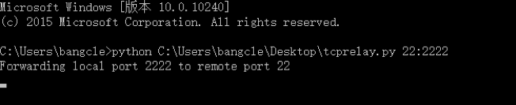

1. 使用SSH工具直接连接本地2222端口即可连接手机的ssh服务

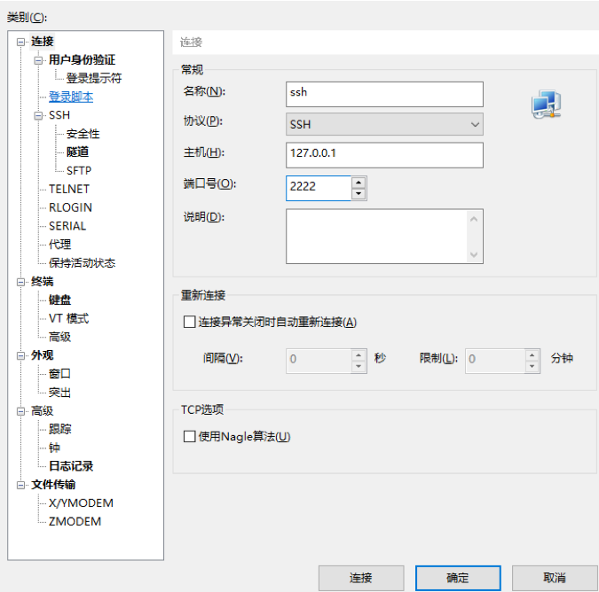

1. 运行要测试的APP，通过ps查找目标进程(本次测试APP为TikTok)

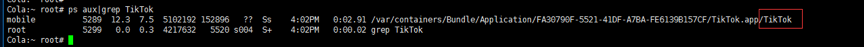

1. 使用debugserver附加目标进程并监听本地端口12345端口

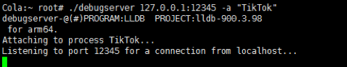

1. 1. ​	4.1.如果附加后出现如下错误，则证明APP存在ptrace反调试

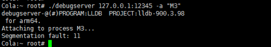

1. 使用tcprelay.py将手机上的12345端口转发到本地12345端口

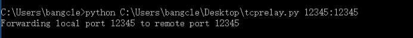

1. 使用IDA选择 remote IOS debugger

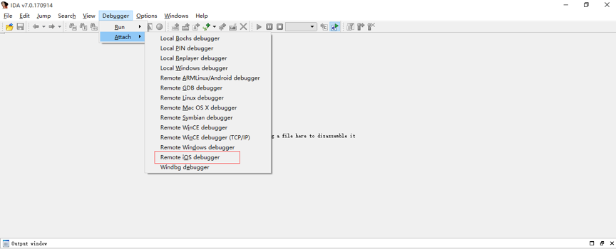

1. 连接刚刚转发的端口,127.0.0.1:12345

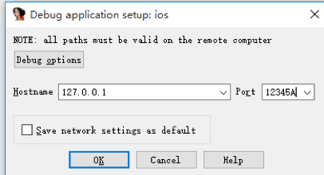

1. 选择OK

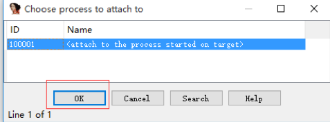

1. 出现对话框点击OK即可，加载完毕后点击运行按钮,如果APP正常运行，无任何提示或者未存在闪退现象则代表调试成功。

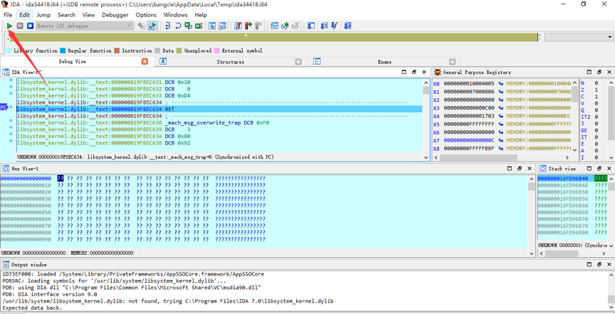

**MAC下**

工具: debugserver 、LLDB、iproxy

1. 安装iproxy

brew insall iproxy

1. 将手机22端口转发到本地2222端口

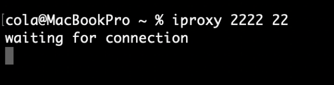

1. 通过本地2222连接手机ssh服务

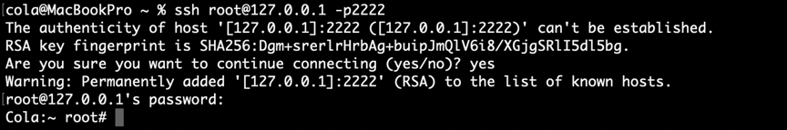

1. 运行APP，通过ps查找目标进程

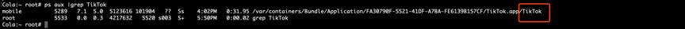

1. 使用debugserver 附加目标进程,并监听本地12345端口

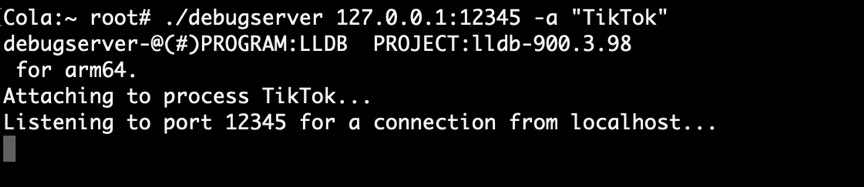

1. 1. ​	5.1.如果附加出现如下错误，则证明APP存在ptrace反调试

1. iproxy转发手机12345端口到本地12345端口

1. 运行LLDB连接12345端口,连接成功后，输入命令**c**，如果APP正常运行，无任何提示或者未存在闪退现象则代表调试成功。

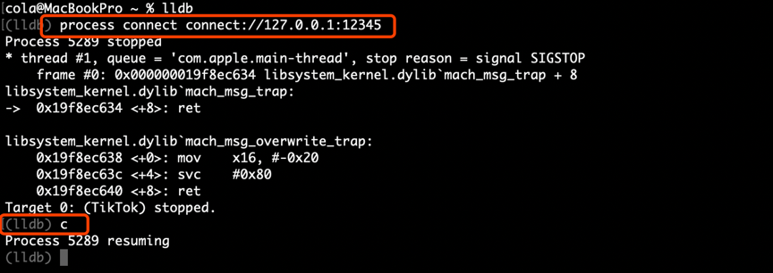

#### 1.2.1.5 缺少二次打包检测

**概述**

应用篡改后二次打包不仅已经严重危害开发者版权和经济利益，而且也使app用户遭受到不法应用的恶意侵害。对客户端程序添加或修改代码，修改客户端资源图片，配置信息、图标，添加广告，推广自己的产品，再生成新的客户端程序，可导致大量盗版应用的出现分食开发者的收入；恶意的二次打包还能实现应用钓鱼、添加病毒代码、添加恶意代码，从而窃取登录账号密码、支付密码，拦截验证码短信，修改转账目标账号、金额等等。

**风险等级**

**高危**

**测试用例**

1. 解压后对修改APP图标，然后使用爱思助手的ipa签名工具进行签名，安装重新签名后的应用，检测其是否能够重新运行。

### 1.2.2 用户数据安全

#### 1.2.2.1 plist文件中明文存储敏感信息

**概述**

Plist文件主要用于存储用户设置及App的配置信息，但App可能使用Plist文件存储明文的用户名、密码或其它一些个人敏感信息。而保存在Plist文件中的二进制格式文件数据则可以使用Plist文件编辑器（如plutil）进行查看或修改，即使在一个没有越狱的设备上，plist文件内容也可以通过工具iExplorer获取。对于以编码、未加密或弱加密形式存储的敏感信息就可能会导致敏感信息泄露了。

**风险等级**

**高危**/**中危**/**低危**

**测试用例**

1. 正常使用APP的部分功能后(如登录操作等)，使用三方工具(爱思助手等)读取APP的plist文档，查看是否有明文保存的信息。根据具体存储的信息类型，判定风险等级，如明文存储密码为高危，明文存储姓名、手机号、银行卡号为中危，明文存储位置信息等为低危。（如不确定，请找2人以上进行交叉验证）。

#### 1.2.2.2 SQLite数据库中明文存储敏感信息

**概述**

iOS自带的SQLite数据库没有内置的加密支持，因此，许多iOS APP会直接以明文格式将许多敏感数据存储在SQLite数据库中,除非APP自身对数据进行加密后再存储。例如，为提供离线的邮件访问功能，Gmail的iOS APP以明文方式将所有邮件存储在SQLite数据库中。一旦可以物理访问到设备或其备份文件，存储在SQLite中未加密的敏感信息容易被泄露。

**风险等级**

**高危**/**中危**/**低危**

**测试用例**

1. 正常使用APP的部分功能后(如登录操作等)，使用三方工具（爱思助手等）导出APP的.db文件，查看是否有明文保存的信息。
2. 使用第三方工具（如：sqlitestudio）读取APP的.db文件，查看是否有明文保存的信息，根据具体存储的信息类型，判定风险等级，如明文存储密码为高危，明文存储姓名、手机号、银行卡号为中危，明文存储位置信息等为低危。（如不确定，请找2人以上进行交叉验证）。

#### 1.2.2.3 明文传输核心业务数据

**概述**

应用数据交互采用明文传输数据，没有加密，完整校验等机制，在不可信的网络环境下，网络请求依然可以被进行中间人攻击（人在这方面的-MiddleAttack），导致传输过程中的敏感信息能够被第三方程序监听，截获，篡改，重放等。

**风险等级**

**警告**

**测试用例**

1. 通过burp抓取核心业务数据包（密码、姓名、手机号、银行卡号、位置信息等）看是否明文进行传输

#### 1.2.2.4 敏感信息界面截屏未进行提示

**概述**

App的敏感界面没有做防止截屏处理，导致用户的个人敏感信息被三方截屏、录屏软件截取。

**风险等级**

**警告**

**测试用例**

1. 在敏感信息界面截屏，查看能否截屏成功，若截屏成功且无提示页面则存在该风险；若可以截屏成功且有提示，则判定为不存在该风险。（需截图到有敏感数据的页面，如登录、支付等截面）

#### 1.2.2.5 敏感界面切换至后台时未进行模糊处理

**概述**

App在切换到后台运行时，双击home可以看见被切换到后台的APP界面，当此界面包含一些敏感个人信息时，将可能产生一定的信息泄露风险。

**风险等级**

**警告**

**测试用例**

1. 将正在运行的APP切换到后台；
2. 双击home键，查看后台运行的APP界面是否进行了模糊处理（需截图到有敏感数据的页面，如登录、支付等截面）。

#### 1.2.2.6 调试日志输出敏感信息

**概述**

App没有移除调试日志输出相关的代码，在运行的时候，会输出日志信息，且日志信息中包含业务相关的敏感信息。而调试日志中的敏感信息可能被第三方程序获取，导致用户敏感信息泄露。

**风险等级**

**中危**

**测试用例**

1. 使用数据线连接手机，打开爱思助手等第三方工具，利用自带工具查看实时日志；
2. 运行app，进行一些操作，查看是否有日志输出；
3. 人工查看日志中是否有敏感信息。

#### 1.2.2.7 缺少代理检测

**概述**

应用使用代理服务器联网，可能导致客户端与服务器端通信的数据被监听和篡改，导致用户敏感数据泄露或者服务器被恶意攻击。

**风险等级**

**警告**

**测试用例**

1. 在测试机上开启代理进行抓包，看APP是否有提示或者无法抓取到数据包，如无法抓包，需进一步判断是否由其他原因引起，如https单向、双向校验等，可通过逆向代码或调试查看无法抓包原因，从而准确判断是否是由代理检测导致无法抓包。

#### 1.2.2.8 缺少运行环境安全性检查

**概述**

App在不安全的越狱环境下运行时存在较高的风险，系统原有的安全机制几乎失效，防护软件也会变得更加容易遭受攻击，获取了高权限的恶意程序可任意读取App的敏感数据、内存数据，或者注入代码等，导致用户敏感信息被泄露。

**风险等级**

**警告**

**测试用例**

将APP运行于越狱环境，查看APP是否会弹出环境风险提示，以下情况为不存在问题：

1. App能够正常运行，有提示处于越狱环境的信息。
2. 在越狱环境下卡在初始页面或闪退。

#### 1.2.2.9 输入监听风险（安全软键盘）

**概述**

应用程序中的敏感信息通常主要来源于使用者的直接输入，如果用户的输入数据被监听或者按键位置被记录，很可能导致用户的输入数据被获取，其中的账号、密码等隐私信息泄露。而iOS系统的默认输入键盘中都面临数据监听的风险。

**风险等级**

**中危****/****低危**

**测试用例**

页面+代码分析进行确认，风险等级视情况而定，银行类判定为中危，其余类为低危

1. 在登录界面、注册界面、支付界面等，调用键盘，查看是否调用安全键盘（非系统自带键盘）；

### 1.2.3 数据传输保护

#### 1.2.3.1 使用HTTP进行核心业务数据交互

**概述**

使用http网络传输协议进行APP与服务器的数据交互，当APP所属设备的网络环境被外部监控时，APP与服务器间的所有通信数据都被第三方可见，极易导致中间人攻击。

**风险等级**

**警告**

**测试用例**

1. 通过burp抓取目标APP核心业务数据包（如登陆、支付等接口数据）看是否使用http进行传输。

#### 1.2.3.2 不严格的HTTPS证书校验或域名检查

**概述**

使用https传输协议进行APP与服务器端的数据通信，当客户端没有严格校验https的证书或者信任所有主机域名时，后果是在不可信的网络环境下，网络请求依然可以被进行中间人攻击（Man-in-the-MiddleAttack），导致传输过程中的敏感信息能够被第三方程序监听、截获、篡改、重放等。

**风险等级**

**中危**

**测试用例**

1. 在未越狱的测试机上，抓包查看能否抓取https的通信数据。
2. 在越狱的测试机上，确认未开启ssl-kill-switch2插件的情况下，抓包查看能否抓取https的通信数据。

（推荐使用未越狱的测试机进行测试，以免其它测试环境对测试结果的准确性有影响）

#### 1.2.3.3 端口开放检测

**概述**

app为了某些特定的功能(消息推送，信息收集等)，会在本地开启某些端口进行监听，当接收到远程指令，就调用对应的接口函数来进行操作，如果这些端口被发现并恶意利用，将对用户造成巨大危害。

**风险等级**

**警告**

**测试用例**

1. 使用ssh连接到手机Terminal
2. 使用lsof -i命令查看手机当前开启端口

### 1.2.4 加密算法及密码安全

#### 1.2.4.1 不合理配置加密算法

**概述**

APP加密核心数据时是否使用了业界推荐的加密算法。使用这些算法时是否正确使用。

**风险等级**

**低危**

**测试用例**

1. 使用工具反编译ipa包；
2. 查看是否使用了DES算法进行加密；
3. 使用AES算法时是否使用ECB模式；
4. RSA加密算法每次加密结果是否相同。

（分析业务逻辑中是否用到此算法，如果没有使用此算法就不算风险，最好可以找到解密方法进行解密数据）

#### 1.2.4.2 密钥硬编码在客户端代码

**概述**

App开发者在使用了密码学相关代码对敏感信息或者网络请求进行加密，但密钥以字符串形式存储在代码中。攻击者可以通过反编译的方式获取加密算法和加密密钥，然后通过中间人攻击窃取通信密文数据，结合密钥和加解密算法即可解密还原数据，导致用户敏感信息存在泄露的风险。

**风险等级**

**高危**

**测试用例**

1. 使用工具反编译ipa包；
2. 在代码中搜索密码学相关字符串；
3. 对定位到的代码进行回溯分析、深度人工分析，确定密钥是否硬编码存储在代码中。

（分析业务逻辑中是否用到此算法，如果没有使用此算法就不算风险，最好可以找到解密方法进行解密数据）

### 1.2.4 iOS应用安全规范

#### 1.2.4.1 访问第三方页面时未进行提示

**概述**

应用使用其它浏览器组件加载第三方页面时，未提示用户当前正在访问第三方页面。可导致用户在页面被劫持或跳转至钓鱼页面时无法区分，产生风险。

**风险等级**

**警告**

**测试用例**

1. 使用应用打开第三方页面，或在网络请求响应中增加页面跳转代码跳转至第三方页面。
2. 观察应用是否对第三方页面进行了标识。

#### 1.2.4.2 未校验二维码域名

**概述**

攻击者伪造二维码，让用户去扫描二维码导致，没有做域名校验的情况下用户进入伪造的钓鱼二维码，最终造成用户信息泄露或资金损失。

**风险等级**

**低危**

**测试用例**

1. 生成伪造二维码，扫码后查看是否有校验域名

#### 1.2.4.3 地址随机化

**概述**

PIE(position-independent executable)是一种生成地址无关可执行程序的技术。 如果编译器在生成可执行程序的过程中使用了PIE，那么当可执行程序被加载到内存中时其加载地址存在不可预知性。

**风险等级**

**低危**

**测试用例**

1. 使用ssh连接到手机；
2. 使用 otools -hv *** 查看程序信息。

#### 1.2.4.4 堆栈保护

**概述**

编译程序时采用Stack Smashing Protector (SSP)选项，能够防止栈溢出等破坏性攻击。

**风险等级**

**低危**

**测试用例**

1. 使用otool -Iv *** | grep stack_chk_guard 查看程序信息.**

#### 1.2.4.5 自动引用计数

**概述**

采用Automatic Reference Counting(ARC)选项编译的应用能够自动对Objective-C对象进行内存管理，防止造成内存破坏漏洞，同时可以减少代码量，节省劳动力。

**风险等级**

**低危**

**测试用例**

1. 使用otool -Iv *** | grep objc_release 查看应用程序信息.

# 2. 附录

## 2.1 漏洞危害及漏洞风险等级定义

本次安全审计的漏洞风险定级标准主要依据可能性和影响两个维度进行。可能性指漏洞被准确识别和成功利用的概率；影响是攻击者通过成功利用漏洞可能对资产造成的潜在损害。这种损害包括但不限于财务损失、信息泄露、违反合规，品牌声誉损失和负面影响。

根据上述两个维度，我们的定级标准如下：

| **风险定级** | **说明**                                                     |
| ------------ | ------------------------------------------------------------ |
| **严重**     | 严重问题具有高影响和高可能性； 严重问题易于检测和利用，并导致大量资产损失； 这些问题代表了应用程序的最高安全风险； 因此，应立即予以补救。 |
| **高危**     | 高危问题具有高影响和低可能性； 高危问题通常难以检测和利用，但可能导致大量资产损失这些问题代表了应用程序的高安全风险； 高危问题应在下一个计划的修补程序版本中进行修复。 |
| **中危**     | 中危问题具有低影响和高可能性； 中危问题易于检测和利用，但通常导致小的资产损失； 这些问题对应用程序来说是一种温和的安全风险； 中危问题应在下一个计划产品中进行修复。 |
| **低危**     | 低危问题具有低影响和低可能性； 低危问题可能难以检测和利用，通常导致小的资产损失； 这些问题对应用程序来说是次要的安全风险； 低危问题应该在时间允许的情况下修复。 |
| **警告**     | 警告问题不存在直接影响和攻击的可能性，但在特殊情况下可能会结合被其他漏洞利用； 修复此类问题可减小目标系统的攻击面和攻击成功的可能性。 |

## 2.2 工具使用

本次安全审计使用的工具包括但不限于下表所列举的工具：

| **编号** | **工具名称** | **主要用途**                         | **介绍**                                                     |
| -------- | ------------ | ------------------------------------ | ------------------------------------------------------------ |
| **1**    | IDA pro      | 反编译工具                           | 交互式反编译工具，支持多平台可执行文件的静态反汇编和动态调试 |
| **2**    | Xcode        | 查看应用编译，如堆栈保护，随机地址等 | ios开发工具                                                  |
| **3**    | otool        | 查看应用运行日志                     | 针对目标文件的信息展示工具                                   |
| **4**    | Fiddler      | 抓包工具                             | http协议调试代理工具                                         |
| **5**    | Brupsuit     |                                      | http报文代理工具                                             |
| **6**    | Wireshark    |                                      | 网络抓包分析工具                                             |
